This file is a merged representation of the entire codebase, combined into a single document by Repomix.
The content has been processed where security check has been disabled.

# File Summary

## Purpose
This file contains a packed representation of the entire repository's contents.
It is designed to be easily consumable by AI systems for analysis, code review,
or other automated processes.

## File Format
The content is organized as follows:
1. This summary section
2. Repository information
3. Directory structure
4. Repository files (if enabled)
5. Multiple file entries, each consisting of:
  a. A header with the file path (## File: path/to/file)
  b. The full contents of the file in a code block

## Usage Guidelines
- This file should be treated as read-only. Any changes should be made to the
  original repository files, not this packed version.
- When processing this file, use the file path to distinguish
  between different files in the repository.
- Be aware that this file may contain sensitive information. Handle it with
  the same level of security as you would the original repository.

## Notes
- Some files may have been excluded based on .gitignore rules and Repomix's configuration
- Binary files are not included in this packed representation. Please refer to the Repository Structure section for a complete list of file paths, including binary files
- Files matching patterns in .gitignore are excluded
- Files matching default ignore patterns are excluded
- Security check has been disabled - content may contain sensitive information
- Files are sorted by Git change count (files with more changes are at the bottom)

# Directory Structure
```
migrations/
  meta/
    _journal.json
    0000_snapshot.json
  0000_chemical_paibok.sql
public/
  assets/
    blog/
      cloudflare-contextual-rag/
        architecture.png
        flow.png
        og.png
        sigmoid.png
      context-engineering/
        building-context.png
        magic-vs-dud.png
        og.png
        rag-diagram.png
      durable-objects-database-per-user/
        og.png
      durable-objects-graph-databases/
        demo.png
        og.png
      how-i-use-claude-code/
        og.png
      learnings-from-starting-building-and-exiting-a-devtools-startup/
        build-sell.jpg
        monopoly.jpg
        og.png
        scale.png
      observability-wide-events-101/
        chart-1.png
        chart-2.png
        chart-3.png
        chart-4.png
        chart-5.png
        chart-6.png
        og.png
        request-lifecycle.png
        trace.png
        unknown-unknowns.png
      the-software-development-lifecycle-is-dead/
        og.png
      what-are-cloudflare-durable-objects/
        npm-install-agents.svg
        og.png
    projects/
      basebrain.png
      baselime.png
      bkmark.png
      lyrically.jpeg
      parliament.png
      rooom.png
      thesis.png
    talks/
      craft-your-own-serverless-observability-platform/
        og.png
      creating-an-innovation-engine-with-observability-v1/
        og.png
      creating-an-innovation-engine-with-observability-v2/
        og.png
      javascript-runtimes-on-aws-lambda/
        og.png
      lessons-from-self-hosting-clickhouse/
        og.png
      observability-with-clickhouse/
        og.png
      observing-serverless-applications/
        og.png
      serverless-transactional-outbox-pattern-on-aws/
        og.png
  .assetsignore
  favicon.svg
  preview.png
src/
  components/
    BaseHead.astro
    BlogImage.astro
    BlogYoutubeVideo.astro
    Footer.vue
    Header.vue
    ListPosts.vue
    ListTags.vue
    ListTopics.vue
    PageOperate.vue
    PostCounter.vue
    Project.astro
    TableOfContents.astro
    ThemeToggle.vue
  content/
    blog/
      cloudflare-contextual-rag.mdx
      context-engineering.mdx
      durable-objects-database-per-user.mdx
      durable-objects-graph-databases.mdx
      how-I-use-claude-code.mdx
      learnings-from-starting-building-and-exiting-a-devtools-startup.mdx
      logging-sucks.mdx
      observability-wide-events-101.mdx
      ship-types.mdx
      the-software-development-lifecycle-is-dead.mdx
      what-are-cloudflare-durable-objects.mdx
    projects/
      basebrain.mdx
      baselime.mdx
      bkmark.mdx
      lyrically.mdx
      parliament.mdx
      rooom.mdx
      thesis.mdx
    talks/
      craft-your-own-serverless-observability-platform.mdx
      creating-an-innovation-engine-with-observability-v1.mdx
      creating-an-innovation-engine-with-observability-v2.mdx
      javascript-runtimes-on-aws-lambda.mdx
      lessons-from-self-hosting-clickhouse.mdx
      observability-with-clickhouse.mdx
      observing-serverless-applications.mdx
      serverless-transactional-outbox-pattern-on-aws.mdx
    config.ts
  layouts/
    BaseLayout.astro
  pages/
    blog/
      [slug]/
        og.png.ts
      [slug].astro
    tags/
      [slug].astro
    talks/
      [slug]/
        og.png.ts
      [slug].astro
    [...slug].astro
    background.astro
    blog.astro
    for-llms.astro
    index.astro
    llms-full.txt.ts
    llms.txt.ts
    projects.astro
    robots.txt.ts
    rss.xml.js
    talks.astro
  services/
    analytics/
      collect.ts
      count.ts
    db/
      users.ts
  styles/
    markdown.css
  utils/
    og-image.ts
    posts.ts
    utils.ts
  env.d.ts
  schema.ts
  site-config.ts
  types.ts
.gitignore
.nojekyll
astro.config.mjs
drizzle.config.ts
eslint.config.js
package.json
README.md
tsconfig.json
uno.config.ts
wrangler.toml
```

# Files

## File: migrations/meta/_journal.json
````json
{
  "version": "6",
  "dialect": "sqlite",
  "entries": [
    {
      "idx": 0,
      "version": "6",
      "when": 1715304491094,
      "tag": "0000_chemical_paibok",
      "breakpoints": true
    }
  ]
}
````

## File: migrations/meta/0000_snapshot.json
````json
{
  "version": "6",
  "dialect": "sqlite",
  "id": "d9d52458-c76f-42a4-8472-9c82750a9aba",
  "prevId": "00000000-0000-0000-0000-000000000000",
  "tables": {
    "users": {
      "name": "users",
      "columns": {
        "id": {
          "name": "id",
          "type": "text",
          "primaryKey": true,
          "notNull": true,
          "autoincrement": false
        },
        "email": {
          "name": "email",
          "type": "text",
          "primaryKey": false,
          "notNull": true,
          "autoincrement": false
        },
        "name": {
          "name": "name",
          "type": "text",
          "primaryKey": false,
          "notNull": false,
          "autoincrement": false
        },
        "is_verified": {
          "name": "is_verified",
          "type": "integer",
          "primaryKey": false,
          "notNull": true,
          "autoincrement": false,
          "default": false
        },
        "created_at": {
          "name": "created_at",
          "type": "text",
          "primaryKey": false,
          "notNull": false,
          "autoincrement": false,
          "default": "CURRENT_TIMESTAMP"
        },
        "updated_at": {
          "name": "updated_at",
          "type": "text",
          "primaryKey": false,
          "notNull": false,
          "autoincrement": false,
          "default": "CURRENT_TIMESTAMP"
        }
      },
      "indexes": {
        "users_email_unique": {
          "name": "users_email_unique",
          "columns": [
            "email"
          ],
          "isUnique": true
        }
      },
      "foreignKeys": {},
      "compositePrimaryKeys": {},
      "uniqueConstraints": {}
    }
  },
  "enums": {},
  "_meta": {
    "schemas": {},
    "tables": {},
    "columns": {}
  }
}
````

## File: migrations/0000_chemical_paibok.sql
````sql
CREATE TABLE `users` (
	`id` text PRIMARY KEY NOT NULL,
	`email` text NOT NULL,
	`name` text,
	`is_verified` integer DEFAULT false NOT NULL,
	`created_at` text DEFAULT CURRENT_TIMESTAMP,
	`updated_at` text DEFAULT CURRENT_TIMESTAMP
);
--> statement-breakpoint
CREATE UNIQUE INDEX `users_email_unique` ON `users` (`email`);
````

## File: public/assets/blog/what-are-cloudflare-durable-objects/npm-install-agents.svg
````xml
<svg width="800" height="250" xmlns="http://www.w3.org/2000/svg">
  <!-- Background pattern -->
  <defs>
    <pattern id="dots" x="0" y="0" width="20" height="20" patternUnits="userSpaceOnUse">
      <circle cx="2" cy="2" r="1.5" fill="#FF6B35" opacity="0.3"/>
    </pattern>
  </defs>
  
  <!-- Background -->
  <rect width="800" height="250" fill="#FFF8F3"/>
  <rect width="800" height="250" fill="url(#dots)"/>
  
  <!-- Main container -->
  <rect x="40" y="40" width="720" height="170" rx="20" ry="20" fill="white" stroke="#FF6B35" stroke-width="3"/>
  
  <!-- Terminal text -->
  <text x="80" y="135" font-family="'Courier New', monospace" font-size="48" font-weight="bold">
    <tspan fill="#FF6B35">$</tspan>
    <tspan dx="20" fill="#D84315">npm i agents</tspan>
  </text>
  
  <!-- Red square accent -->
  <rect x="700" y="90" width="40" height="70" fill="#D84315"/>
</svg>
````

## File: public/.assetsignore
````
_worker.js
_routes.json
````

## File: public/favicon.svg
````xml
<?xml version="1.0" encoding="UTF-8"?>
<svg width="200" height="200" version="1.1" xmlns="http://www.w3.org/2000/svg">
 <rect width="200" height="200" fill="#e4e4e4"/>
</svg>
````

## File: src/components/BaseHead.astro
````astro
---
import siteConfig from "../site-config";
import "../styles/markdown.css";
import { SEO } from "astro-seo";

export type Props = {
  title?: string;
  description?: string;
  image?: { src: string; alt?: string };
  pageType?: "website" | "article";
  articleSchema?: {
    headline: string;
    datePublished: string;
    description?: string;
  };
};

const {
  description = "Hello, I'm Boris Tane, and I build software. This is my personal website with my blog and all the talks and projects I'm working on.",
  image = siteConfig.image,
  pageType = "website",
  articleSchema,
} = Astro.props;

// Person schema for site-wide use
const personSchema = {
  "@context": "https://schema.org",
  "@type": "Person",
  "name": siteConfig.author,
  "url": siteConfig.site,
  "jobTitle": "Engineering Lead",
  "worksFor": {
    "@type": "Organization",
    "name": "Cloudflare"
  },
  "description": siteConfig.bio,
  "sameAs": siteConfig.footerNavLinks.map(link => link.href)
};

// Article schema (only included if articleSchema prop is provided)
const articleJsonLd = articleSchema ? {
  "@context": "https://schema.org",
  "@type": "Article",
  "headline": articleSchema.headline,
  "author": {
    "@type": "Person",
    "name": siteConfig.author,
    "url": siteConfig.site
  },
  "datePublished": articleSchema.datePublished,
  "description": articleSchema.description || description,
  "publisher": {
    "@type": "Person",
    "name": siteConfig.author
  }
} : null;
const title = [Astro.props.title || "Boris Tane", siteConfig.title].filter(Boolean).join(" | ");
const resolvedImage = image?.src
  ? {
      src: new URL(image.src, Astro.site).toString(),
      alt: image.alt,
    }
  : undefined;
const canonicalURL = new URL(Astro.request.url, Astro.site);

/**
 * Enforce some standard canonical URL formatting across the site.
 */
function formatCanonicalURL(url: string | URL) {
  const path = url.toString();
  const hasQueryParams = path.includes("?");
  // If there are query params, make sure the URL has no trailing slash
  if (hasQueryParams) path.replace(/\/?$/, "");

  // otherwise, canonical URL always has a trailing slash
  return path.replace(/\/?$/, hasQueryParams ? "" : "/");
}
---

<!-- High Priority Global Metadata -->
<meta charset="utf-8" />
<meta name="viewport" content="width=device-width,initial-scale=1" />
<title>{title}</title>
<meta name="generator" content={Astro.generator} />

<!-- Plausible -->
<script defer data-domain="boristane.com" src="https://plausible.io/js/script.js"></script>


<SEO
  title={title}
  description={description}
  openGraph={{
    basic: {
      title: "Boris Tane",
      type: "website",
      image: resolvedImage?.src || "",
    },
  }}
  twitter={{
    creator: "@boristane",
  }}
  extend={{
    // extending the default link tags
    link: [{ rel: "icon", href: "/favicon.ico" }],
    // extending the default meta tags
    meta: [
      {
        name: "twitter:image",
        content: resolvedImage?.src,
      },
      { name: "twitter:card", content: "summary_large_image" },
      { name: "twitter:title", content: "Boris Tane" },
      { name: "twitter:description", content: "Boris Tane" },
    ],
  }}
/>

<!-- Fonts -->
<link rel="preconnect" href="https://fonts.googleapis.com" />
<link rel="preconnect" href="https://fonts.gstatic.com" crossorigin />
<link
  href="https://fonts.googleapis.com/css2?family=Inter:wght@400..700&family=Newsreader:ital,opsz,wght@0,6..72,400..700;1,6..72,400..700&display=swap"
  rel="stylesheet"
/>

<!-- Low Priority Global Metadata -->
<link rel="icon" type="image/svg+xml" href="/favicon.svg" />
<link rel="sitemap" href="/sitemap-index.xml" />
<link rel="alternate" type="application/rss+xml" href="/rss.xml" title="RSS" />

<!-- Schema.org JSON-LD -->
<script type="application/ld+json" set:html={JSON.stringify(personSchema)} />
{articleJsonLd && <script type="application/ld+json" set:html={JSON.stringify(articleJsonLd)} />}

<!-- Page Metadata -->
<link rel="canonical" href={formatCanonicalURL(canonicalURL)} />
<meta name="description" content={description} />

<!-- Open Graph / Facebook -->
<meta name="og:type" property="og:type" content={pageType} />
<meta name="og:url" property="og:url" content={formatCanonicalURL(canonicalURL)} />
<meta name="og:title" property="og:title" content={title} />
<meta name="og:description" property="og:description" content={description} />
{resolvedImage?.src && <meta property="og:image" content={resolvedImage.src} />}
{
  resolvedImage?.alt && (
    <meta name="og:image:alt" property="og:image:alt" content={resolvedImage.alt} />
  )
}

<!-- X/Twitter -->
<meta name="twitter:card" property="twitter:card" content="summary_large_image" />
<meta name="twitter:url" property="twitter:url" content={formatCanonicalURL(canonicalURL)} />
<meta name="twitter:title" property="twitter:title" content={title} />
<meta name="twitter:site" property="twitter:site" content="@boristane" />
<meta name="twitter:creator" property="twitter:creator" content="@boristane" />
<meta name="twitter:description" property="twitter:description" content={description} />
{
  resolvedImage?.src && (
    <meta name="twitter:image" property="twitter:image" content={resolvedImage.src} />
  )
}
{
  resolvedImage?.alt && (
    <meta name="twitter:image:alt" property="twitter:image:alt" content={resolvedImage?.alt} />
  )
}
````

## File: src/components/BlogImage.astro
````astro
---
const { path, title, id } = Astro.props;
---

<style>
  .image-wrapper {
    cursor: zoom-in;
    display: inline-block;
    margin-top: 15px;
  }

  .image {
    width: 100%;
    height: auto;
    transition: transform 0.3s ease;
  }

  .image:hover {
    transform: scale(1.02);
  }

  .modal {
    display: none;
    position: fixed;
    top: 0;
    left: 0;
    width: 100%;
    height: 100vh;
    background-color: rgb(255, 255, 255);
    justify-content: center;
    align-items: center;
    z-index: 999;
    justify-items: center;
    align-items: center;
  }

  .modal img {
    max-width: 80%;
    max-height: 90vh;
    
    /* box-shadow: 0 0 10px rgba(0, 0, 0, 0.5); */
  }

  .modal.show {
    display: flex;
  }

  .close {
    position: absolute;
    top: 20px;
    right: 20px;
    font-size: 24px;
    color: black;
    cursor: pointer;
  }
</style>

<div class="image-wrapper" id={`image-wrapper-${id}`} onClick={() => {}}>
  
  <div text-gray-500 text-sm text-center w-full mt-4>{title}</div>
</div>

<div
id={`modal-${id}`}
  class="modal"
  onClick={() => document.getElementById("modal")?.classList.remove("show")}
>
  <span class="close">&times;</span>
  <div>
    
    <div text-white text-sm text-center w-full mt-4>{title}</div>
  </div>
</div>

<script define:vars={{id}}>
  function initializeImageModal() {
    const image = document.getElementById(`image-wrapper-${id}`);
    const modal = document.getElementById(`modal-${id}`);

    if (!image || !modal) return;

    const newImage = image.cloneNode(true);
    image.parentNode?.replaceChild(newImage, image);

    const newModal = modal.cloneNode(true);
    modal.parentNode?.replaceChild(newModal, modal);

    newImage.addEventListener("click", () => {
      const elt = document.getElementById(`modal-${id}`);
      elt?.classList.add("show");
    });

    newModal.addEventListener("click", () => {
      newModal.classList.remove("show");
    });
  }

  initializeImageModal();

  document.addEventListener("astro:page-load", initializeImageModal);
</script>
````

## File: src/components/BlogYoutubeVideo.astro
````astro
---
const { embed } = Astro.props;
---

<div class="">
  <style>
    .embed-container {
      position: relative;
      padding-bottom: 56.25%;
      height: 0;
      overflow: hidden;
      max-width: 100%;
    }

    .embed-container iframe,
    .embed-container object,
    .embed-container embed {
      position: absolute;
      top: 0;
      left: 0;
      width: 100%;
      height: 100%;
    }
  </style>
  <div class='embed-container'><iframe src={'https://www.youtube-nocookie.com/embed/' + embed + '?&rel=0&vq=hd1080'}
      frameborder='0' allowfullscreen></iframe></div>

</div>
````

## File: src/components/Footer.vue
````vue
<script lang="ts" setup>
import siteConfig from '../site-config'
</script>

<template>
  <footer class="w-full px-6 pt-4 pb-12 max-w-3xl mx-auto">
    <div class="mb-6 flex flex-wrap gap-x-4 gap-y-2">

      <a v-for="link in siteConfig.footerNavLinks" :href="link.href" target="_blank" rel="noopener noreferrer"
        class="prose-link flex items-center">
        <span>{{ link.text }}</span>
      </a>

    </div>
  </footer>
</template>
````

## File: src/components/Header.vue
````vue
<script lang="ts" setup>
import { ref, watchEffect } from 'vue'
import { onClickOutside, useWindowSize } from '@vueuse/core'
import siteConfig from '../site-config'
import ThemeToggle from './ThemeToggle.vue'

const navLinks = siteConfig.headerNavLinks || []

const menuRef = ref(null)

defineProps<{
  pathname: string
}>()

const menu = ref(false)

function toggleMenu() {
  menu.value = !menu.value
}

const { width } = useWindowSize()

onClickOutside(menuRef, () => {
  if (width.value < 640)
    menu.value = false
})

watchEffect(() => {
  if (width.value > 640)
    menu.value = true
  else
    menu.value = false
})
</script>

<template>
  <header text-lg max-w-3xl mx-auto h-32 sm:h-18 px-6 flex mt-5 sm:mt-0 justify-between items-start sm:items-center relative>
    <div>
      <a href="/" nav-link font-500 text-xl hover:text-gray-800>boris tane</a>
    </div>
    <div flex gap-2 sm:gap-6 sm:flex-row flex-col>
      <a v-for="link in navLinks" :key="link.text" nav-link
        :class="pathname.includes(link.href) ? 'text-sky-600' : 'opacity-60  hover:opacity-100'" :href="link.href">
        {{ link.text }}
      </a>
      <div flex items-center>
        <a nav-link href="/rss.xml" i-ri-rss-line opacity-60 hover:opacity-100 w-5 h-5 />
      </div>
      <ThemeToggle />
    </div>
  </header>
</template>
````

## File: src/components/ListPosts.vue
````vue
<script lang="ts" setup>
import ListTags from './ListTags.vue';

interface Post {
  id: string
  slug: string
  body: string
  data: Record<string, any>
  collection: string
  render: any
}

withDefaults(defineProps<{
  list: Post[],
  mini?: boolean,
}>(), {
  list: () => [],
})

function getDate(date: string) {
  return new Date(date).toISOString()
}

function getHref(post: Post) {
  if (post.data.redirect)
    return post.data.redirect
  return `/${post.collection}/${post.slug}`
}

function getTarget(posts: Post) {
  if (posts.data.redirect)
    return '_blank'
  return '_self'
}

function isSameYear(a: Date | string | number, b: Date | string | number) {
  return a && b && getYear(a) === getYear(b)
}

function getYear(date: Date | string | number) {
  return new Date(date).getFullYear()
}
</script>

<template>
  <ul>
    <template v-if="!list || list.length === 0">
      <div py2 text-gray-400>
        nothing here yet.
      </div>
    </template>
    <li v-for="(post, index) in list " :key="post.data.title" :class="mini ? 'mb-4' : 'mb-6'">
      <div v-if="!isSameYear(post.data.date, list[index - 1]?.data.date) && !mini" select-none relative h18
        pointer-events-none>
        <span text-7em -ml-2 xl:-ml-18 absolute top--0.2em relative -z-10
          class="font-neucha text-[#eaeaea] dark:text-[#474747]">
          {{ getYear(post.data.date) }}
        </span>
      </div>
      <div text-lg lh-tight flex="~ col gap-1">
        <div flex="~ col" md:flex="~ row gap-0 items-center" flex-wrap :class="mini ? 'text-sm' : 'text-lg'">
          <time w-32 :datetime="getDate(post.data.date)" v-if="mini" flex-none>{{ post.data.date }}</time>
          <a :target="getTarget(post)" :href="getHref(post)" nav-link :class="mini ? 'text-lg text-link' : 'text-2xl'">
            <span lh-normal inline-flex items-center>
              <i v-if="post.data.draft" text-base i-ri-draft-line />
              {{ post.data.title }}
              <i v-if="post.data.redirect" text-base i-ri-external-link-line ml-1 />
            </span>
          </a>
        </div>
        <div text-gray-500 text-md v-if="!mini">{{ post.data.description }}</div>
        <div text-gray-500 text-sm ws-nowrap flex="~ gap-1 items-center" flex-wrap w-full v-if="!mini">
          <time :datetime="getDate(post.data.date)">{{ post.data.date }}</time>
          <div v-if="post.data.location" flex="~ gap-1 items-center">
            <div>·</div>
            <div>{{ post.data.location }}</div>
          </div>
          <div v-if="post.data.tags && post.data.tags.length" flex="~ gap-1 items-center">
            <div>·</div>
            <ListTags :tags="post.data.tags" />
          </div>
        </div>
      </div>
    </li>
  </ul>
</template>
````

## File: src/components/ListTags.vue
````vue
<script lang="ts" setup>


withDefaults(defineProps<{
  tags: string[]
}>(), {
  tags: () => [],
})

function getHref(tag: string) {
  return `/tags/${tag}`
}


</script>

<template>
  <ul v-if="tags && tags.length" class="flex flex-wrap items-center gap-1 text-main text-gray-400 w-full">[
  <li v-for="(tag, index) in tags" :key="tag" class="block">
    <a :href="getHref(tag)" class="bg-gray-100 px-2 py-[1px] text-sky-600 rounded hover:text-white hover:bg-sky-600 transition">
      <span lh-normal>
        {{ tag }}
      </span>
    </a>
  </li>
  ]
</ul>
</template>
````

## File: src/components/ListTopics.vue
````vue
<script lang="ts" setup>


withDefaults(defineProps<{
  topics: string[]
}>(), {
  topics: () => [],
})


</script>

<template>
  <ul v-if="topics && topics.length" class="flex items-center gap-1 text-main text-gray-400">[
    <li v-for="(topic, index) in topics " :key="topic">
      <span lh-normal class="bg-gray-100 px-2 py-[1px] text-sky-600 rounded">
        {{ topic }}
      </span>
    </li>
    ]
  </ul>
</template>
````

## File: src/components/PageOperate.vue
````vue
<script lang="ts" setup>
import { useWindowScroll } from '@vueuse/core'
import ListTags from './ListTags.vue';


withDefaults(defineProps<{
  showShare?: boolean
  showBack?: boolean
  url?: URL
  tags?: string[]
  next?: {
    collection: string,
    slug: string,
  }
}>(), {
  showShare: false,
  showBack: true,
})

const shareLinks = [
  {
    text: 'twitter',
    icon: 'i-ri-twitter-line',
    href: 'https://twitter.com/intent/tweet?url=',
  },
  {
    text: 'mail',
    icon: 'i-ri-mail-line',
    href: 'mailto:?subject=See%20this%20post&body=',
  },
]

const { y: scroll } = useWindowScroll()

function toTop() {
  window.scrollTo({
    top: 0,
    behavior: 'smooth',
  })
}
</script>

<template>
  <div sm:flex="~ flex-row items-start justify-between" w-full font-mono text-main text-sm>
    <div>
      <div v-if="showShare" flex="~ gap-2 items-center flex-wrap" mb-2>
        <i i-ri-arrow-right-s-line />
        <span>share on</span>
        <a v-for="link in shareLinks" :key="link.text" prose-link lh-tight flex class="item-center"
          :href="link.href + url">
          <div>
            {{ link.text }}
          </div>
        </a>
      </div>
      <div v-if="tags && tags.length" flex="~ gap-2 " mb-2>
        <i i-ri-arrow-right-s-line flex-none />
        <span>grep</span>
        <ListTags :tags="tags" />
      </div>
      <div v-if="next" flex="~ gap-2 items-start" mb-2>
        <i i-ri-arrow-right-s-line flex-none mt-1 />
        <a prose-link text-wrap :href="`/${next.collection}/${next.slug}`">goto {{ next.slug }}</a>
      </div>
      <div v-if="showBack" flex="~ gap-2 items-center" mb-2>
        <i i-ri-arrow-right-s-line flex-none />
        <a prose-link href="javascript:history.back(-1)">cd ..</a>
      </div>
    </div>
    <div v-show="scroll > 300" cursor-pointer sm:m-0 mt-6 flex="~ gap-2 items-center" sm:gap-2>
      <i vertical-mid i-ri-arrow-up-line />
      <span prose-link @click="toTop()">Scroll to top</span>
    </div>
  </div>
</template>
````

## File: src/components/PostCounter.vue
````vue
<script lang="ts" setup>
import { computed, onMounted, ref } from 'vue';
import { useBrowserLocation } from '@vueuse/core'


const props = defineProps({
  type: {
    type: String,
    required: true,
  },
  slug: {
    type: String,
    required: true,
  },
});

const location = useBrowserLocation()
const basePath = location.value.origin;

onMounted(async () => {
  const params = new URLSearchParams({
    type: props?.type,
    slug: props?.slug,
    referrer: document.referrer
  });
})
</script>

<template>
</template>
````

## File: src/components/Project.astro
````astro
---
import { getCollection } from "astro:content";
import BaseLayout from "../layouts/BaseLayout.astro";
import type { CollectionPosts } from "../types";
import ListTopics from "./ListTopics.vue";

type Props = { page: CollectionPosts };

async function getRepoStars(repo: string): Promise<number | null> {
  const url = `https://api.github.com/repos/${repo}`;

  try {
    const response = await fetch(url);

    if (!response.ok) {
      console.error(`Failed to fetch repository: ${response.statusText}`);
      return null;
    }

    const data = await response.json();

    const stars = (data as any).stargazers_count;
    return stars;
  } catch (error) {
    console.error(`Error fetching repository data: ${(error as any).message}`);
    return null;
  }
}

function getDate(date: string) {
  const d = new Date(date);
  const options = { year: "numeric", month: "long" };
  const formatter = new Intl.DateTimeFormat("en-US", options as any);
  return formatter.format(d);
}

const { page } = Astro.props;
const { title, image, description, topics, repo, date } = page.data;
const imageSrc = `/assets/projects/${image}`;

const { Content } = await page.render();
---

<div>
    <div class="text-2xl lh-normal text-main">
      {title}
    </div>
  <div class="flex items-center gap-1 flex-wrap">
    <div class="text-gray-400 text-main flex-none">
      <time datetime={getDate(date)}>{getDate(date)}</time>
    </div>
    {repo && <div>{getRepoStars(repo)}</div>}
    <div class="flex gap-1 items-center">
      <div>·</div>
      <ListTopics topics={topics} />
    </div>
  </div>
  <div class="my-4">
    
  </div>
  <div class="text-xl text-main text-gray-400">
    {description}
  </div>
  <div class="max-w-none prose">
    <Content />
  </div>
</div>
````

## File: src/components/TableOfContents.astro
````astro
---
import type { MarkdownHeading } from 'astro';

interface Props {
  headings: MarkdownHeading[];
}

const { headings } = Astro.props;

// Filter headings to include only those with depth <= 2
const filteredHeadings = headings.filter((heading) => heading.depth <= 2);
---

<div class="toc-container">
  <nav class="rounded-lg p-4">
    <h2 class="text-base font-600 mb-3 text-sky-600 dark:text-white">Table of Contents</h2>
    <ul class="list-none p-0 m-0">
      {
        filteredHeadings.map((heading) => (
          <li class={`mb-1.5 leading-tight}`}>
            <a 
              href={`#${heading.slug}`} 
              class="toc-link"
              data-heading={heading.slug}
              title={heading.text}
            >
              {heading.text}
            </a>
          </li>
        ))
      }
    </ul>
  </nav>
</div>

<style>
  .toc-container {
    width: 100%;
  }

  .toc-link {
    display: block;
    font-size: 0.9rem;
    padding: 0.25rem 0.5rem;
    border-radius: 0.25rem;
    color: var(--text-main, #374151);
    text-decoration: none;
    transition: all 0.2s ease;
    position: relative;
    overflow: hidden;
    white-space: nowrap;
    text-overflow: ellipsis;
  }

  .toc-link:hover {
    color: var(--sky-600, #0284c7);
    background-color: rgba(229, 231, 235, 0.2);
    transform: translateX(2px);
  }

  .toc-link::before {
    content: '';
    position: absolute;
    left: 0;
    top: 0;
    height: 100%;
    width: 3px;
    background-color: var(--sky-600, #0284c7);
    border-radius: 0 2px 2px 0;
    transform: scaleY(0);
    transition: transform 0.2s ease;
  }

  .toc-link.active {
    color: var(--sky-600, #0284c7);
    font-weight: 500;
    background-color: rgba(37, 99, 235, 0.1);
  }

  .toc-link.active::before {
    transform: scaleY(1);
  }
</style>
````

## File: src/components/ThemeToggle.vue
````vue
<script lang="ts" setup>
import { useDark, useToggle } from '@vueuse/core'

// const isDark = useDark()
// const toggleDark = useToggle(isDark)
</script>

<template>
  <!-- <i nav-link dark:i-ri-moon-line i-ri-sun-line @click="toggleDark()" /> -->
</template>
````

## File: src/content/blog/cloudflare-contextual-rag.mdx
````markdown
---
title: "Contextual Retrieval-Augmented Generation (RAG) on Cloudflare Workers"
description: Implementing Contextual Retrieval-Augmented Generation with Using Cloudflare AI, Vectorize and D1 database with Drizzle ORM in a Hono app
date: 2025-04-27
tags:
  - cloudflare dev 101
  - cloudflare workers
  - cloudflare ai
  - rag
---

import BlogImage from '../../components/BlogImage.astro';

Today I am sharing a powerful pattern I've implemented on the [Cloudflare Developers Platform](https://workers.dev) whilst building my [weekends project](https://basebrain.ai): Contextual Retrieval-Augmented Generation (RAG).

Traditional RAG implementations often fall short when presented with nuanced queries or complex documents. Anthropic introduced [Contextual Retrieval](https://www.anthropic.com/news/contextual-retrieval) as an answer to this problem.

In this blog post, I'll walk through implementing a contextual RAG system entirely on the [Cloudflare Developer Plarform](https://workers.dev). You'll see how combining vector search with full-text search, query rewriting, and smart ranking techniques creates a system that truly understands your content.

## What is Contextual RAG

If you're doing any kind of RAG today, you're probably:

1. Chunking documents
2. Storing vectors
3. Searching embeddings
4. Stuffing the results into your LLM context window

The problem is simple: chunking is often not good enough. When you retrieve a chunk based on cosine similarity, it might be totally out of context and irrelevant to the user query.

In a nutshell, key issues with traditional RAG systems are:

1. **Context loss**: When documents are chunked into smaller pieces, the broader context that gives meaning to each chunk is often lost
2. **Relevance issues**: Vector search alone might retrieve semantically similar content that isn't actually relevant to the query
3. **Query limitations**: User queries are often ambiguous or lack specificity needed for effective retrieval

Contextual RAG provides a solution to these issues. It consists of pre-pending every chunk with a short explanation situating it within the context of the entire document. Every chunk is passed through an LLM to provide this context.

The prompt looks like:

```txt
<document> 
{{WHOLE_DOCUMENT}} 
</document> 
Here is the chunk we want to situate within the whole document 
<chunk> 
{{CHUNK_CONTENT}} 
</chunk> 
Please give a short succinct context to situate this chunk within the overall document for the purposes of improving search retrieval of the chunk. Answer only with the succinct context and nothing else. 
```

The result is a short sentence situating the chunk within the context of the entire documents. It is prepended to the actual chunk before inserting it into the vector databse. This provides a solution to the context loss challenge.

Additionally, the query side of the RAG system is enhanced with full-text search, reciprocal rank fusion and a LLM reranker.

<BlogImage path="/assets/blog/cloudflare-contextual-rag/flow.png" title="Contextual Retrieval + Reranking" id="flow"/>

With this technique the challenges of traditional RAG are addressed by:

1. **Enhancing chunks with context**: Each chunk is augmented with contextual information from the full document
2. **Using hybrid search**: Combining vector similarity with keyword-based search
3. **Rewriting queries**: Expanding and transforming user queries into multiple search variations
4. **Intelligent ranking**: Using sophisticated algorithms to merge and rank results from different search methods

Let's dive deeper and see how to implemented this on Cloudflare Workers.

## Project Overview

We'll be using:

- [**Cloudflare Workers**](https://developers.cloudflare.com/workers/) - Our serverless platform
- [**Cloudflare D1**](https://developers.cloudflare.com/d1/) - SQL database for document storage
- [**Cloudflare Vectorize**](https://developers.cloudflare.com/vectorize/) - Vector search engine
- [**Workers AI**](https://developers.cloudflare.com/ai/) - Cloudflare AI platform
- [**Drizzle ORM**](https://orm.drizzle.team/) - Type-safe database access
- [**Hono**](https://hono.dev/) - Lightweight framework for our API routes

Here's the basic structure of the project:

```
.
├── bindings.ts                # Bindings TypeScript Definition
├── bootstrap.sh               # Automate creating the Cloudflare resources
├── drizzle.config.ts          # Database configuration
├── fts5.sql                   # Full-text search SQL triggers
├── package.json               # Dependencies and scripts
├── src
│   ├── db
│   │   ├── index.ts           # Database CRUD operations
│   │   ├── schemas.ts         # Databae schema definition
│   │   └── types.ts           # Database TypeScript types
│   ├── index.ts               # Main Worker code and Durable Object
│   ├── search.ts              # Search functionality
│   ├── utils.ts               # Util functions
│   └── vectorize.ts           # Vectorize operations
├── tsconfig.json              # TypeScript configuration
└── wrangler.json              # Cloudflare Workers configuration
```

This final solution will be implementing the following architecture. The goal of this blog post is to walk through each item individually and finally explain how they all work together.

<BlogImage path="/assets/blog/cloudflare-contextual-rag/architecture.png" title="Solution Architecture" id="architecture"/>

The complete source code for this blog post is available on [GitHub](https://github.com/boristane/cloudflare-dev-101/tree/main/contextual-rag). I suggest following the post with the source code available for reference.

## Bootstrapping the RAG System

We first need to create our cloud resources. Let's create a `bootstrap.sh` script that creates a Vectorize index and a D1 database:

```bash title="bootstrap.sh"
#! /bin/bash
set -e

npx wrangler vectorize create contextual-rag-index --dimensions=1024 --metric=cosine
npx wrangler vectorize create-metadata-index contextual-rag-index --property-name=timestamp --type=number

npx wrangler d1 create contextual-rag
```

It use [wrangler](https://developers.cloudflare.com/workers/wrangler/) to create:

1. A Vectorize index for storing embeddings
2. A metadata index for timestamp-based filtering
3. A D1 database for document storage


Running this script will output a database ID we will use in our `wrangler.json` and `drizzle.config.ts` files.

Next, after creating a Node.js project with `npm` and configuring TypeScript, let's create our `wrangler.json` file to configure our Cloudflare Worker and connect our resources to it.

```json title="wrangler.json"
{
  "name": "contextual-rag",
  "compatibility_date": "2024-11-12",
  "workers_dev": true,
  "upload_source_maps": true,
  "observability": {
    "enabled": true
  },
  "main": "./src/index.ts",
  "vectorize": [
    {
      "binding": "VECTORIZE",
      "index_name": "contextual-rag-index"
    }
  ],
  "d1_databases": [
    {
      "binding": "D1",
      "database_name": "contextual-rag",
      "database_id": "<REPLACE WITH YOUR DATABASE ID>"
    }
  ],
  "ai": {
    "binding": "AI"
  },
  "vars": {}
}
```

## Document Ingestion Pipeline

After initializing the project, the first step is to ingest documents we want to retrieve. We are building everything on a Hono application deployed on Cloudflare Workers.

Our API endpoint for document uploads looks like this:

```typescript title="src/index.ts"
app.post('/', async (c) => {
  const { contents } = await c.req.json();
  if (!contents || typeof contents !== "string") return c.json({ message: "Bad Request" }, 400)

  const doc = await createDoc(c.env, { contents });

  const splitter = new RecursiveCharacterTextSplitter({
    chunkSize: 1024,
    chunkOverlap: 200,
  });
  const raw = await splitter.splitText(contents);
  const chunks = await contextualizeChunks(c.env, contents, raw)
  await insertChunkVectors(c.env, { docId: doc.id, created: doc.created }, chunks);

  return c.json(doc)
});
```

It's a `POST` endpoint that takes the contents of the document to process. The processing steps are:

1. Store the complete document in the database
2. Split the document into manageable chunks
3. Contextualize each chunk
4. Generate vector embeddings for each chunk
5. Store the chunks and their embeddings

### Text Splitting

We split the documents because LLMs have limited context windows, and retrieving entire documents for every query would be inefficient. By splitting documents into smaller chunks, we can retrieve only the most relevant pieces.

We use the [RecursiveCharacterTextSplitter](https://v03.api.js.langchain.com/classes/langchain.text_splitter.RecursiveCharacterTextSplitter.html) from LangChain, which intelligently splits text based on content boundaries:

```typescript title="src/index.ts"
const splitter = new RecursiveCharacterTextSplitter({
  chunkSize: 1024,
  chunkOverlap: 200,
});
const raw = await splitter.splitText(contents);
```

The `chunkSize` parameter controls the maximum size of each chunk, while `chunkOverlap` creates an overlap between adjacent chunks. This overlap helps maintain context across chunk boundaries and prevents information from being lost at the dividing points.

### Context Enhancement

This is where we do the "contextual" part of Contextual RAG. Instead of storing raw chunks, we first enhance each chunk with contextual information situating it within the context of the full text:

```typescript title="src/vectorize.ts"
export async function contextualizeChunks(env: { AI: Ai }, content: string, chunks: string[]): Promise<string[]> {
  const promises = chunks.map(async c => {

    const prompt = `<document> 
${content} 
</document> 
Here is the chunk we want to situate within the whole document 
<chunk> 
${c}
</chunk> 
Please give a short succinct context to situate this chunk within the overall
document for the purposes of improving search retrieval of the chunk.
Answer only with the succinct context and nothing else. `;

    // @ts-ignore
    const res = await env.AI.run("@cf/meta/llama-3.1-8b-instruct-fast", {
      prompt,
    }) as { response: string }

    return `${res.response}; ${c}`;
  })

  return await Promise.all(promises);
}
```
Without the context, chunks become isolated islands of information, divorced from their surrounding context. For example, a chunk containing "it increases efficiency by 40%" is meaningless without knowing what "it" refers to. By adding contextual information to each chunk, we make them more self-contained and improve retrieval accuracy.

We use an LLM to analyze the relationship between the chunk and the full document, then generate a short context summary that precedes the chunk text. This enhancement makes each chunk more self-contained and improves retrieval relevance.

For example, I tried this with a short text describing Paris. After chunking the text, one of the chunks was:

> The city doesn’t shout. It smirks. It moves with a kind of practiced nonchalance, a shrug that says, of course it’s beautiful here. It’s a city built for daydreams and contradictions, grand boulevards designed for kings now flooded with delivery bikes and tourists holding maps upside-down. Crumbling stone facades wear ivy and grime like couture. Every corner feels staged, but somehow still effortless, like the city isn’t even trying to impress you.

There is no indication that this chunk is talking about Paris.

The enhanced chunk after running through the LLM is:

> The chunk describes the essence and atmosphere of Paris, highlighting its unique blend of beauty, history, and contradictions.; The city doesn’t shout. It smirks. It moves with a kind of practiced nonchalance, a shrug that says, of course it’s beautiful here. It’s a city built for daydreams and contradictions, grand boulevards designed for kings now flooded with delivery bikes and tourists holding maps upside-down. Crumbling stone facades wear ivy and grime like couture. Every corner feels staged, but somehow still effortless, like the city isn’t even trying to impress you.

A retrieval query consisting of just the word **Paris** is more likely to match the enhanced chunk versus the raw chunk without context.

### Vector Generation and Storage

After contextualizing the chunks, we generate vector embeddings and store them in Cloudflare Vectorize and D1:

```typescript title="src/vectorize.ts"
export async function insertChunkVectors(
  env: { D1: D1Database, AI: Ai, VECTORIZE: Vectorize },
  data: { docId: string, created: Date },
  chunks: string[],
) {

  const { docId, created } = data;
  const batchSize = 10;
  const insertPromises = [];

  for (let i = 0; i < chunks.length; i += batchSize) {
    const chunkBatch = chunks.slice(i, i + batchSize);

    insertPromises.push(
      (async () => {
        const embeddingResult = await env.AI.run("@cf/baai/bge-large-en-v1.5", {
          text: chunkBatch,
        });
        const embeddingBatch: number[][] = embeddingResult.data;

        const chunkInsertResults = await Promise.all(chunkBatch.map(c => createChunk(env, { docId, text: c })))
        const chunkIds = chunkInsertResults.map((result) => result.id);

        await env.VECTORIZE.insert(
          embeddingBatch.map((embedding, index) => ({
            id: chunkIds[index],
            values: embedding,
            metadata: {
              docId,
              chunkId: chunkIds[index],
              text: chunkBatch[index],
              timestamp: created.getTime(),
            },
          }))
        );
      })()
    );
  }

  await Promise.all(insertPromises);
}
```

This function:

1. Divides chunks into batches of 10
2. Generates embeddings for each batch using Cloudflare AI
3. Stores the chunks in the D1 database
4. Stores the embeddings and associated metadata in Vectorize

The `createChunk` function inserts the chunks the D1 database and gives us a unique ID for each chunk, which is then shared in Vectorize. The next section gives more details on the D1 database.

The metadata attached to each vector includes the original text, document ID, and timestamp, which enables filtering and improves retrieval performance.

### D1 Database Schema

Our RAG system must combine full-text and vector search.

We have two data models to store outside of the vector database: full documents and the chunks derived from them. For this, I'm using Cloudflare D1 (SQLite) with Drizzle ORM.

Here's the schema definition:

```typescript title="src/db/schemas.ts"
import { index, integer, sqliteTable, text } from "drizzle-orm/sqlite-core";

export const docs = sqliteTable(
  "docs",
  {
    id: text("id")
      .notNull()
      .primaryKey()
      .$defaultFn(() => randomString()),
    contents: text("contents"),
    created: integer("created", { mode: "timestamp_ms" })
      .$defaultFn(() => new Date())
      .notNull(),
    updated: integer("updated", { mode: "timestamp_ms" })
      .$onUpdate(() => new Date())
      .notNull(),
  },
  (table) => ([
    index("docs.created.idx").on(table.created),
  ]),
);


export const chunks = sqliteTable(
  "chunks",
  {
    id: text("id")
      .notNull()
      .primaryKey()
      .$defaultFn(() => randomString()),
    docId: text('doc_id').notNull(),
    text: text("text").notNull(),
    created: integer("created", { mode: "timestamp_ms" })
      .$defaultFn(() => new Date())
      .notNull(),
  },
  (table) => ([
    index("chunks.doc_id.idx").on(table.docId),
  ]),
);

function randomString(length = 16): string {
  const chars = "abcdefghijklmnopqrstuvwxyz";
  const resultArray = new Array(length);

  for (let i = 0; i < length; i++) {
    const randomIndex = Math.floor(Math.random() * chars.length);
    resultArray[i] = chars[randomIndex];
  }

  return resultArray.join("");
}
```

With these schemas, we can add CRUD functions to write reand and write documents and chunks in D1.

```typescript title="src/db/index.ts"

export function getDrizzleClient(env: DB) {
  return drizzle(env.D1, {
    schema,
  });
}

export async function createDoc(env: DB, doc: InsertDoc): Promise<Doc> {
  const d1 = getDrizzleClient(env);

  const [res] = await d1
    .insert(docs)
    .values(doc)
    .onConflictDoUpdate({
      target: [docs.id],
      set: doc,
    })
    .returning();

  return res;
}

export async function listDocsByIds(
  env: DB,
  params: { ids: string[] },
): Promise<Doc[]> {
  const d1 = getDrizzleClient(env);

  const qs = await d1
    .select()
    .from(docs)
    .where(inArray(docs.id, params.ids))
  return qs;
}

export async function createChunk(env: DB, chunk: InsertChunk): Promise<Chunk> {
  const d1 = getDrizzleClient(env);

  const [res] = await d1
    .insert(chunks)
    .values(chunk)
    .onConflictDoUpdate({
      target: [chunks.id],
      set: chunk,
    })
    .returning();

  return res;
}
```

### SQLite Full-Text Search

While vector search excels at semantic similarity, it often misses exact keyword matches that full-text search handles perfectly. Full-text search excels at finding exact keyword matches and can retrieve relevant content even when the semantic meaning might be ambiguous. By combining both approaches, we get the best of both worlds.

SQLite provides a powerful full-text search extension called [FTS5](https://www.sqlite.org/fts5.html). We'll create a virtual table that mirrors our `chunks` table but with full-text search capabilities:

```sql title="fts5.sql"
CREATE VIRTUAL TABLE chunks_fts USING fts5(
	id UNINDEXED,
	doc_id UNINDEXED,
	text,
	content = 'chunks',
	created
);

CREATE TRIGGER chunks_ai
AFTER
INSERT
	ON chunks BEGIN
INSERT INTO
	chunks_fts(id, doc_id, text, created)
VALUES
	(
		new.id,
		new.doc_id,
		new.text,
		new.created
	);

END;

CREATE TRIGGER chunks_ad 
AFTER DELETE ON chunks 
FOR EACH ROW
BEGIN
    DELETE FROM chunks_fts WHERE id = old.id;
		INSERT INTO chunks_fts(chunks_fts) VALUES('rebuild');
END;

CREATE TRIGGER chunks_au 
AFTER UPDATE ON chunks BEGIN
    DELETE FROM chunks_fts WHERE id = old.id;
    INSERT INTO chunks_fts(id, doc_id, text, created)
    VALUES (new.id, new.doc_id, new.text, new.created);
		INSERT INTO chunks_fts(chunks_fts) VALUES('rebuild');
END;
```

The triggers ensure that our FTS table stays in sync with the main chunks table. Whenever a chunk is inserted, updated, or deleted, the corresponding entry in the FTS table is also modified.

We use [DrizzleKit](https://orm.drizzle.team/docs/kit-overview) to create migration files for our D1 database with this schema.

```bash
drizzle-kit generate
```

The above SQL for the FTS tables must be included manually in the migration file before running the migration in D1. Otherwise, we will not have full-text search capabilities in our SQLite database.

```bash
drizzle-kit migrate
```

Once the migration is completed, we're ready to start processing documets in the ingestion side of our RAG system.


## Query Processing and Search

Now let's examine how queries are handled. Our query endpoint looks like this:

```typescript title="src/index.ts"
app.post('/query', async (c) => {
  const { prompt, timeframe } = await c.req.json();

  if (!prompt) return c.json({ message: "Bad Request" }, 400);

  const searchOptions: {
    timeframe?: { from?: number; to?: number };
  } = {};

  if (timeframe) {
    searchOptions.timeframe = timeframe;
  }

  const ai = createWorkersAI({ binding: c.env.AI });
  // @ts-ignore
  const model = ai("@cf/meta/llama-3.1-8b-instruct-fast") as LanguageModel;

  const { queries, keywords } = await rewriteToQueries(model, { prompt });

  const { chunks } = await searchDocs(c.env, {
    questions: queries,
    query: prompt,
    keywords,
    topK: 8,
    scoreThreshold: 0.501,
    ...searchOptions,
  });

  const uniques = getUniqueListBy(chunks, "docId").map((r) => {
    const arr = chunks
      .filter((f) => f.docId === r.docId)
      .map((v) => v.score);
    return {
      id: r.docId,
      score: Math.max(...arr),
    };
  });

  const res = await listDocsByIds(c.env, { ids: uniques.map(u => u.id) });
  const answer = await c.env.AI.run("@cf/meta/llama-3.3-70b-instruct-fp8-fast", {
    prompt: `${prompt}
    
Context: ${chunks}`
  })

  return c.json({
    keywords,
    queries,
    chunks,
    answer,
    docs: res.map(doc => ({ ...doc, score: uniques.find(u => u.id === doc.id)?.score || 0 })).sort((a, b) => b.score - a.score)
  })
});

function getUniqueListBy<T extends Record<string, unknown>>(arr: T[], key: keyof T): T[] {
  const result: T[] = [];
  for (const elt of arr) {
    const found = result.find((t) => t[key] === elt[key]);
    if (!found) {
      result.push(elt);
    }
  }
  return result;
}
```

It's a `POST` endpoint that uses the [AI SDK](https://sdk.vercel.ai/) and the [Workers AI Provider](https://github.com/cloudflare/ai/tree/main/packages/workers-ai-provider) to complete the following steps:

1. **Query rewriting**: Rewrite the user prompt into multiple related questions and keywords to improve RAG performance 
2. **Hybrid search**: Combining vector and text search
3. **Result fusion and reranking**
4. **Answer generation**

Let's examine each in detail.

### Query Rewriting

Users rarely express their needs perfectly on the first try. Their queries are often ambiguous or lack specific keywords that would make retrieval effective. Query rewriting expands the original query into multiple variations:

```typescript title="src/search.ts"
export async function rewriteToQueries(model: LanguageModel, params: { prompt: string }): Promise<{ keywords: string[], queries: string[] }> {
  const prompt = `Given the following user message,
rewrite it into 5 distinct queries that could be used to search for relevant information,
and provide additional keywords related to the query.
Each query should focus on different aspects or potential interpretations of the original message.
Each keyword should be a derived from an interpratation of the provided user message.

User message: ${params.prompt}`;

  try {
    const res = await generateObject({
      model,
      prompt,
      schema: z.object({
        queries: z.array(z.string()).describe(
          "Similar queries to the user's query. Be concise but comprehensive."
        ),
        keywords: z.array(z.string()).describe(
          "Keywords from the query to use for full-text search"
        ),
      }),
    })

    return res.object;
  } catch (err) {
    return {
      queries: [params.prompt],
      keywords: []
    }
  }
}
```

By generating multiple interpretations of the original query, we can capture different aspects and increase the likelihood of finding relevant information.

The AI model generates:
1. A set of expanded queries that explore different interpretations of the user's question
2. Keywords extracted from the query for full-text search

This approach dramatically improves search recall compared to using just the original query.

For example, I sent this prompt:

> what's special about paris?

and it was rewritten as:

```json
{
  "keywords": [
		"paris",
		"eiffel tower",
		"monet",
		"loire river",
		"montmartre",
		"notre dame",
		"art",
		"history",
		"culture",
		"tourism"
	],
	"queries": [
		"paris attractions",
		"paris landmarks",
		"paris history",
		"paris culture",
		"paris tourism"
	]
}
```

By searching the databases with all these combinations, we increase the likelihood of finding relevant chunks.

### Hybrid Search

With our rewritten queries and extracted keywords, we now perform a hybrid search using both vector similarity and full-text search:

```typescript title="src/search.ts"
export async function searchDocs(env: SearchBindings, params: DocSearchParams): Promise<{ chunks: Array<{ text: string, id: string, docId: string; score: number }> }> {
  const { timeframe, questions, keywords } = params;

  const [vectors, sql] = (await Promise.all([
    queryChunkVectors(env, { queries: questions, timeframe, },),
    searchChunks(env, { needles: keywords, timeframe }),
  ]));

  const searchResults = {
    vectors,
    sql: sql.map(item => {
      return {
        id: item.id,
        text: item.text,
        docId: item.doc_id,
        rank: item.rank,
      }
    })
  };

  const mergedResults = performReciprocalRankFusion(searchResults.sql, searchResults.vectors);
  const res = await processSearchResults(env, params, mergedResults);
  return res;
}
```

Vector search excels at finding semantically similar content but can miss exact keyword matches while full-text search is great at finding keyword matches but lacks semantic understanding.

By running both search types in parallel and then merging the results, we get more comprehensive coverage.

The vector search looks for embeddings similar to our query embeddings, applying timestamp filters if they are provided:

```typescript title="src/vectorize.ts"
export async function queryChunkVectors(
  env: { AI: Ai, VECTORIZE: Vectorize },
  params: { queries: string[], timeframe?: { from?: number, to?: number } }) {
  const { queries, timeframe, } = params;
  const queryVectors = await Promise.all(
    queries.map((q) => env.AI.run("@cf/baai/bge-large-en-v1.5", { text: [q] }))
  );

  const filter: VectorizeVectorMetadataFilter = {  };
  if (timeframe?.from) {
    // @ts-expect-error error in the package
    filter.timestamp = { "$gte": timeframe.from }
  }
  if (timeframe?.to) {
    // @ts-expect-error error in the package
    filter.timestamp = { "$lt": timeframe.to }
  }

  const results = await Promise.all(
    queryVectors.map((qv) =>
      env.VECTORIZE.query(qv.data[0], {
        topK: 20,
        returnValues: false,
        returnMetadata: "all",
        filter,
      })
    )
  );

  return results;
}
```

The full-text search uses SQLite's FTS5 to find keyword matches:

```typescript title="src/db/index.ts"
export async function searchChunks(env: DB, params: { needles: string[], timeframe?: { from?: number, to?: number }; }, limit = 40) {
  const d1 = getDrizzleClient(env);

  const { needles, timeframe } = params;
  const queries = needles.filter(Boolean).map(
    (term) => {
      const sanitizedTerm = term.trim().replace(/[^\w\s]/g, '');

      return `
        SELECT chunks.*, bm25(chunks_fts) AS rank
        FROM chunks_fts
        JOIN chunks ON chunks_fts.id = chunks.id
        WHERE chunks_fts MATCH '${sanitizedTerm}'
        ${timeframe?.from ? `AND created > ${timeframe.from}` : ''}
        ${timeframe?.to ? `AND created < ${timeframe.to}` : ''}
        ORDER BY rank
        LIMIT ${limit}
      `;
    }
  );

  const results = await Promise.all(
    queries.map(async (query) => {
      const res = await d1.run(query);
      return res.results as ChunkSearch[];
    })
  );

  return results.flat()
}
```

We're using the [BM25 ranking algorithm](https://www.sqlite.org/fts5.html#the_bm25_function) (built into FTS5) to sort results by relevance. It's an algorithm that considers term frequency, document length, and other factors to determine relevance.

### Reciprocal Rank Fusion

After getting results from both search methods, we need to merge them. This is where [Reciprocal Rank Fusion (RRF)](https://learn.microsoft.com/en-us/azure/search/hybrid-search-ranking) comes in.

It's a rank aggregation method that combines ranking from multiple sources into a single unified ranking.

When you have multiple ranked lists from different systems, each with their own scoring method, it's challenging to merge them fairly. RRF provides a principled way to combine these lists by:

1. Considering the rank position rather than raw scores (which may not be comparable)
2. Giving higher weights to items that appear at high ranks in multiple lists
3. Using a constant `k` to mitigate the impact of outliers

The formula gives each item a score based on its rank in each list: `score = 1 / (k + rank)`. Items that appear high in multiple lists get the highest combined scores.

The constant `k` (set to 60 in our implementation) is crucial as it prevents items that appear at the very top of only one list from completely dominating the results. A larger k value makes the algorithm more conservative, reducing the advantage of top-ranked items and giving more consideration to items further down the lists.


```typescript title="src/utils.ts"
export function performReciprocalRankFusion(
  fullTextResults: DocMatch[],
  vectorResults: VectorizeMatches[]
): { docId: string,  id: string; score: number; text?: string }[] {

  const vectors = uniqueVectorMatches(vectorResults.flatMap(r => r.matches));
  const sql = uniqueDocMatches(fullTextResults);

  const k = 60; // Constant for fusion, can be adjusted
  const scores: { [key: string]: { id: string, text?: string;  docId: string, score: number } } = {};

  // Process full-text search results
  sql.forEach((result, index) => {
    const key = result.id;
    const score = 1 / (k + index);
    scores[key] = {
      id: result.id,
      docId: result.docId,
      text: result.text,
      score: (scores[key]?.score || 0) + score,
    };
  });

  // Process vector search results
  vectors.forEach((match, index) => {
    const key = match.id;
    const score = 1 / (k + index);
    scores[key] = {
      id: match.id,
      docId: match.metadata?.docId as string,
      text: match.metadata?.text as string,
      score: (scores[key]?.score || 0) + score,
    };
  });

  const res = Object.entries(scores)
    .map(([key, { id, score, docId, text }]) => ({ docId, id, score, text }))
    .sort((a, b) => b?.score - a?.score);

  return res.slice(0, 150);
}
```

### AI Reranking

After merging the results, we use another LLM to rerank them based on their relevance to the original query.

The initial search and fusion steps are based on broader relevance signals. The reranker performs a more focused assessment of whether each result directly answers the user's question. It uses [baai/bge-reranker-base](https://huggingface.co/BAAI/bge-reranker-base), a reranker model. These models are language models that reorder search results based on relevance to the user query, improving the qualify of the RAG. They take as input the user query and a list of documents, and return the order of the documents from most relevant to the query to least.

```typescript title="src/search.ts"
async function processSearchResults(env: SearchBindings, params: DocSearchParams, mergedResults: { docId: string, id: string; score: number; text?: string }[]) {
  if (!mergedResults.length) return { chunks: [] };
  const { query, scoreThreshold, topK } = params;
  const chunks: Array<{ text: string; id: string; docId: string } & { score: number }> = [];

  const response = await env.AI.run(
    "@cf/baai/bge-reranker-base",
    {
      // @ts-ignore
      query,
      contexts: mergedResults.map(r => ({ id: r.id, text: r.text }))
    },
  ) as { response: Array<{ id: number, score: number }> };


  const scores = response.response.map(i => i.score);
  let indices = response.response.map((i, index) => ({ id: i.id, score: sigmoid(scores[index]) }));
  if (scoreThreshold && scoreThreshold > 0) {
    indices = indices.filter(i => i.score >= scoreThreshold);
  }
  if (topK && topK > 0) {
    indices = indices.slice(0, topK)
  }

  const slice = reorderArray(mergedResults, indices.map(i => i.id)).map((v, index) => ({ ...v, score: indices[index]?.score }));

  await Promise.all(slice.map(async result => {
    if (!result) return;
    const a = {
      text: result.text || (await getChunk(env, { docId: result.docId, id: result.id }))?.text || "",
      docId: result.docId,
      id: result.id,
      score: result.score,
    };

    chunks.push(a)
  }));

  return { chunks };
}
```

After reranking, we apply a sigmoid function to transform the raw scores:

```typescript title="src/search.ts"
function sigmoid(score: number, k: number = 0.4): number {
  return 1 / (1 + Math.exp(-score / k));
}
```

The reranker's raw scores can have a wide range and don't directly translate to a probability of relevance. The sigmoid function has a few compelling characteristics:

1. **Bounded output range**: Sigmoid squashes values into a fixed range (0,1), creating a probability-like score that's easier to interpret and threshold.
2. **Non-linear transformation**: Sigmoid emphasizes differences in the middle range while compressing extremes, which is ideal for relevance scoring where we need to distinguish between "somewhat relevant" and "very relevant" items.
3. **Stability with outliers**: Extreme scores don't disproportionately affect the normalized range.
4. **Ordering**: Sigmoid maintains the relative ordering of results


The parameter `k` controls the steepness of the sigmoid curve: a smaller value creates a sharper distinction between relevant and irrelevant results. The specific value of `k=0.4` was chosen after experimentation to create an effective decision boundary around the 0.5 mark. Results above this threshold are considered sufficiently relevant for inclusion in the final context.

Below is a plot of our sigmoid function:

<BlogImage path="/assets/blog/cloudflare-contextual-rag/sigmoid.png" title="Sigmoid - 1 / (1 + e^(-x/0.4))" id="sigmoid"/>

We pass the reranker score of each chunk through the `signoid` function, and we can set a fixed threshold score as the `sigmoid` normalises the scores. We can ignore anything below the threshold score as these chunks are likely not relevant to the user query.

Without the `sigmoid` function, each ranking would have a different score distribution and it would be difficult to fairly select a threshold score.

### Search Parameter Tuning

The `searchDocs` function includes several parameters that significantly impact retrieval quality:

```typescript title="src/index.ts"
const { chunks } = await searchDocs(c.env, {
  questions: queries,
  query: prompt,
  keywords,
  topK: 8,
  scoreThreshold: 0.501,
  ...searchOptions,
});
```


The `topK` parameter limits the number of chunks we retrieve, which is essential for:

1. Managing the LLM context window size limitations
2. Reducing noise in the context that could distract the model
3. Minimizing cost and latency

The `scoreThreshold` is calibrated to work with our `sigmoid` normalization. Since sigmoid transforms scores to the (0,1) range with 0.5 representing the inflection point, setting the threshold just above 0.5 ensures we only include chunks that the reranker determined are more likely relevant than not.

This threshold prevents the inclusion of marginally relevant content that might dilute the quality of our context window.

### Answer Generation

Finally, we generate an answer using the retrieved chunks as context:

```typescript
const answer = await c.env.AI.run("@cf/meta/llama-3.3-70b-instruct-fp8-fast", {
  prompt: `${prompt}
  
Context: ${chunks}`
})
```

This step is where the "Generation" part of RAG comes in. The LLM receives both the user's question and the retrieved context, then generates an answer that draws on that context.

### Stitching it all together

The entire system is an integrated pipeline where each component builds upon the previous ones:

1. When a query arrives, it first hits the Query Rewriter, which expands it into multiple variations to improve search coverage.

2. These expanded queries alongside extracted keywords simultaneously feed into two separate search systems:
   - Vector Search (semantic similarity using embeddings)
   - Full-Text Search (keyword matching using FTS5)

3. The results from both search methods then enter the Reciprocal Rank Fusion function, which combines them based on rank position. This solves the challenge of comparing scores from fundamentally different systems.

4. The fused results are then passed to the AI Reranker, which performs an LLM based relevance assessment focused on answering the original query.

5. The reranked results are then filtered by score threshold and count limits before being passed into the context window for the final LLM.

6. The LLM receives both the original query and the curated context to produce the final answer.

This multi-stage approach creates a system that outperforms traditional RAG systems.


## Testing It Out

Now let's see how our contextual RAG system works in practice. After deploying your Worker using `wrangler`, you'll get a URL for your Worker:

```txt
https://contextual-rag.account-name.workers.dev
```

where `account-name` is the name of your Cloudflare account.

Here are some example API calls:

#### Uploading a document

```bash
curl -X POST https://contextual-rag.account-name.workers.dev/ \
  -H "Content-Type: application/json" \
  -d '{"contents":"Paris doesn’t shout. It smirks. It moves with a kind of practiced nonchalance, a shrug that says, of course it’s beautiful here. It’s a city built for daydreams and contradictions — grand boulevards designed for kings now flooded with delivery bikes and tourists holding maps upside-down. Crumbling stone facades wear ivy and grime like couture. Every corner feels staged, but somehow still effortless, like the city isn’t even trying to impress you. It just is. Each arrondissement spins its own little universe. In the Marais, tiny alleys drip with charm — cafés packed so tightly you can hear every clink of every espresso cup. Montmartre clings to its hill like a stubborn old cat... <REDACTED>"}'

# Response:
# {
#   "id": "jtmnofvveptdalwl",
#   "contents": "Paris doesn’t shout. It smirks. It moves with a kind of...",
#   "created": "2025-04-26T19:50:39.941Z",
#	  "updated": "2025-04-26T19:50:39.941Z",
# }
```

#### Querying

```bash
curl -X POST https://contextual-rag.account-name.workers.dev/query \
  -H "Content-Type: application/json" \
  -d '{"prompt":"What is special about Paris?"}'

# Response:
# {
#   "keywords": [
#   	"paris",
#   	"eiffel tower",
#   	"monet",
#   	"loire river",
#   	"montmartre",
#   	"notre dame",
#   	"art",
#   	"history",
#   	"culture",
#   	"tourism"
#   ],
#   "queries": [
#   	"paris attractions",
#   	"paris landmarks",
#   	"paris history",
#   	"paris culture",
#   	"paris tourism"
#   ],
#   "chunks": [
#     {
#       "text": "This chunk describes Paris, the capital of France, its location on the Seine River, and its famous landmarks and characteristics.; Paris doesn’t shout. It smirks. It moves with a kind of practiced nonchalance, a shrug that says, of course it’s beautiful here. It’s a city built for daydreams and contradictions...",
#       "id": "abcdefghijklmno",
#       "docId": "qwertyuiopasdfg",
#       "score": 0.8085310556071287
#     }
#   ],
#   "answer": "Paris, the capital of France, is known as the City of Light. It has been a hub for intellectuals and artists for centuries, and its stunning architecture, art museums, and romantic atmosphere make it one of the most popular tourist destinations in the world. Some of the most famous landmarks in Paris include the Eiffel Tower, the Louvre Museum...",
#   "docs": [
#     {
#       "id": "jtmnofvveptdalwl",
#       "contents": "Paris doesn’t shout. It smirks. It moves with a kind of practiced nonchalance, a shrug that says, of course it’s beautiful here. It’s a city built for daydreams and contradictions...",
#       "created": "2025-04-26T19:50:39.941Z",
#			  "updated": "2025-04-26T19:50:39.941Z",
#       "score": 0.8085310556071287
#     }
#   ]
# }
```

## Limitations and Considerations

As much as this contextual RAG system is powerful, there are several limitations and considerations to keep in mind:

1. **AI Costs**: The contextual enhancement process requires running each chunk through an LLM, which increases both the computation time and cost compared to traditional RAG systems. For very large document collections, this can become a significant consideration.

2. **Latency Trade-offs**: Adding multiple stages of processing (query rewriting, hybrid search, reranking) improves result quality but increases end-to-end latency. For applications where response time is critical, you might need to optimize certain components or make trade-offs.

3. **Storage Growth**: The contextualized chunks are longer than raw chunks, requiring more storage in both D1 and Vectorize. It's important to monitor the size of your databases and remain below limits.

4. **Rate Limits**: All components of the pipeline have rate-limits. This can affect high-throughput applications. Consider offloading the document ingestion into a queue in production.

5. **Context Window Limitations**: When contextualizing chunks, very long documents may exceed the context window of the LLM. You might need to implement a hierarchical approach for extremely large documents.

On [Basebrain](https://basebrain.ai), I've addressed some of these challenges by using [Cloudflare Workflows](https://developers.cloudflare.com/workflows/) for document ingestion, and Durable Objects instead of D1 for storage, where I implement [one database per user](/blog/durable-objects-database-per-user.mdx).
````

## File: src/content/blog/context-engineering.mdx
````markdown
---
title: Context engineering is what makes AI magical
description: What's context engineering and why you should spend more time on it. 
date: 2025-06-23
tags:
  - agents
---

import BlogImage from '../../components/BlogImage.astro';


Everyone's busy tweaking prompts, swapping models, chaining tools. Yeah, models are getting better. Tools are getting fancier. But none of that matters if your **context sucks**.

Here's the uncomfortable truth: **the main thing that really matters when building AI agents is the quality of the context you give the model.** Models are so good that most SOTA models can do most things with outstanding quality.

Two products could be doing the exact same thing, but one feels magical and the other feels like a cheap demo. The difference? Context.

<BlogImage path="/assets/blog/context-engineering/magic-vs-dud.png" title="Same model, same task, different outcome" id="magic-vs-dud" />

---

## What is context?

Context is everything the model sees before it produces tokens. It includes:

* the **system prompt** (what you tell the model it is)
* the **user message** (what the user is asking)
* any **external information**, tools, or retrieved documents you stuff in before the call
* implicit context like **who the user is**, what they've done before, what they want right now, etc.

The better this context, the better the model performs. Garbage in, garbage out, still true in 2025.

---

## Context > Model

Models are already better than most of us at most tasks. But most AI tools still underperform, not because the model is bad, but because we're feeding it a half-baked view of the world.

Let's look at RAG as an example.

<BlogImage path="/assets/blog/context-engineering/rag-diagram.png" title="From Naive RAG to Agentic RAG" id="rag-diagram" />

Naive RAG just dumps the top 3 chunks into the prompt and hopes for the best. Useful, sometimes. But the moment you move beyond toy examples, this starts to fall apart.

Agentic RAG, builds a contextual snapshot that includes data from multiple sources:

* the question
* related documents
* source structure
* metadata
* and critically, **the user's intent and environment**

For example, a coding agent shouldn't just embed source files and search them. It should know:

* how to find and read any file in your repository
* which files were changed recently
* which files are open in your IDE
* what the LSP says about types and errors
* even what production logs and metrics say

That's context. And that's the difference between “meh” and “wow”.

---

## Email example: the magic of good context

Let's say you're a CTO at a startup. You get an email:

> Hey Boris, just checking if you're around for a quick sync tomorrow. Would love to chat through a few ideas from our last call.

A decent AI email tool will reply like:

> Dear Jim,

> Thank you for your message. Tomorrow works for me. May I ask what time you had in mind?

> Best regards,
> Boris

**Who writes emails like this?**

A magical agent will do a few things first:

* check your **calendar**: you're in back-to-back calls all day.
* look at **previous emails to this person**: you're friendly, informal.
* scan **recent meeting notes**: this person is pitching a joint partnership.
* pull in your **contact list**: they're a senior PM at a partner org.
* apply your **system prompt customisation**: "be concise, decisive, warm"

And finally generate and autonomously send an email that actually is helpful:

> *Hey Jim! Tomorrow's packed on my end, back-to-back all day. Thursday AM free if that works for you? Sent an invite, lmk if works.*

That's magic. Not because the model is smarter, but because the context is richer.

<BlogImage path="/assets/blog/context-engineering/building-context.png" title="Building context before generating tokens" id="building-context" />


---

## Build context like it's your product

You wouldn't build a product without thinking deeply about state, user intent, and interaction history. So why treat your AI agent like a stateless chatbot?

Context engineering is the new prompt engineering.

It means:

* Designing the right structure and format for context
* Knowing what context actually helps the model perform
* Building pipelines to fetch, transform and deliver this context at runtime
* Constantly improving context quality with feedback loops

---

## TL;DR

* Models are great.
* But **context is king**.
* Context is the difference between a dumb assistant and a superpowered teammate.
* Build your agents like you build your products: obsess over what they know, when they know it, and how they use it.

If your agent isn't magical yet, don't swap the model, **fix your context.**
````

## File: src/content/blog/durable-objects-database-per-user.mdx
````markdown
---
title: "One Database Per User with Cloudflare Durable Objects and Drizzle ORM"
description: Using Durable Objects and Drizzle ORM to create isolated SQLite databases for each user in a Hono app
date: 2025-03-24
tags:
  - cloudflare dev 101
  - cloudflare workers
  - cloudflare durable objects
  - drizzle orm
---

import BlogImage from '../../components/BlogImage.astro';

I'm building a production-ready app entirely on the [Cloudflare Developers Platform](https://workers.dev) ([Basebrain](https://basebrain.ai)) and I want to share implementation details of the key patterns I use.

Today, I'm focusing on a specific pattern that's surprisingly simple to implement: creating one isolated database per user using Durable Objects and Drizzle ORM.

[Durable Objects](https://www.cloudflare.com/developer-platform/products/durable-objects/) are one of the most powerful primitives on the Cloudflare Developer Platform, but I have seen many people struggle to define them. I see them as **mini servers without the ops**.

Each object (server) is:

- Addressable by a unique name/ID, like a key in a distributed system.
- Run in a single location at any given time, so no race conditions.
- Can store persistent state, backed by Durable Object Storage.
- Can coordinate between multiple clients, like a chat room, game session, or rate limiter.

They're great when you need strong consistency, low-latency coordination, or lightweight stateful logic.

Durable Objects provide a convenient [SQLite API](https://blog.cloudflare.com/sqlite-in-durable-objects/), and when combined with Drizzle ORM, give you a clean, type-safe way to create a database per user in your applications.

## One Database Per User

Before looking at implementation, let's understand why you might want one database per user:

1. **Scalability** - Sharding a database into one instance per user addresses the limitations of storing and managing large datasets on a single database server
2. **True isolation** - Each user's data is completely isolated
3. **Simplified access control** - No complex filtering or multi-tenancy code
4. **Performance** - Durable Objects are distributed globally, and instanciated closest to the first request they receive. As such, each database will be instanciated closest to its users, significantly reducing end-to-end latency

In this example, we'll build a simple notes API where each user gets their own SQLite database. A user can create, read, list, or delete notes. They will be able to interact exclusively with their own database. By definition, a user will not be able to access another user's data.

The complete code for this tutorial is available on [GitHub](https://github.com/boristane/cloudflare-dev-101/tree/main/durable-objects-database-per-user).

Throughout this example, we'll assume you're familiar with deploying [Cloudflare Workers](https://developers.cloudflare.com/workers/) and we will focus on Durable Objects.

## Project Overview

Let's start with an overview of the project. We'll be using:

- [**Cloudflare Workers**](https://developers.cloudflare.com/workers/) - Our serverless platform
- [**Durable Objects**](https://developers.cloudflare.com/durable-objects/) - To maintain per-user databases
- [**Drizzle ORM**](https://orm.drizzle.team/) - For type-safe database operations
- [**Hono**](https://hono.dev/) - A lightweight framework for our API routes

Here's the basic structure of the project:

```
.
├── bindings.ts                # Bindings TypeScript Definition
├── package.json               # Dependencies and scripts
├── src
│   ├── db                     # Database-related code
│   │   ├── index.ts           # CRUD operations
│   │   ├── notes.ts           # Schema definition
│   │   ├── schemas.ts         # Schema exports
│   │   └── types.ts           # TypeScript types
│   └── index.ts               # Main Worker code and Durable Object
├── tsconfig.json              # TypeScript configuration
└── wrangler.json              # Cloudflare Workers configuration
```

## Bootstrapping the Durable Object

Let's start with bootstrapping our Durable Object code.

Each Durable Object is part of a [Durable Object Namespace](https://developers.cloudflare.com/durable-objects/api/namespace/). A Durable Object Namespace is how you reference a Durable Object class from your Worker. It's like a binding that lets you create or execute methods in the Durable Objects from your Worker. A Durable Object Namespace must be bound to your Worker before you can instanciate Durable Objects.

After creating a Node.js project with `npm` and configuring TypeScript, let's create our `wrangler.json` file to configure our Worker and Durable Object Namespace.


```json title="wrangler.json"
{
  "name": "durable-objects-database-per-user",
  "compatibility_date": "2024-11-12",
  "workers_dev": true,
  "upload_source_maps": true,
  "observability": {
    "enabled": true
  },
  "main": "./src/index.ts",
  "migrations": [
    {
      "new_sqlite_classes": [
        "DurableDatabase"
      ],
      "tag": "v1"
    }
  ],
  "durable_objects": {
    "bindings": [
      {
        "class_name": "DurableDatabase",
        "name": "DurableDatabase"
      }
    ]
  }
}

```

Our Worker script name will be `durable-objects-database-per-user`, it will have a `worker.dev` URL, and observability enabled. Our Durable Object class will be `DurableDatabase` and we enabled the Durable Object SQLite API on it. 

Next, let's write the code for our Worker and our Durable Objects.

```ts title="src/index.ts"
import { DurableObject } from 'cloudflare:workers';
import { Hono } from 'hono'
import { Bindings } from '../bindings';

const app = new Hono<{ Bindings: Bindings }>();

app.get('/', async (c) => {
  return c.json({ message: "Hello World!" })
});

export default {
  async fetch(request: Request, env: Bindings, ctx: ExecutionContext): Promise<Response> {
    return app.fetch(request, env, ctx);
  },
};

export class DurableDatabase extends DurableObject {
  constructor(ctx: DurableObjectState, env: Bindings) {
    super(ctx, env);
  }
}
```

It's a Hono API, and the `DurableDatabase` doesn't do anything yet. We will come back to implement its methods.

We import `Bindings` from our bindings definition file. The `Bindings` type enables us to have type-safety and auto-completion when interacting with resources bound to the Worker.


```typescript title="src/bindings.ts"
import type { DurableDatabase } from "./src/index.ts";

export type Bindings = {
  DurableDatabase: DurableObjectNamespace<DurableDatabase>;
};
```
We are pointing out to TypeScript that there's a Durable Object Namespace called `DurableDatabase` implementing the Durable Object class `DurableDatabase` bound to our Worker.

## Database Schema

Now let's define our database schema. Let's keep it simple: a note has an ID, a text content, and created and updated timestamps.

We use the `sqliteTable` function from Drizzle ORM to create schema for our table:

```ts title="src/db/notes.ts"
import { integer, sqliteTable, text } from "drizzle-orm/sqlite-core";

export const notes = sqliteTable(
  "notes",
  {
    id: text("id")
      .notNull()
      .primaryKey()
      .$defaultFn(() => `note_${randomString()}`),
    
    text: text("text").notNull(),
    
    created: integer("created", { mode: "timestamp_ms" })
      .$defaultFn(() => new Date())
      .notNull(),
    updated: integer("updated", { mode: "timestamp_ms" })
      .$onUpdate(() => new Date())
      .notNull(),
  },
);

// Helper to generate random IDs for our notes
function randomString(length = 16): string {
  const chars = "abcdefghijklmnopqrstuvwxyz";
  const resultArray = new Array(length);

  for (let i = 0; i < length; i++) {
    const randomIndex = Math.floor(Math.random() * chars.length);
    resultArray[i] = chars[randomIndex];
  }

  return resultArray.join("");
}
```

Alongside our schemas, we need to define the TypeScript types of notes saved in the database. We can infer those from the schema thanks to Drizzle `$infer` properties.

```ts title="src/db/types.ts"
import type * as schema from "./schemas";
import { notes } from "./notes";

export type Note = typeof notes.$inferSelect;
export type InsertNote = typeof notes.$inferInsert;
```

We also create a type for our Database, such that we can easily use it when making database operations.

```ts title="src/db/types.ts" ins={1,5}
import type { DrizzleSqliteDODatabase } from "drizzle-orm/durable-sqlite";
import type * as schema from "./schemas";
import { notes } from "./notes";

export type DB = DrizzleSqliteDODatabase<typeof schema>;

export type Note = typeof notes.$inferSelect;
export type InsertNote = typeof notes.$inferInsert;
```

And we export all the schemas in a single file.


```ts title="src/db/schemas.ts"
export * from "./notes";
```

## Database Operations

Now that we have a schema, let's create the functions that will interact with our database. These will be the core operations our Durable Object will expose. Each use should have the ability to create a new note, delete a note by ID, get a specific note by ID, and list all notes.

```typescript title="src/db/index.ts"
import { eq } from "drizzle-orm";
import { notes } from "./notes";
import { DB, InsertNote, Note } from "./types";

// Create a new note
export async function create(db: DB, note: InsertNote): Promise<Note> {
  const [res] = await db
    .insert(notes)
    .values(note)
    .onConflictDoUpdate({
      target: [notes.id],
      set: note,
    })
    .returning();

  return res;
}

// Delete a note by ID
export async function del(db: DB, params: { id: string }): Promise<Note> {
  const [note] = await db
    .delete(notes)
    .where(eq(notes.id, params.id))
    .returning();
  return note;
}

// Get a note by ID
export async function get(db: DB, params: { id: string }): Promise<Note | null> {
  const [result] = await db
    .select()
    .from(notes)
    .where(eq(notes.id, params.id));
  if (!result) return null;
  return result;
}

// List all notes
export async function list(db: DB): Promise<Note[]> {
  const ns = await db
    .select()
    .from(notes)
  return ns;
}
```

These operations are using fairly standard Drizzle's query builder API functions, it gives us a clean, fluent interface for building SQL queries.

## Implementing the Durable Object

Now let's look at how we implement our Durable Object. This is where the magic happens, each Durable Object instance will be tied to a specific user and contain their own SQLite database.

```typescript title="src/index.ts" ins={4-6,8,27-28,30-45}
import { DurableObject } from 'cloudflare:workers';
import { Hono } from 'hono'
import { Bindings } from '../bindings';
import { drizzle } from 'drizzle-orm/durable-sqlite';
import * as schema from "./db/schemas";
import * as notes from "./db/index";

import { DB } from './db/types';

const app = new Hono<{ Bindings: Bindings }>();

app.get('/', async (c) => {
  return c.json({ message: "Hello World!" })
});

export default {
  async fetch(request: Request, env: Bindings, ctx: ExecutionContext): Promise<Response> {
    return app.fetch(request, env, ctx);
  },
};

export class DurableDatabase extends DurableObject {
  private db: DB;
  
  constructor(ctx: DurableObjectState, env: Bindings) {
    super(ctx, env);
    // Initialize Drizzle with the Durable Object's storage
    this.db = drizzle(ctx.storage, { schema, logger: true });
  }

  async notesCreate(note: Parameters<typeof notes.create>[1]): ReturnType<typeof notes.create> {
    return await notes.create(this.db, note);
  }

  async notesGet(params: Parameters<typeof notes.get>[1]): ReturnType<typeof notes.get> {
    return await notes.get(this.db, params);
  }

  async notesList(): ReturnType<typeof notes.list> {
    return await notes.list(this.db);
  }

  async notesDel(params: Parameters<typeof notes.get>[1]): ReturnType<typeof notes.del> {
    return await notes.del(this.db, params);
  }
}
```

Let's break down what's happening here:

1. In the constructor, we initialize Drizzle with `ctx.storage`, which is the Durable Object's built-in storage that SQLite operates on. This gives us a `DrizzleSqliteDODatabase` which is unique per Durable Object. Everytime we do an operation using this object, we are interacting with a single SQLite instance.

3. We create methods that map directly to our database operations. These methods will be called from our API routes.

The key insight here is that each instance of our `DurableDatabase` class is completely isolated from other instances. When we create a Durable Object for a user, they get their own private database.

## Database Migrations

Database migration for Durable Object SQLite can be confusing, but the key thing to understand is that migrations must be run in the constructor of the Durable Object class.

Durable Object constructors run when a request is routed to an instance that isn't currently active, basically on cold start. When you try to access a specific Durable Object from a Worker using its name/ID, if the Durable Object for that ID isn't already in memory somewhere in Cloudflare's edge network, a new instance spins up and the constructor is run once.

After that, the object stays warm for a while (usually minutes of inactivity) before being evicted from memory. If another request comes in later, the object will spin up again and the constructor is called again.

It then makes sense to run migrations in the Durable Object class constructor. When a new request is routed to a specific Durable Objects, the migration files since the last migration will be run in the constructor. This enables doing migrations on potentially millions of Durable Objects, "just-in-time".

```typescript title="src/index.ts" ins={5-6,31-35,53-56}
import { DurableObject } from 'cloudflare:workers';
import { Hono } from 'hono'
import { Bindings } from '../bindings';
import { drizzle } from 'drizzle-orm/durable-sqlite';
import { migrate } from 'drizzle-orm/durable-sqlite/migrator';
import migrations from '../drizzle/migrations';
import * as schema from "./db/schemas";
import * as notes from "./db/index";

import { DB } from './db/types';

const app = new Hono<{ Bindings: Bindings }>();

app.get('/', async (c) => {
  return c.json({ message: "Hello World!" })
});

export default {
  async fetch(request: Request, env: Bindings, ctx: ExecutionContext): Promise<Response> {
    return app.fetch(request, env, ctx);
  },
};

export class DurableDatabase extends DurableObject {
  private db: DB;
  
  constructor(ctx: DurableObjectState, env: Bindings) {
    super(ctx, env);
    // Initialize Drizzle with the Durable Object's storage
    this.db = drizzle(ctx.storage, { schema, logger: true });
    
    // Run migrations before accepting any requests
    ctx.blockConcurrencyWhile(async () => {
      await this._migrate();
    });
  }

  async notesCreate(note: Parameters<typeof notes.create>[1]): ReturnType<typeof notes.create> {
    return await notes.create(this.db, note);
  }

  async notesGet(params: Parameters<typeof notes.get>[1]): ReturnType<typeof notes.get> {
    return await notes.get(this.db, params);
  }

  async notesList(): ReturnType<typeof notes.list> {
    return await notes.list(this.db);
  }

  async notesDel(params: Parameters<typeof notes.get>[1]): ReturnType<typeof notes.del> {
    return await notes.del(this.db, params);
  }

  private async _migrate() {
    await migrate(this.db, migrations);
  }
}
```

We use `blockConcurrencyWhile` to run migrations before accepting any requests. This ensures our database schema is up-to-date.

You're asking yourself what is the `migrations` we import from `../drizzle/migrations`. These are database migration files created by [Drizzle Kit](https://orm.drizzle.team/docs/kit-overview). Drizzle Kit is a CLI tool for managing SQL database migrations with Drizzle.

Let's define our Drizzle config with the `durable-sqlite` driver.

```ts title="drizzle.config.ts"
import { defineConfig } from 'drizzle-kit';

export default defineConfig({
  out: './drizzle',
  schema: './src/db/schemas.ts',
  dialect: 'sqlite',
  driver: 'durable-sqlite',
});
```

To create the migration files, it's necessary to run the Drizzle Kit `generate` command:

```bash
drizzle-kit generate
```

This command will create a new folder `drizzle` in our project structure, which will keep track of all our migrations. After every change to our database schema, we need to run the same command to generate migration files.

These migration files need to be uploaded alongside our Worker code, such that they can be run on Durable Object cold-starts. However, [`wrangler`](https://developers.cloudflare.com/workers/wrangler/), the Cloudflare Developer Platform command-line interface, only uploads files it generates when bundling a project. It is necessary to explicitely require migration files to be uploaded alongside the Worker code.

```json title="wrangler.json" ins={18-26}
{
  "name": "durable-objects-database-per-user",
  "compatibility_date": "2024-11-12",
  "workers_dev": true,
  "upload_source_maps": true,
  "observability": {
    "enabled": true
  },
  "main": "./src/index.ts",
  "migrations": [
    {
      "new_sqlite_classes": [
        "DurableDatabase"
      ],
      "tag": "v1"
    }
  ],
  "rules": [
    {
      "type": "Text",
      "globs": [
        "**/*.sql"
      ],
      "fallthrough": true
    }
  ],
  "durable_objects": {
    "bindings": [
      {
        "class_name": "DurableDatabase",
        "name": "DurableDatabase"
      }
    ]
  }
}
```

The `rules` section tells Wrangler to include all `.sql` files in our deployment. Without this rule, our SQL migration files wouldn't be included in the deployment, and our migrations would fail.

## Setting Up API Routes

Now let's set up our API routes to interact with our Durable Objects.

```typescript title="src/index.ts" ins={23-65}
import { DurableObject } from 'cloudflare:workers';
import { Hono } from 'hono'
import { Bindings } from '../bindings';
import { drizzle } from 'drizzle-orm/durable-sqlite';
import { migrate } from 'drizzle-orm/durable-sqlite/migrator';
import migrations from '../drizzle/migrations';
import * as schema from "./db/schemas";
import * as notes from "./db/index";

import { DB } from './db/types';

const app = new Hono<{ Bindings: Bindings }>();

app.get('/', async (c) => {
  return c.json({ message: "Hello World!" })
});

export default {
  async fetch(request: Request, env: Bindings, ctx: ExecutionContext): Promise<Response> {
    return app.fetch(request, env, ctx);
  },
};

function getDurableDatabaseStub(env: Bindings, userId: string) {
  const doId = env.DurableDatabase.idFromName(userId);
  return env.DurableDatabase.get(doId);
} 

// Create a note for a user
app.post('/:userId', async (c) => {
  const userId = c.req.param("userId");
  const { text } = await c.req.json();
  const stub = getDurableDatabaseStub(c.env, userId);
  const note = await stub.notesCreate({ text });
  return c.json({ note })
});

// List all notes for a user
app.get('/:userId', async (c) => {
  const userId = c.req.param("userId");
  const stub = getDurableDatabaseStub(c.env, userId);
  const notes = await stub.notesList()
  return c.json({ notes })
});

// Get a specific note for a user
app.get('/:userId/:noteId', async (c) => {
  const userId = c.req.param("userId");
  const noteId = c.req.param("noteId");
  const stub = getDurableDatabaseStub(c.env, userId);
  const note = await stub.notesGet({ id: noteId });
  if (!note) {
    return c.notFound();
  }
  return c.json({ note })
});

// Delete a note for a user
app.delete('/:userId/:noteId', async (c) => {
  const userId = c.req.param("userId");
  const noteId = c.req.param("noteId");
  const stub = getDurableDatabaseStub(c.env, userId);
  const note = await stub.notesDel({ id: noteId });
  return c.json({ note })
});

export class DurableDatabase extends DurableObject {
  private db: DB;
  
  constructor(ctx: DurableObjectState, env: Bindings) {
    super(ctx, env);
    // Initialize Drizzle with the Durable Object's storage
    this.db = drizzle(ctx.storage, { schema, logger: true });
    
    // Run migrations before accepting any requests
    ctx.blockConcurrencyWhile(async () => {
      await this._migrate();
    });
  }

  async notesCreate(note: Parameters<typeof notes.create>[1]): ReturnType<typeof notes.create> {
    return await notes.create(this.db, note);
  }

  async notesGet(params: Parameters<typeof notes.get>[1]): ReturnType<typeof notes.get> {
    return await notes.get(this.db, params);
  }

  async notesList(): ReturnType<typeof notes.list> {
    return await notes.list(this.db);
  }

  async notesDel(params: Parameters<typeof notes.get>[1]): ReturnType<typeof notes.del> {
    return await notes.del(this.db, params);
  }

  private async _migrate() {
    await migrate(this.db, migrations);
  }
}
```

The key pattern in each route is:

- Extract the `userId` from the URL
- Get a Durable Object ID using `idFromName(userId)`
- Get a stub to the Durable Object using `get(doId)`
- Call methods on the stub to interact with the user's database

A durable object stub is the proxy we use to send requests to a specific Durable Object instance. We get the Durable Object ID from the `userId`, and we use it to instanciate a lightweight proxy object (the stub).

```ts
function getDurableDatabaseStub(env: Bindings, userId: string) {
  const doId = env.DurableDatabase.idFromName(userId);
  return env.DurableDatabase.get(doId);
} 
```

With the stub, we can call methods on the Durable Object using [JavaScript-native RPC](https://blog.cloudflare.com/javascript-native-rpc/). That's how we're able to call the `notesCreate`, `notesGet`, `notesDel`, and `notesList` methods in the Durable Object.

This is the core of our "one database per user" pattern. By using `idFromName(userId)`, we're creating a consistent mapping from user IDs to Durable Objects. Each user gets their own Durable Object, and thus their own database.

## Testing It Out

Now let's see how our "one database per user" pattern works in practice. After you have deployed your Worker using `wrangler`, you'll get a URL for your Worker:

```txt
https://durable-objects-database-per-user.account-name.workers.dev
```

 where `account-name` is the name of your account.

Here are some example API calls:

#### Creating a note for user "john"

```bash
curl -X POST https://durable-objects-database-per-user.account-name.workers.dev/john \
  -H "Content-Type: application/json" \
  -d '{"text":"Buy groceries"}'

# Response:
# {
#   "note": {
#     "id": "note_jxqegmbonzvdstpy",
#     "text": "Buy groceries",
#     "created": "2025-03-23T15:42:18.760Z",
#     "updated": "2025-03-23T15:42:18.760Z"
#   }
# }
```

#### Listing all notes for "john"

```bash
curl https://durable-objects-database-per-user.account-name.workers.dev/john

# Response:
# {
#   "notes": [
#     {
#       "id": "note_jxqegmbonzvdstpy",
#       "text": "Buy groceries",
#       "created": "2025-03-23T15:42:18.760Z",
#       "updated": "2025-03-23T15:42:18.760Z"
#     }
#   ]
# }
```

#### Creating a note for user "bob"

```bash
curl -X POST https://durable-objects-database-per-user.account-name.workers.dev/bob \
  -H "Content-Type: application/json" \
  -d '{"text":"Finish the report"}'

# Response:
# {
#   "note": {
#     "id": "note_lnkcpfqyrtzbmags",
#     "text": "Finish the report",
#     "created": "2025-03-23T15:43:05.120Z",
#     "updated": "2025-03-23T15:43:05.120Z"
#   }
# }
```

#### Listing all notes for "bob"

```bash
curl https://durable-objects-database-per-user.account-name.workers.dev/bob

# Response:
# {
#   "notes": [
#     {
#       "id": "note_lnkcpfqyrtzbmags",
#       "text": "Finish the report",
#       "created": "2025-03-23T15:43:05.120Z",
#       "updated": "2025-03-23T15:43:05.120Z"
#     }
#   ]
# }
```

The key insight here is that "john" and "bob" have completely separate databases.

## Limitations and Considerations

While this pattern is powerful, there are a few things to keep in mind:

1. **Storage Limits** - Each Durable Object has a storage limit (currently 10GB), which could be limiting and push us to further sharding depending on the scale of our app
2. **Cross-User Operations** - Queries across multiple users' data, for example back-office queries or analytics, require additional work

On [Basebrain](https://basebrain.ai), I'm going around these with further sharding and by using a different database for analytics, [Workers Analytics Engine](https://blog.cloudflare.com/workers-analytics-engine/).
````

## File: src/content/blog/durable-objects-graph-databases.mdx
````markdown
---
title: "Unlimited On-Demand Graph Databases with Cloudflare Durable Objects"
description: How to create isolated, scalable graph databases using Cloudflare Durable Objects and SQLite for multi-tenant applications
date: 2025-10-28
tags:
  - cloudflare dev 101
  - durable objects
  - graph database
  - agents
---

import BlogImage from '../../components/BlogImage.astro';

I found myself needing to create unlimited, isolated graph databases for an AI agent I'm building. I figured an elegant way using [Durable Objects](https://developers.cloudflare.com/durable-objects/) on the [Cloudflare Developers Platform](https://workers.dev). Each graph gets its own instance with dedicated SQLite storage, enabling true multi-tenancy without the complexity of traditional database partitioning.

Traditional graph database deployments require careful infrastructure planning. You need to decide upfront how many database instances to provision, configure connection pooling, implement tenant isolation at the query level, and manage scaling as your user base grows. What if you could skip all of that and let the platform handle it?

In this blog post, I'll walk through building a simple and extensible graph database system leveraging SQLite on Durable Objects where creating a new database is as simple as making an HTTP request with a new identifier. No provisioning, no configuration, just instant isolation.

<BlogImage path="/assets/blog/durable-objects-graph-databases/demo.png" title="Graph database visualisation" id="demo" />

## The Multi-Tenancy Problem

If you're building any kind of multi-tenant application today, you're probably dealing with one of these patterns:

1. **Shared database with tenant IDs**: Every query needs `WHERE tenant_id = ?`
2. **Schema per tenant**: Complex migrations and connection management
3. **Traditional database per tenant**: Infrastructure overhead and cost

The key problem is architectural complexity. When you store multiple tenants in a shared database, you're constantly guarding against data leakage. One missing `WHERE` clause and you've exposed customer data. Likewise, when you create separate databases per tenant, you're managing infrastructure at scale, which usually is resource inefficient.

Graph databases add another layer of complexity. Graph queries naturally traverse relationships, making it even easier to accidentally cross tenant boundaries.

Traditional solutions require:

1. **Careful query design**: Every traversal must check tenant ownership
2. **Complex access control**: Node and edge-level security policies
3. **Performance trade-offs**: Filtering by tenant ID on every hop

What if each tenant could have their own isolated graph database, created automatically on first access?

## Durable Objects as Micro-Databases

[Cloudflare Durable Objects](https://developers.cloudflare.com/durable-objects/) solve this elegantly. Each Durable Object instance is a globally-unique, [strongly-consistent](https://en.wikipedia.org/wiki/Strong_consistency) compute environment with built-in SQLite storage. The key insight: **treat each Durable Object as a complete database instance**.

With Durable Objects, you get:

- **Automatic isolation**: Each instance has its own SQLite database
- **Deterministic routing**: Each `graphId` always routes to the same instance
- **Zero provisioning**: Instances are created on-demand
- **Global distribution**: Automatically deployed to Cloudflare's edge network

This enables a powerful pattern: **one graph database per identifier**.

```typescript
// This is all you need to get an isolated database
const doId = env.GraphDatabase.idFromName("user-123-graph");
const stub = env.GraphDatabase.get(doId);
```

The first time you access `user-123-graph`, Cloudflare creates a new Durable Object instance. The second time, you get the same instance. It's deterministic, isolated, and automatic.

## Project Overview

We'll be using:

- [**Cloudflare Workers**](https://developers.cloudflare.com/workers/) - Serverless HTTP handling and routing
- [**Cloudflare Durable Objects**](https://developers.cloudflare.com/durable-objects/) - Stateful instances with SQLite
- [**Hono**](https://hono.dev/) - Lightweight web framework
- [**TypeScript**](https://www.typescriptlang.org/) - Type-safe development

Here's the basic structure:

```
.
├── bindings.ts           # TypeScript bindings
├── src
│   ├── index.ts         # Worker router and API endpoints
│   ├── do.ts            # Durable Object graph database implementation
│   └── migrate.ts       # Migration system
├── migrations
│   ├── index.ts         # Migration registry
│   └── v00_add_graph_tables.ts  # Initial schema
├── web
│   ├── index.html       # Graph visualization UI
│   ├── app.js           # Frontend application
│   └── style.css        # Styles
├── wrangler.json        # Cloudflare configuration
└── package.json         # Dependencies
```

The architecture looks like this:

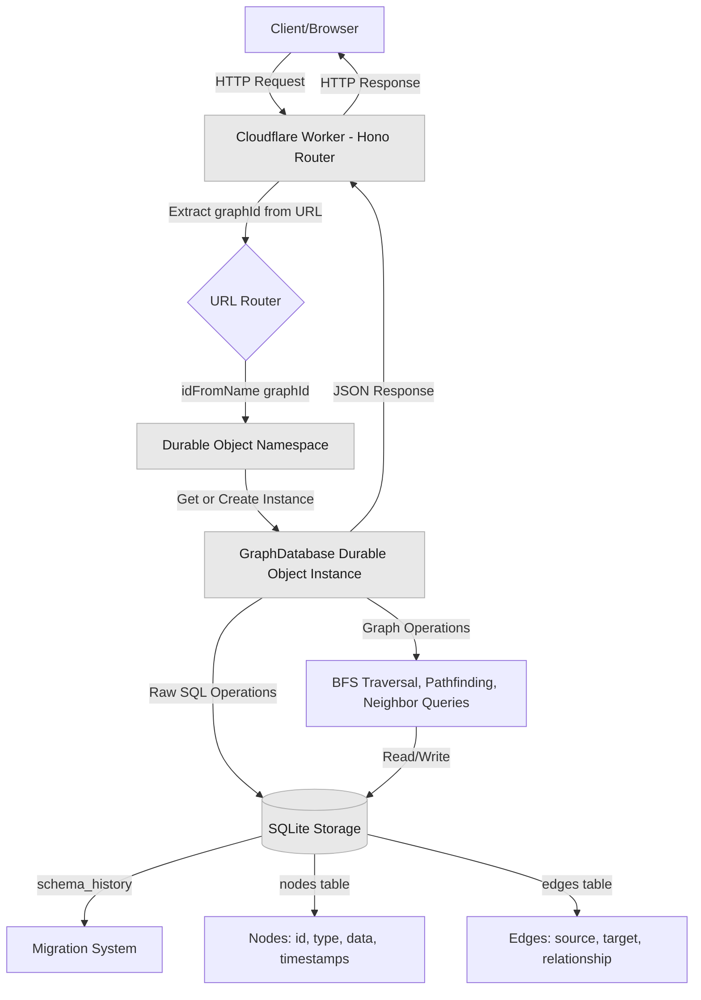

The complete source code is available on [GitHub](https://github.com/boristane/cloudflare-dev-101/tree/main/durable-objects-graph-database). I suggest following along with the code for reference.

## Setting Up the Worker

Let's start with the Worker configuration. Create a `wrangler.json` file:

```json
{
  "name": "durable-objects-graph-database",
  "compatibility_date": "2025-10-27",
  "workers_dev": true,
  "main": "./src/index.ts",
  "assets": {
    "directory": "./web",
    "binding": "ASSETS"
  },
  "migrations": [
    {
      "new_sqlite_classes": ["GraphDatabase"],
      "tag": "v1"
    }
  ],
  "durable_objects": {
    "bindings": [
      {
        "name": "GraphDatabase",
        "class_name": "GraphDatabase"
      }
    ]
  }
}
```

The `new_sqlite_classes` migration is crucial. It enables [SQLite storage](https://developers.cloudflare.com/durable-objects/api/sqlite-storage-api/) in your Durable Objects. Without this, your Durable Objects will not have a SQLite database attached.

The [`assets` configuration](https://developers.cloudflare.com/workers/static-assets/) serves a web interface directly from the Worker, enabling us to visualise our graph databases.

## Building the Graph Database Durable Object

The `GraphDatabase` Durable Object implements the graph database. It's a class extending the `DurableObject` class. It encapsulates all graph operations and manages its own SQLite database.

### Schema Design

[Graph databases](https://en.wikipedia.org/wiki/Graph_database) are different from traditional relational databases. Instead of thinking in individual tables with joins, you think in **nodes** (entities) and **edges** (relationships).

#### Understanding Nodes and Edges

Imagine modeling an organization:

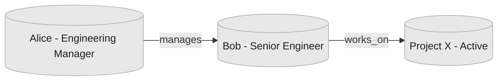

**Nodes** are the "things": Alice, Bob, and Project X. Each node has:
- An **ID** (unique identifier)
- A **type** (person, project, document, etc.)
- **Data** (arbitrary JSON properties like name, role, status)

**Edges** are the connections: "Alice manages Bob" and "Bob works on Project X". Each edge has:
- A **source** (where the edge starts)
- A **target** (where the edge ends)
- A **relationship** (what type of connection this is)
- Optional **properties** (metadata about the relationship)

The power comes from traversing these relationships. To answer "what projects does Alice's team work on?", you traverse: Alice → manages → Bob → works_on → Project X.

#### The Schema

Here's how we model this in SQLite:

```sql title="migrations/v00_add_graph_tables.ts"
CREATE TABLE IF NOT EXISTS nodes (
    id TEXT PRIMARY KEY,            -- Unique identifier (e.g., "alice", "project-x")
    type TEXT NOT NULL,             -- Category (e.g., "person", "project")
    data TEXT NOT NULL,             -- JSON blob: {"name": "Alice", "role": "Manager"}
    created_by TEXT NOT NULL,       -- Who created this node
    last_edited_by TEXT NOT NULL,   -- Who last modified it
    updated INTEGER NOT NULL,       -- Last update timestamp (ms since epoch)
    created INTEGER NOT NULL        -- Creation timestamp (ms since epoch)
);

CREATE TABLE IF NOT EXISTS edges (
    source TEXT NOT NULL,           -- Source node ID
    target TEXT NOT NULL,           -- Target node ID
    relationship TEXT NOT NULL,     -- Relationship type (e.g., "manages", "works_on")
    properties TEXT,                -- Optional JSON: {"since": "2024", "hours": 40}
    created_by TEXT NOT NULL,
    last_edited_by TEXT NOT NULL,
    updated INTEGER NOT NULL,
    created INTEGER NOT NULL,
    UNIQUE(source, target, relationship)  -- Prevents duplicate edges
);
```

#### Why This Design Works

**Flexible Node Storage**: The `data` field stores JSON as text. This means different node types can have completely different properties:

```json
// Person node
{"name": "Alice", "role": "Engineering Manager", "email": "alice@example.com"}

// Project node
{"name": "Project X", "status": "active", "deadline": "2025-12-31"}

// Document node
{"title": "Architecture Doc", "url": "https://...", "embedding": [...]}
```

You don't need to alter the schema when adding new node types or properties. Just store different JSON.

**Multi-Relationship Support**: The `UNIQUE(source, target, relationship)` constraint ensures the uniqueness of relationships between nodes, and enables multiple relationship types between the same two nodes:

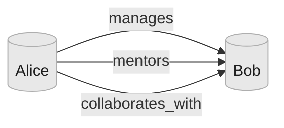

Alice can simultaneously manage, mentor, and collaborate with Bob. Each is a separate edge with a different `relationship` value.

**Directional Relationships**: Edges have direction. "Alice manages Bob" is different from "Bob manages Alice". The `source` and `target` fields encode this direction:

For bidirectional relationships (like "friends_with"), you create two edges:

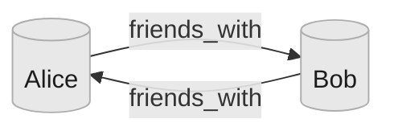

**Indexes**: We add indexes to improve query performance:

```sql
CREATE INDEX edges_source_idx ON edges(source);  -- Fast outbound queries
CREATE INDEX edges_target_idx ON edges(target);  -- Fast inbound queries
CREATE INDEX nodes_type_idx ON nodes(type);      -- Filter by node type
```

When you ask "who does Alice manage?", the database uses `edges_source_idx` to quickly find all edges where `source = 'alice'`. Without this index, it would scan a large number of edge. Query performance would tank for large graphs.

Similarly, "who manages Alice?" uses `edges_target_idx` to find edges where `target = 'alice'`.

The `nodes_type_idx` lets you efficiently query "find all person nodes" or "find all projects" without scanning every node.

### Migration System

Durable Object provide a SQLite interface, but it's up to us to figure out a migration system. The database schema will evolve over time as our application evolves. The migration system is **idempotent** and **version-tracked**. Each Durable Object instance maintains its own migration state in a `schema_history` table.

The migration logic:

1. Create `schema_history` table if it doesn't exist
2. Compare current schema version with available migrations
3. Apply any pending migrations in order within a transaction
4. Record each migration in the history table

```typescript title="src/migrate.ts"
export function migrate(storage: DurableObjectStorage, migrations: SQLMigration[]) {
  createSchemaHistory(storage);
  const current = getSchema(storage);
  const toApply = migrations.filter((m) => m.version > (current?.version || -1));

  storage.transactionSync(() => {
    for (const migration of toApply) {
      storage.sql.exec(migration.sql);
      storage.sql.exec(
        "INSERT INTO schema_history (version, name) VALUES (?, ?)",
        migration.version, migration.name
      );
    }
  });
}
```

The [`transactionSync`](https://developers.cloudflare.com/durable-objects/api/sqlite-storage-api/#transactionsync) wrapper ensures atomicity; either all migrations succeed or none do. This prevents corrupted schema states if a migration fails partway through.

The migrations must run in the constructor of the Durable Object class. When a Durable Object receives a request, if it's not yet in memory on the Cloudflare network, it is initialised and the migrations run "just-in-time" for this given instance of the Durable Object class.

### Durable Object Implementation

Now let's implement the `GraphDatabase` class:

```typescript title="src/do.ts"
import { DurableObject } from "cloudflare:workers";
import type { Bindings } from "../bindings";
import { migrations } from "../migrations";
import { migrate } from "./migrate";

export class GraphDatabase extends DurableObject {
  private db: SqlStorage;

  constructor(ctx: DurableObjectState, env: Bindings) {
    super(ctx, env);
    this.db = ctx.storage.sql;

    this.ctx.blockConcurrencyWhile(async () => {
      migrate(ctx.storage, migrations);
    });
  }
}
```

The `blockConcurrencyWhile` ensures migrations complete before any other requests are processed. Without this, you could have race conditions where a request tries to query a table that doesn't exist yet.

### Node Operations

We need operations to create, read, update, and delete nodes. The key node methods in the `GraphDatabase` class are:

- **addNode()**: Creates or updates a node with JSON data stored as text
- **findNode()**: Retrieves a single node by its ID
- **findNodes()**: Lists nodes with optional filtering by type, a limit, and an offset
- **deleteNode()**: Removes a node and cascades to delete all connected edges, ensuring the integrity of the graph

```typescript title="src/do.ts"
addNode(node: InsertNode): Node {
  const { id, type, data, userId } = node;
  const result = this.db.exec(
    "INSERT OR REPLACE INTO nodes (...) VALUES (...) RETURNING *",
    id, type, JSON.stringify(data), userId, userId, Date.now(), Date.now()
  );

  return toNode(result.toArray()[0]);
}

findNode(id: string): Node | null {
  const result = this.db.exec("SELECT * FROM nodes WHERE id = ?", id);
  const res = result.toArray();
  if (!res.length) {
    return null;
  }

  const rows = res as Array<DBNode>;
  const row = rows[0];
  if (!row) return null;

  return toNode(row);
}

findNodes(filters?: { type?: string; limit?: number; offset?: number }): Node[] {
  let query = "SELECT * FROM nodes";
  const params: any[] = [];

  if (filters?.type) {
    query += " WHERE type = ?";
    params.push(filters.type);
  }

  if (filters?.limit) {
    query += " LIMIT ?";
    params.push(filters.limit);
  }

  if (filters?.offset) {
    query += " OFFSET ?";
    params.push(filters.offset);
  }

  const result = this.db.exec(query, ...params);
  const res = result.toArray();

  return res.map((row) => toNode(row as DBNode));
}

deleteNode(id: string): Node | null {
  // First delete all edges connected to this node
  this.db.exec("DELETE FROM edges WHERE source = ? OR target = ?", id, id);

  // Then delete the node
  const result = this.db.exec("DELETE FROM nodes WHERE id = ? RETURNING *", id);
  const res = result.toArray();
  if (!res.length) {
    return null;
  }

  const rows = res as Array<DBNode>;
  const row = rows[0];
  if (!row) return null;

  return toNode(row);
}
```

### Edge Operations

#### How Edges Work

Consider this scenario: you want to model how team members contribute to projects:

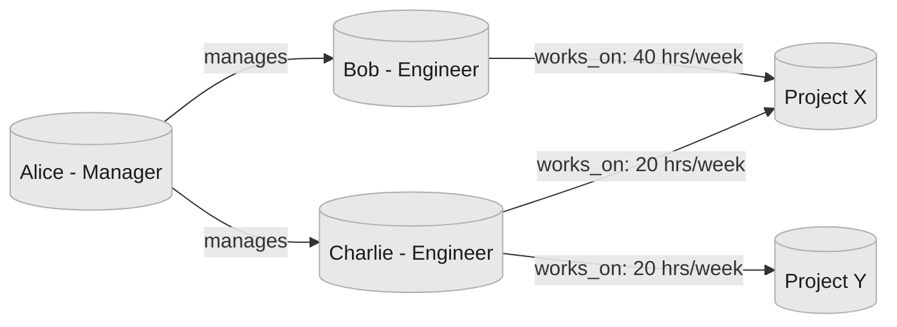

Each edge stores:

```typescript
// Bob works on Project X
{
  source: "bob",
  target: "project-x",
  relationship: "works_on",
  properties: { hours_per_week: 40, role: "lead" }
}

// Charlie works on Project X
{
  source: "charlie",
  target: "project-x",
  relationship: "works_on",
  properties: { hours_per_week: 20, role: "contributor" }
}
```

Notice how the same relationship type (`works_on`) can have different properties. This lets you capture nuance, both Bob and Charlie work on Project X, but with different time commitments and roles.

#### The Composite Key Pattern

The `UNIQUE(source, target, relationship)` constraint is fundamental to the design. It means:

- Alice can both "manages" and "mentors" Bob (different relationships)
- Alice can "manages" both Bob and Charlie (different targets)
- Alice "manages" Bob can't be inserted twice (duplicate prevented)

```typescript
// First call: creates the edge
await connectNodes({
  source: "bob",
  target: "project-x",
  relationship: "works_on",
  properties: { hours_per_week: 30 }
});

// Second call: updates the same edge (changes hours from 30 to 40)
await connectNodes({
  source: "bob",
  target: "project-x",
  relationship: "works_on",
  properties: { hours_per_week: 40 }
});
```

#### Edge Methods

The core edge operations are:

**connectNodes()** - Creates or updates an edge:
```typescript
const edge = await stub.connectNodes({
  source: "alice",
  target: "bob",
  relationship: "manages",
  properties: { since: "2024-01-15", team: "engineering" },
  userId: "system"
});
```

**disconnectNodes()** - Removes a specific edge:
```typescript
// Remove the "manages" relationship (other relationships remain)
await stub.disconnectNodes("alice", "bob", "manages");
```

**findEdges()** - Query edges by node or relationship:
```typescript
// Find all edges connected to Bob (any direction)
const bobEdges = await stub.findEdges({ nodeId: "bob" });

// Find all "manages" relationships in the graph
const managesEdges = await stub.findEdges({ relationship: "manages" });
```

#### Edge Properties: When to Use Them

Some relationships are simple facts ("knows", "contains", "references"). Others carry context that's essential to understanding the relationship:

```typescript
// Simple edge - no properties needed
{ source: "doc-1", target: "doc-2", relationship: "references" }

// Rich edge - properties add crucial context
{
  source: "alice",
  target: "project-x",
  relationship: "contributed_to",
  properties: {
    role: "architect",
    startDate: "2024-01-01",
    endDate: "2024-06-30",
    linesOfCode: 15420,
    commits: 247
  }
}
```

The flexibility to add properties without schema changes lets you evolve your data model. You can start with simple edges and enrich them later as you discover what metadata matters.

### Graph Traversal

Graph traversal enables your to explore relationships and answer questions like "how are these two entities connected?" or "what's reachable from this starting point?"

#### Directional Queries

The `findNeighbors()` method finds all nodes directly connected to a given node. Direction matters:

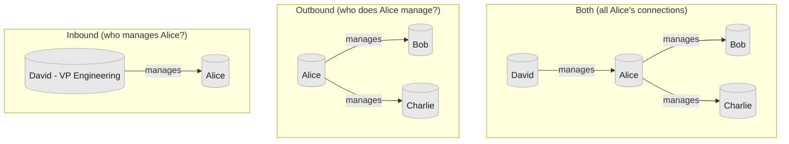

Directional queries are lets you model asymmetric relationships. "Alice manages Bob" is directional, the reverse isn't automatically true.

```typescript title="src/do.ts"
findNeighbors(
  nodeId: string,
  direction: "inbound" | "outbound" | "both" = "both"
): string[] {
  let query: string;
  const params: string[] = [];

  switch (direction) {
    case "inbound":
      query = "SELECT DISTINCT source AS neighbor FROM edges WHERE target = ?";
      params.push(nodeId);
      break;
    case "outbound":
      query = "SELECT DISTINCT target AS neighbor FROM edges WHERE source = ?";
      params.push(nodeId);
      break;
    case "both":
    default:
      query = `
        SELECT DISTINCT target AS neighbor FROM edges WHERE source = ?
        UNION
        SELECT DISTINCT source AS neighbor FROM edges WHERE target = ?
      `;
      params.push(nodeId, nodeId);
      break;
  }

  const result = this.db.exec(query, ...params);
  const res = result.toArray();
  return res.map((row) => (row as { neighbor: string }).neighbor);
}
```

#### Breadth-First Search (BFS)

The `traverse()` method implements [breadth-first search](https://en.wikipedia.org/wiki/Breadth-first_search) to explore the graph layer by layer. BFS guarantees finding the **shortest path** between two nodes.

Here's how BFS explores a graph starting from Alice:

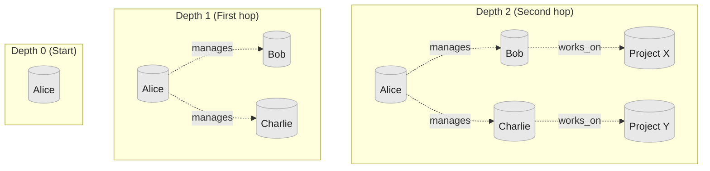

BFS visits all nodes at depth 1 before moving to depth 2. This guarantees the first path found to any node is the shortest.

**Pathfinding Example**: "How is Alice connected to Project X?"
- Depth 0: Start at Alice
- Depth 1: Explore Bob and Charlie (Alice's direct reports)
- Depth 2: Find Project X through Bob
- Result: Alice → manages → Bob → works_on → Project X (2 hops)

Even if there's a longer path (Alice → manages → Charlie → collaborates_with → Bob → works_on → Project X), BFS finds the shorter one first.

The traversal operates in two modes:

1. **Pathfinding Mode** (when `endNodeId` is specified): Find the shortest path from start to end node
2. **Reachability Mode** (when `endNodeId` is omitted): Find all nodes reachable within `maxDepth` hops


```typescript title="src/do.ts"
traverse(startNodeId: string, options = {}) {
  const { endNodeId, maxDepth = 50, direction = "both" } = options;
  const visited = new Set<string>();
  const queue = [{ id: startNodeId, path: [startNodeId], depth: 0 }];

  while (queue.length > 0) {
    const current = queue.shift()!;
    if (current.depth > maxDepth) continue;

    // Pathfinding: stop when target found
    if (endNodeId && current.id === endNodeId) {
      return { found: true, path: current.path, depth: current.depth };
    }

    if (visited.has(current.id)) continue;
    visited.add(current.id);

    // Explore neighbors
    const neighbors = this.findNeighbors(current.id, direction);
    for (const neighborId of neighbors) {
      if (!visited.has(neighborId)) {
        queue.push({
          id: neighborId,
          path: [...current.path, neighborId],
          depth: current.depth + 1,
        });
      }
    }
  }

  // Reachability: return all visited nodes
  return { found: true, reachableNodes: Array.from(visited), count: visited.size };
}
```

In a highly connected graph (think social networks where most people are connected within 6 degrees), an unbounded traversal could visit the entire graph. By limiting depth through `maxDepth`, you can explore local neighborhoods without scanning millions of nodes.

The algorithm maintains a `visited` set to avoid cycles. Without this, you could loop indefinitely in a graph with circular references (A → B → C → A).

## Building the HTTP API

Now let's expose these operations through an HTTP API. We'll use Hono for routing:

```typescript title="src/index.ts"
import { Hono } from "hono";
import { cors } from "hono/cors";
import type { Bindings } from "../bindings";

const app = new Hono<{ Bindings: Bindings }>();

app.use("/*", cors());

export default {
  async fetch(request: Request, env: Bindings, ctx: ExecutionContext): Promise<Response> {
    const url = new URL(request.url);

    if (url.pathname.startsWith("/api/")) {
      const apiRequest = new Request(request.url.replace("/api", ""), request);
      return app.fetch(apiRequest, env, ctx);
    }

    return env.ASSETS.fetch(request);
  },
};

export { GraphDatabase } from "./do";

function getGraphDatabaseStub(env: Bindings, graphId: string) {
  const doId = env.GraphDatabase.idFromName(graphId);
  return env.GraphDatabase.get(doId);
}
```

The routing is clean: `/api/*` goes to our Hono app, everything else is served from static assets for a simple web interface to visualise the graph.

The `getGraphDatabaseStub` function uses [`idFromName(graphId)`](https://developers.cloudflare.com/durable-objects/api/namespace/#idfromname) to get a unique ID from the graphId, and creates a [stub](https://developers.cloudflare.com/durable-objects/api/namespace/#get) which can be used to invoke methods on the associated Durable Object. This is the foundation of the multi-tenancy model:

- Same input (`"user-123-graph"`) → Same Durable Object ID → Same instance
- Different input (`"user-456-graph"`) → Different ID → Different instance
- No coordination needed; the `idFromName` guarantees deterministic routing

You don't need a lookup table mapping tenant IDs to Durable Object IDs.

### API Endpoints

Every endpoint extracts `graphId` from the URL path, making multi-tenancy explicit in the URL structure:

```
/api/alice-graph/nodes      # Alice's graph
/api/bob-graph/nodes        # Bob's graph
/api/project-x/nodes        # Project X's graph
```

**Node Operations:**
- `POST /:graphId/nodes` - Create or update a node
- `GET /:graphId/nodes/:nodeId` - Retrieve a specific node
- `GET /:graphId/nodes?type=&limit=&offset=` - List nodes with filtering
- `DELETE /:graphId/nodes/:nodeId` - Delete node and connected edges

**Edge Operations:**
- `POST /:graphId/edges` - Create an edge between nodes
- `GET /:graphId/edges?nodeId=&relationship=` - Find edges by node or relationship
- `DELETE /:graphId/edges/:source/:relationship/:target` - Remove a specific edge

**Graph Operations:**
- `GET /:graphId/nodes/:nodeId/neighbors?direction=` - Find adjacent nodes
- `POST /:graphId/traverse` - Execute BFS pathfinding or reachability analysis
- `GET /:graphId/stats` - Get graph metrics (node count, edge count, type distributions)

Each endpoint follows the same pattern: extract the `graphId`, get the Durable Object stub, call the method, return JSON.

```typescript title="src/index.ts"
app.post("/:graphId/nodes", async (c) => {
  const graphId = c.req.param("graphId");
  const body = await c.req.json<InsertNode>();
  const stub = getGraphDatabaseStub(c.env, graphId);
  const node = await stub.addNode(body);
  return c.json({ node });
});
```

No shared tables, no tenant ID columns in queries. Different graphs queries are routed to different Durable Object instances.

## Interactive Graph Visualization

I also vibe-coded a simple UI to visualise the state of the graph, hosted on the same Worker as the HTTP API.

## Testing It Out

Let's deploy and test our graph database using [Wrangler](https://developers.cloudflare.com/workers/wrangler/):

```bash
npm run deploy
```

Wrangler will build your TypeScript code, upload it to Cloudflare, and output your Worker URL:

```
https://durable-objects-graph-database.your-account.workers.dev
```

### Creating a Knowledge Graph

Let's build a simple organizational graph with people and projects:

```bash
# Create person nodes (Alice, Bob)
curl -X POST https://your-worker.workers.dev/api/my-org/nodes \
  -H "Content-Type: application/json" \
  -d '{
    "id": "alice",
    "type": "person",
    "data": {"name": "Alice", "role": "Engineering Manager"},
    "userId": "system"
  }'

curl -X POST https://your-worker.workers.dev/api/my-org/nodes \
  -H "Content-Type: application/json" \
  -d '{
    "id": "bob",
    "type": "person",
    "data": {"name": "Bob", "role": "Senior Engineer"},
    "userId": "system"
  }'

# Create a project node
curl -X POST https://your-worker.workers.dev/api/my-org/nodes \
  -H "Content-Type: application/json" \
  -d '{
    "id": "project-x",
    "type": "project",
    "data": {"name": "Project X", "status": "active"},
    "userId": "system"
  }'

# Add relationships: Alice manages Bob, Bob works on Project X
curl -X POST https://your-worker.workers.dev/api/my-org/edges \
  -H "Content-Type: application/json" \
  -d '{
    "source": "alice",
    "target": "bob",
    "relationship": "manages",
    "userId": "system"
  }'

curl -X POST https://your-worker.workers.dev/api/my-org/edges \
  -H "Content-Type: application/json" \
  -d '{
    "source": "bob",
    "target": "project-x",
    "relationship": "works_on",
    "properties": {"hours_per_week": 40},
    "userId": "system"
  }'
```

### Querying the Graph

Now let's explore the graph:

```bash
# Find everyone Alice manages
curl https://your-worker.workers.dev/api/my-org/nodes/alice/neighbors?direction=outbound

# Response:
# {
#   "neighbors": ["bob"],
#   "count": 1
# }

# Find who's working on Project X
curl https://your-worker.workers.dev/api/my-org/nodes/project-x/neighbors?direction=inbound

# Response:
# {
#   "neighbors": ["bob"],
#   "count": 1
# }

# Find the path from Alice to Project X
curl -X POST https://your-worker.workers.dev/api/my-org/traverse \
  -H "Content-Type: application/json" \
  -d '{
    "startNodeId": "alice",
    "endNodeId": "project-x",
    "maxDepth": 5
  }'

# Response:
# {
#   "found": true,
#   "path": ["alice", "bob", "project-x"],
#   "depth": 2
# }
```

The traversal found a path: Alice → Bob → Project X. This shows the connection between a manager and a project through the people she manages.

### Multi-Tenancy in Action

Creating multiple graphs is as simple as making HTTP calls:

```bash
# Create a node in Alice's personal graph
curl -X POST https://your-worker.workers.dev/api/alice-personal/nodes \
  -H "Content-Type: application/json" \
  -d '{
    "id": "note-1",
    "type": "note",
    "data": {"content": "Remember to review PRs"},
    "userId": "alice"
  }'

# Create a node in the company graph
curl -X POST https://your-worker.workers.dev/api/company-wide/nodes \
  -H "Content-Type: application/json" \
  -d '{
    "id": "policy-1",
    "type": "policy",
    "data": {"title": "Remote Work Policy"},
    "userId": "hr"
  }'
```

These are completely isolated. A query on "alice-personal" will never see "company-wide" data. Each has its own Durable Object instance with its own SQLite database.

## Use Cases

I'm particularly interested in AI agent uses cases.

### AI Agent Memory

AI agents need persistent memory to build context over time and understand complex relationships. Traditional approaches use vector databases for semantic search, but graph databases excel at representing how concepts, entities, and conversations interconnect.

#### The Problem with Context-Only Memory

When an AI agent remembers only through vector similarity, it loses the **structure** of relationships. Consider this scenario:

An AI assistant named Alice helps a user with their work. Over multiple conversations, the user mentions:
- They're working on "Project X" (a web app)
- They're collaborating with "Bob" (the designer)
- "Project X" has a deadline of March 1st
- Bob is on vacation until February 20th

A vector database might retrieve "Bob" when the user asks about the deadline, but it can't easily answer "Who on my team is available to help before the deadline?" That requires understanding the relationships: Project X → has_deadline → March 1st, Project X → involves → Bob, Bob → unavailable_until → February 20th.

#### Graph-Based Agent Memory

With a graph database, each agent builds a knowledge graph that captures not just facts, but how they relate:

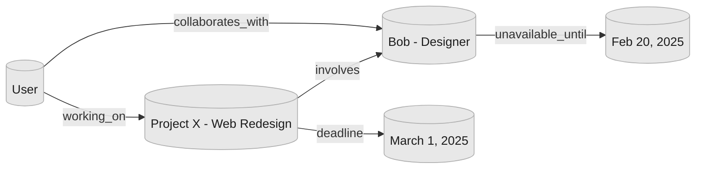

Here's how the agent builds this knowledge over time:

```typescript
// Conversation 1: User mentions they're working on a project
await fetch('/api/agent-alice/nodes', {
  method: 'POST',
  body: JSON.stringify({
    id: 'project-x',
    type: 'project',
    data: { name: 'Web Redesign', status: 'in_progress' },
    userId: 'agent-alice'
  })
});

await fetch('/api/agent-alice/edges', {
  method: 'POST',
  body: JSON.stringify({
    source: 'user',
    target: 'project-x',
    relationship: 'working_on',
    userId: 'agent-alice'
  })
});

// Conversation 2: User mentions Bob is helping with design
await fetch('/api/agent-alice/nodes', {
  method: 'POST',
  body: JSON.stringify({
    id: 'bob',
    type: 'person',
    data: { name: 'Bob', role: 'Designer' },
    userId: 'agent-alice'
  })
});

await fetch('/api/agent-alice/edges', {
  method: 'POST',
  body: JSON.stringify({
    source: 'project-x',
    target: 'bob',
    relationship: 'involves',
    userId: 'agent-alice'
  })
});

// Conversation 3: User mentions Bob's vacation
await fetch('/api/agent-alice/edges', {
  method: 'POST',
  body: JSON.stringify({
    source: 'bob',
    target: 'unavailable-period',
    relationship: 'unavailable_until',
    properties: { date: '2025-02-20' },
    userId: 'agent-alice'
  })
});
```

Now when the user asks "Is my team available to help me finish before the deadline?", the agent can traverse the graph:

```typescript
// Start from the user, explore their projects and collaborators
const context = await fetch('/api/agent-alice/traverse', {
  method: 'POST',
  body: JSON.stringify({
    startNodeId: 'user',
    maxDepth: 3,  // Explore up to 3 hops away
    direction: 'both'
  })
});

// Returns: User → Project X → Bob → Unavailable Until Feb 20
// Agent can reason: "Bob won't be available until Feb 20, but your deadline is March 1,
// so you'll have 9 days to work together"
```

#### Why This Works

Each agent gets its own graph (`/api/agent-alice/`, `/api/agent-bob/`). As the agent has more conversations, the graph grows organically:

- **Conversations** link to **Topics** they discuss
- **Topics** link to **Projects**, **People**, **Deadlines**
- **Projects** link to **Tasks**, **Documents**, **Decisions**
- **People** link to **Skills**, **Availability**, **Preferences**

The graph becomes a structure memory layer that captures not just what the agent knows, but how concepts interconnect. When recalling context, traversal provides the most relevant connected information, not just similar words, but structurally related concepts.

### Graph-RAG Systems

Retrieval-Augmented Generation (RAG) enhances LLMs by providing relevant context from external knowledge bases. Graph-based RAG goes beyond simple vector similarity by modeling relationships between documents, entities, and concepts. Store document chunks and their relationships for more intelligent retrieval. 

## Limitations and Considerations

While this pattern is powerful, there are important limitations to understand:

1. **Scale per Graph**: Each Durable Object instance is limited to 10 GB, as such is best suited for graphs with thousands to tens of thousands of nodes. For larger graphs, consider sharding.

2. **Cross-Graph Queries**: You can't easily query across multiple graphs. Each Durable Object is isolated. If you need to aggregate data from multiple tenants, you'll need to query each graph individually.

3. **Cold Start Latency**: The first request to a new Durable Object has some initialization overhead. For frequently accessed graphs this isn't an issue, but rarely-used graphs might experience slightly higher latency on first access.

4. **Global Consistency**: Durable Objects provide strong consistency within a single instance but don't offer distributed transactions across instances. If you need atomicity across multiple graphs, you'll need to implement your own coordination.

5. **Backup and Export**: There's no built-in backup system. For production use, you'll want to implement periodic exports of graph data to durable storage like [Cloudflare R2](https://developers.cloudflare.com/r2/).

## What's Next

This foundation enables many extensions:

- **Full-Text Search**: Add [SQLite FTS5](https://www.sqlite.org/fts5.html) virtual tables for text search within node and edge properties

- **Complex nested queries**: Add the ability to run more complex queries on the JSON data of nodes and edges using [SQLite json_tree](https://sqlite.org/json1.html#jtree) functions

- **Graph Algorithms**: Implement [PageRank](https://en.wikipedia.org/wiki/PageRank), [community detection](https://en.wikipedia.org/wiki/Community_structure), or [centrality metrics](https://en.wikipedia.org/wiki/Centrality) for graph analysis

- **Graph Embeddings**: Store vector embeddings on nodes using [Cloudflare Vectorize](https://developers.cloudflare.com/vectorize/) for hybrid graph + semantic similarity search

- **Batch Operations**: Add endpoints for bulk node/edge creation and updates to improve performance for large imports

The complete source code with a visualization UI is available on [GitHub](https://github.com/boristane/cloudflare-dev-101/tree/main/durable-objects-graph-database). Fork it and build something interesting.

## Conclusion

Durable Objects flip the traditional database model on its head. Instead of managing infrastructure and partitioning data, you create instances on demand. Each instance is a complete, isolated database with its own storage and compute.

With SQLite storage, migrations, and proper schema design, each instance becomes a fully-featured database that happens to run at the edge.

This pattern works for graphs, but it generalizes to any domain where you need isolated per-tenant data stores. Document databases, time-series data, etc; the architecture is the same.
````

## File: src/content/blog/how-I-use-claude-code.mdx
````markdown
---
title: "How I Use Claude Code"
description: The research-plan-implement workflow I use to build software with Claude Code, and why I never let it write code until I've approved a written plan.
date: 2026-02-11
tags:
  - agents
  - sdlc
---

import BlogImage from '../../components/BlogImage.astro';

I've been using [Claude Code](https://docs.anthropic.com/en/docs/claude-code) as my primary development tool for approx 9 months, and the workflow I've settled into is radically different from what most people do with AI coding tools. Most developers type a prompt, sometimes use plan mode, fix the errors, repeat. The more terminally online are stitching together ralph loops, mcps, gas towns (remember those?), etc. The results in both cases are a mess that completely falls apart for anything non-trivial.

The workflow I'm going to describe has one core principle: **never let Claude write code until you've reviewed and approved a written plan**. This separation of planning and execution is the single most important thing I do. It prevents wasted effort, keeps me in control of architecture decisions, and produces significantly better results with minimal token usage than jumping straight to code.

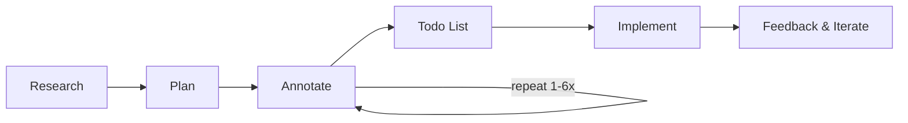

## Phase 1: Research

Every meaningful task starts with a deep-read directive. I ask Claude to thoroughly understand the relevant part of the codebase before doing anything else. And I always require the findings to be written into a persistent markdown file, never just a verbal summary in the chat.


> read this folder in depth, understand how it works deeply, what it does and all its specificities. when that's done, write a detailed report of your learnings and findings in research.md

> study the notification system in great details, understand the intricacies of it and write a detailed research.md document with everything there is to know about how notifications work

> go through the task scheduling flow, understand it deeply and look for potential bugs. there definitely are bugs in the system as it sometimes runs tasks that should have been cancelled. keep researching the flow until you find all the bugs, don't stop until all the bugs are found. when you're done, write a detailed report of your findings in research.md

Notice the language: **"deeply"**, **"in great details"**, **"intricacies"**, **"go through everything"**. This isn't fluff. Without these words, Claude will skim. It'll read a file, see what a function does at the signature level, and move on. You need to signal that surface-level reading is not acceptable.

The written artifact (`research.md`) is critical. It's not about making Claude do homework. It's my review surface. I can read it, verify Claude actually understood the system, and correct misunderstandings before any planning happens. If the research is wrong, the plan will be wrong, and the implementation will be wrong. Garbage in, garbage out.

This is the most expensive failure mode with AI-assisted coding, and it's not wrong syntax or bad logic. It's implementations that work in isolation but break the surrounding system. A function that ignores an existing caching layer. A migration that doesn't account for the ORM's conventions. An API endpoint that duplicates logic that already exists elsewhere. The research phase prevents all of this.

## Phase 2: Planning

Once I've reviewed the research, I ask for a detailed implementation plan in a separate markdown file.


> I want to build a new feature \<name and description> that extends the system to perform \<business outcome>. write a detailed plan.md document outlining how to implement this. include code snippets

> the list endpoint should support cursor-based pagination instead of offset. write a detailed plan.md for how to achieve this. read source files before suggesting changes, base the plan on the actual codebase

The generated plan always includes a detailed explanation of the approach, code snippets showing the actual changes, file paths that will be modified, and considerations and trade-offs.

I use my own `.md` plan files rather than Claude Code's built-in plan mode. The built-in plan mode sucks. My markdown file gives me full control. I can edit it in my editor, add inline notes, and it persists as a real artifact in the project.

**One trick I use constantly:** for well-contained features where I've seen a good implementation in an open source repo, I'll share that code as a reference alongside the plan request. If I want to add sortable IDs, I paste the ID generation code from a project that does it well and say "this is how they do sortable IDs, write a plan.md explaining how we can adopt a similar approach." Claude works dramatically better when it has a concrete reference implementation to work from rather than designing from scratch.

But the plan document itself isn't the interesting part. The interesting part is what happens next.

## The Annotation Cycle

This is the most distinctive part of my workflow, and the part where I add the most value.

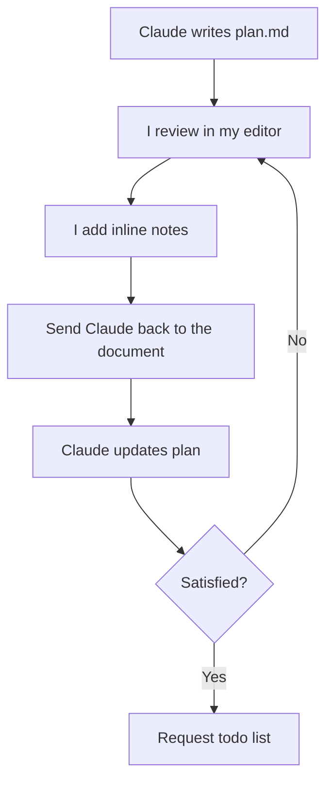

After Claude writes the plan, I open it in my editor and **add inline notes directly into the document**. These notes correct assumptions, reject approaches, add constraints, or provide domain knowledge that Claude doesn't have.

The notes vary wildly in length. Sometimes a note is two words: "not optional" next to a parameter Claude marked as optional. Other times it's a paragraph explaining a business constraint or pasting a code snippet showing the data shape I expect.

Some real examples of notes I'd add:

- *"use drizzle:generate for migrations, not raw SQL"* -- domain knowledge Claude doesn't have
- *"no -- this should be a PATCH, not a PUT"* -- correcting a wrong assumption
- *"remove this section entirely, we don't need caching here"* -- rejecting a proposed approach
- *"the queue consumer already handles retries, so this retry logic is redundant. remove it and just let it fail"* -- explaining why something should change
- *"this is wrong, the visibility field needs to be on the list itself, not on individual items. when a list is public, all items are public. restructure the schema section accordingly"* -- redirecting an entire section of the plan

Then I send Claude back to the document:

> I added a few notes to the document, address all the notes and update the document accordingly. don't implement yet

**This cycle repeats 1 to 6 times.** The explicit **"don't implement yet"** guard is essential. Without it, Claude will jump to code the moment it thinks the plan is good enough. It's not good enough until I say it is.

### Why This Works So Well

The markdown file acts as **shared mutable state** between me and Claude. I can think at my own pace, annotate precisely where something is wrong, and re-engage without losing context. I'm not trying to explain everything in a chat message. I'm pointing at the exact spot in the document where the issue is and writing my correction right there.

This is fundamentally different from trying to steer implementation through chat messages. The plan is a structured, complete specification I can review holistically. A chat conversation is something I'd have to scroll through to reconstruct decisions. The plan wins every time.

Three rounds of "I added notes, update the plan" can transform a generic implementation plan into one that fits perfectly into the existing system. Claude is excellent at understanding code, proposing solutions, and writing implementations. But it doesn't know my product priorities, my users' pain points, or the engineering trade-offs I'm willing to make. The annotation cycle is how I inject that judgement.

### The Todo List

Before implementation starts, I always request a granular task breakdown:

> add a detailed todo list to the plan, with all the phases and individual tasks necessary to complete the plan - don't implement yet


This creates a checklist that serves as a progress tracker during implementation. Claude marks items as completed as it goes, so I can glance at the plan at any point and see exactly where things stand. Especially valuable in sessions that run for hours.

## Phase 3: Implementation

When the plan is ready, I issue the implementation command. I've refined this into a standard prompt I reuse across sessions:

> implement it all. when you're done with a task or phase, mark it as completed in the plan document. do not stop until all tasks and phases are completed. do not add unnecessary comments or jsdocs, do not use any or unknown types. continuously run typecheck to make sure you're not introducing new issues.

This single prompt encodes everything that matters:

- *"implement it all"*: do everything in the plan, don't cherry-pick
- *"mark it as completed in the plan document"*: the plan is the source of truth for progress
- *"do not stop until all tasks and phases are completed"*: don't pause for confirmation mid-flow
- *"do not add unnecessary comments or jsdocs"*: keep the code clean
- *"do not use any or unknown types"*: maintain strict typing
- *"continuously run typecheck"*: catch problems early, not at the end

I use this exact phrasing (with minor variations) in virtually every implementation session. By the time I say "implement it all," every decision has been made and validated. The implementation becomes mechanical, not creative. This is deliberate. **I want implementation to be boring**. The creative work happened in the annotation cycles. Once the plan is right, execution should be straightforward.

Without the planning phase, what typically happens is Claude makes a reasonable-but-wrong assumption early on, builds on top of it for 15 minutes, and then I have to unwind a chain of changes. The "don't implement yet" guard eliminates this entirely.

## Feedback During Implementation

Once Claude is executing the plan, my role shifts from architect to supervisor. My prompts become dramatically shorter.

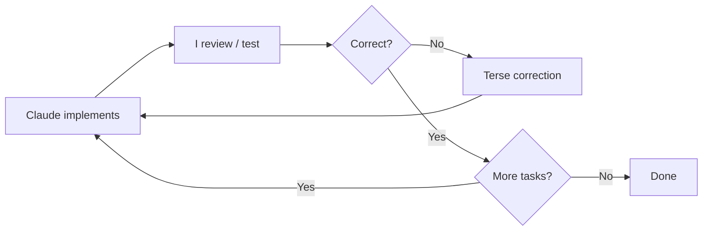

Where a planning note might be a paragraph, an implementation correction is often a single sentence:
- *"You didn't implement the `deduplicateByTitle` function."*
- *"You built the settings page in the main app when it should be in the admin app, move it."*

Claude has the full context of the plan and the ongoing session, so terse corrections are enough.

Frontend work is the most iterative part. I test in the browser and fire off rapid corrections:
- *"wider"*
- *"still cropped"*
- *"there's a 2px gap"*

For visual issues, I sometimes attach screenshots. A screenshot of a misaligned table communicates the problem faster than describing it.

I also reference existing code constantly:
- *"this table should look exactly like the users table, same header, same pagination, same row density."*

This is far more precise than describing a design from scratch. Most features in a mature codebase are variations on existing patterns. A new settings page should look like the existing settings pages. Pointing to the reference communicates all the implicit requirements without spelling them out. Claude would typically read the reference file(s) before making the correction.

When something goes in a wrong direction, I don't try to patch it. I revert and re-scope by discarding the git changes:
- *"I reverted everything. Now all I want is to make the list view more minimal -- nothing else."*

Narrowing scope after a revert almost always produces better results than trying to incrementally fix a bad approach.

## Staying in the Driver's Seat

Even though I delegate execution to Claude, **I never give it total autonomy over what gets built**. I do the vast majority of the active steering in the `plan.md` documents.

This matters because Claude will sometimes propose solutions that are technically correct but wrong for the project. Maybe the approach is over-engineered, or it changes a public API signature that other parts of the system depend on, or it picks a more complex option when a simpler one would do. I have context about the broader system, the product direction, and the engineering culture that Claude doesn't.

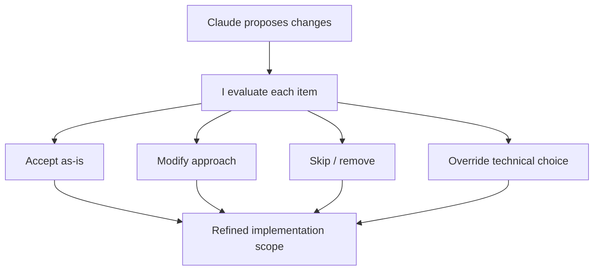

**Cherry-picking from proposals:** When Claude identifies multiple issues, I go through them one by one: *"for the first one, just use Promise.all, don't make it overly complicated; for the third one, extract it into a separate function for readability; ignore the fourth and fifth ones, they're not worth the complexity."* I'm making item-level decisions based on my knowledge of what matters right now.

**Trimming scope:** When the plan includes nice-to-haves, I actively cut them. *"remove the download feature from the plan, I don't want to implement this now."* This prevents scope creep.

**Protecting existing interfaces:** I set hard constraints when I know something shouldn't change: *"the signatures of these three functions should not change, the caller should adapt, not the library."*

**Overriding technical choices:** Sometimes I have a specific preference Claude wouldn't know about: *"use this model instead of that one"* or *"use this library's built-in method instead of writing a custom one."* Fast, direct overrides.

Claude handles the mechanical execution, while I make the judgement calls. The plan captures the big decisions upfront, and selective guidance handles the smaller ones that emerge during implementation.

## Single Long Sessions

I run research, planning, and implementation in a **single long session** rather than splitting them across separate sessions. A single session might start with deep-reading a folder, go through three rounds of plan annotation, then run the full implementation, all in one continuous conversation.

I am not seeing the performance degradation everyone talks about after 50% context window. Actually, by the time I say "implement it all," Claude has spent the entire session building understanding: reading files during research, refining its mental model during annotation cycles, absorbing my domain knowledge corrections.

When the context window fills up, Claude's auto-compaction maintains enough context to keep going. And the plan document, the persistent artifact, survives compaction in full fidelity. I can point Claude to it at any point in time.

## The Workflow in One Sentence

Read deeply, write a plan, annotate the plan until it's right, then let Claude execute the whole thing without stopping, checking types along the way.

That's it. No magic prompts, no elaborate system instructions, no clever hacks. Just a disciplined pipeline that separates thinking from typing. The research prevents Claude from making ignorant changes. The plan prevents it from making wrong changes. The annotation cycle injects my judgement. And the implementation command lets it run without interruption once every decision has been made.

Try my workflow, you'll wonder how you ever shipped anything with coding agents without an annotated plan document sitting between you and the code.
````

## File: src/content/blog/learnings-from-starting-building-and-exiting-a-devtools-startup.mdx
````markdown
---
title: Lessons from starting, building, and exiting a devtools startup
description: Key learnings from building Baselime
date: 2024-06-08
tags:
  - startup
---

I started [Baselime](https://baselime.io), an observability startup, in October 2021. 2.5 years later [we joined Cloudflare](https://assets/blog.cloudflare.com/cloudflare-acquires-baselime-expands-observability-capabilities). I was a first-time solo founder and I made more mistakes than I could count. 

In this post, I'm reflecting on my time leading Baselime. I believe it will resonate with technical founders currently building or considering building similar companies. It focuses on early-stage, pre- Product Market Fit (PMF) developer tooling or infrastructure startups. I'll refrain from typical advice such as "build a strong team", or "build something people want", smarter people already [wrote about this](https://www.paulgraham.com/articles.html) extensively.

## Be obsessed with finding Product Market Fit

Your one and only mission as an early-stage founder is to [find Product Market Fit](https://www.sequoiacap.com/article/pmf-framework/) as quickly as possible. Nothing else matters.

It's extremely easy to focus on software architecture, clean code, tests, scalability, refactoring, etc.

These things don't matter.


I can hear you thinking that your startup is different and you need scalability from day 1. You're wrong. Your solution will evolve. Obviously, it's easier to evolve if the foundations are solid, but that's assuming the solid foundations you're building are for the right thing. Your early thesis about the world is most likely incorrect and you'll have to adjust.

I spent too much time building the foundations for "[Observability as Code](https://baselime.io/assets/blog/why-observability-as-code)". Imagine the best parts of CloudFormation and Terraform for observability: a CLI and a state management backend. Developers write multiple YAML files (with variables, interpolation, templates, etc.), the CLI combines them into a giant JSON file, uploads it to the backend which decides which resources (alerts, queries, dashboards, etc.) to create, edit or delete and the order of those operations.

Despite all the hours spent building, refining and improving this, nobody cared. I was more concerned about building an elegant solution than actually finding PMF. Don't do this. 

Instead, iterate fast, measure the result of your experiments, and if something doesn't work, throw it away and move on quickly. When you find what works, you'll refactor and improve.

## Better, faster, cheaper is not enough anymore

It's common startup wisdom that your solution should be [better, faster, cheaper](https://youtu.be/opkHJLVAM4A) than the competition. Whilst there's truth in this statement, in 2024 this is not enough anymore. Incumbents in the developer tools space iterate fast, and there are 5 new startups going after your market every quarter.

Instead, look for technological shifts and focus your efforts where you're a monopoly, rather than competing.


I started Baselime with a focus on observability for AWS Lambda. There was a consensus among our early users that [Baselime was better, faster and cheaper](https://x.com/patjakubik/status/1687204692915539970) than the competition. But this wasn't enough to stand out in a crowded space.

Until I noticed a massive segment where we could be a monopoly: the new developer platforms such as [Cloudflare](https://www.cloudflare.com/en-gb/developer-platform/), [Vercel](https://vercel.com), [Fly.io](https://fly.io), [Koyeb](https://www.koyeb.com/), [Render](https://render.com/), etc.

Within 1 week, we built a [Vercel integration](https://vercel.com/integrations/baselime) and instantly doubled our weekly active users. Likewise for our [Cloudflare integration](https://developers.cloudflare.com/workers/observability/baselime-integration/).


## Don't be stubborn

If something is not growing fast, drop it quickly and work on something else. There are no points for stubbornness, you're in a race against running out of money before PMF.

In April 2023, I spoke with the Cloudflare team about observability on the Workers platform, but we built our Cloudflare integration only 6 months later. It actually took only 1 week to build it.

Why wait 6 months to build something so obvious? 6 months is an eternity for an early-stage startup.

During this time, I pretended to "[focus on a single problem](https://paulgraham.com/startupideas.html)" to justify being stubborn on becoming the best observability platform for AWS Lambda. I ignored all market signals, both from developers and market research, telling me to shift my focus to an adjacent problem. Don't do this.


## Do things that don't scale, really

We're developers, we want to automate everything. But sometimes you've got to roll up your sleeves and do the tedious, unsexy but necessary work to grow.

We built sales automation and lead generation pipelines, but nothing worked. Our user growth was flat. Until I decided to ignore all the best practices and do what works for me, something I'll actually enjoy: personally message every developer with a slight interest in cloud computing I could find on Twitter. It was unglamorous, tedious, and monotonous, but it had to be done. This directly translated to signups, sales and referrals.

I should have done this months earlier.


## Create hype, don't be shy

[If you build it, they won't come](https://www.forbes.com/sites/georgedeeb/2013/11/06/if-you-build-it-they-may-not-come-budget-ahead-for-startup-marketing/). You must create hype around your product. Technical founders tend to view hype as a bad thing, used to sell snake oil.

When in fact, hype is a cheat code to get in the public awareness. Get developers to know your solution exists, its benefits and its limitations. It doesn't matter if they don't sign up today. Eventually (hopefully in the near future) they, or someone they know, will need to solve your problem and your solution should be the first they consider. Hype will get you there faster.

<blockquote class="twitter-tweet">
<p lang="en" dir="ltr">you thought we were done?<br /><br />distributed tracing for <a href="https://twitter.com/CloudflareDev?ref_src=twsrc%5Etfw">@CloudflareDev</a> with multi-cloud support <br /><br />- automatic correlation between logs and traces<br />- support for workers, kv, durable objects, queues<br/>- all powered by the <a href="https://twitter.com/baselimehq?ref_src=twsrc%5Etfw">@baselimehq</a> query engine<br/><br/>and this design 😍✨<br/><br/>my dms are open if… <a href="https://t.co/KcLZSr4DQP">pic.twitter.com/KcLZSr4DQP</a></p>&mdash; boris tane (@boristane) <a href="https://twitter.com/boristane/status/1717590624596083046?ref_src=twsrc%5Etfw">October 26, 2023</a>
</blockquote> <script async src="https://platform.twitter.com/widgets.js" charset="utf-8"></script>

## Get a side project

[I love building software](/projects). It's my main hobby. But building Baselime meant I didn't have a hobby anymore. I didn't have space to do this thing I love without the pressure of solving a problem for developers.

I kept shipping every day, but there are days I actually despised building software, I didn't want to build software but I had to.

Get a side project, where you can explore and build whatever random useless thing you want. Your overall happiness levels will thank you - building a startup is hard enough, don't go through it without hobbies :)

## Exiting a company is hard

If you thought starting a company is hard, try selling one.

Baselime was a pretty simple business when we joined Cloudflare. Just a few employees and our main assets were our IP. However, it still took quite a bit of work, from the negotiations phase to all the accounting and legal work involved.

The most difficult part was how nerve wracking it all was. I was a solo-founder and until Baselime, the most complex contracts I ever signed were tenancy agreements.

After 2 years of building and selling, Baselime was part of my identity. The reality of joining a larger organisation was challenging. Thankfully a few trusted advisors truly supported me throughout the process. Joining Cloudflare was the best decision to achieve our vision: enabling every developer to resolve issues before they become problems.

---

The Baselime journey taught me much more than these highlights. I'm always keen to connect with dev tool founders and aspiring founders. Hit me up, [my dms are open](https://x.com/boristane) :)
````

## File: src/content/blog/logging-sucks.mdx
````markdown
---
title: "Logging Sucks"
description: "Why traditional logging fails in distributed systems and how wide events transform debugging from archaeology into analytics"
date: 2025-12-22
redirect: "https://loggingsucks.com"
tags:
  - observability
  - logging
  - wide events
---

External link to [loggingsucks.com](https://loggingsucks.com)
````

## File: src/content/blog/observability-wide-events-101.mdx
````markdown
---
title: Observability wide events 101
description: What are wide events, why and how should you implement them?
date: 2024-09-08
tags:
  - observability
---

import BlogImage from '../../components/BlogImage.astro';

Wide events are a very simple concept: for each request, emit a single context-rich event/log per service hop. That's it. Don't let all the buzzwords fool you.

Let's say you're building a blogging platform, and users can save articles. A simplified implementation of the POST /articles endpoint might look like this:

- User makes a request from a browser
- Request hits your `gateway` which authenticates and orchestrates various downstream services
- `gateway` calls the `articles` service. This service adds the article in the database and caches the result
- `gateway` calls the `notifications` service which emails all relevant subscribers to the blog
- `gateway` calls the `analytics` service which sends a message to a queue for product analytics 


<BlogImage path="/assets/blog/observability-wide-events-101/request-lifecycle.png" title="Request lifecycle" id="request-lifecycle"/>

In a nutshell, each of these services, from the browser to the database and queue, should emit a single structured wide-event with an arbitrary number of fields. All these events must be connected with a request ID, such that you can correlate all of them together.

## Why use wide events? 

Zooming in on the `articles` service, its events should include details from your business logic such as the user, their subscription, the saved article, the response status code, etc.:

```json showLineNumbers=false
{
  "method": "POST",
  "path": "/articles",
  "service": "articles",
  "outcome": "ok",
  "status_code": 201,
  "duration": 268,
  "requestId": "8bfdf7ecdd485694",
  "timestamp":"2024-09-08 06:14:05.680",
  "message": "Article created",
  "commit_hash": "690de31f245eb4f2160643e0dbb5304179a1cdd3",
  "user": {
    "id": "fdc4ddd4-8b30-4ee9-83aa-abd2e59e9603",
    "activated": true,
    "subscription": {
      "id": "1aeb233c-1572-4f54-bd10-837c7d34b2d3",
      "trial": true,
      "plan": "free",
      "expiration": "2024-09-16 14:16:37.980",
      "created": "2024-08-16 14:16:37.980",
      "updated": "2024-08-16 14:16:37.980"
    },
    "created": "2024-08-16 14:16:37.980",
    "updated": "2024-08-16 14:16:37.980"
  },
  "article": {
    "id": "f8d4d21c-f1fd-48b9-a4ce-285c263170cc",
    "title": "Test Blog Post",
    "ownerId": "fdc4ddd4-8b30-4ee9-83aa-abd2e59e9603",
    "published": false,
    "created": "2024-09-08 06:14:05.460",
    "updated": "2024-09-08 06:14:05.460"
  },
  "db": {
    "query": "INSERT INTO articles (id, title, content, owner_id, published, created, updated) VALUES ($1, $2, $3, $4, $5, $6, $7);",
    "parameters": {
      "$1": "f8d4d21c-f1fd-48b9-a4ce-285c263170cc",
      "$2": "Test Blog Post",
      "$3": "******",
      "$4": "fdc4ddd4-8b30-4ee9-83aa-abd2e59e9603",
      "$5": false,
      "$6": "2024-09-08 06:14:05.460",
      "$7": "2024-09-08 06:14:05.460"
    }
  },
  "cache": {
    "operation": "write",
    "key": "f8d4d21c-f1fd-48b9-a4ce-285c263170cc",
    "value": "{\"article\":{\"id\":\"f8d4d21c-f1fd-48b9-a4ce-285c263170cc\",\"title\":\"Test Blog Post\"..."
  },
  "headers": {
    "accept-encoding": "gzip, br",
    "cf-connecting-ip": "*****",
    "connection": "Keep-Alive",
    "content-length": "1963",
    "content-type": "application/json",
    "host": "website.com",
    "url": "https://website.com/articles",
    "user-agent": "Mozilla/5.0 (X11; Linux x86_64) AppleWebKit/537.36",
    "Authorization": "********",
    "x-forwarded-proto": "https",
    "x-real-ip": "******"
  }
}
```

At a glance, you can see that an article was posted by a user on a free trial expiring on September 16th. The service responded with `201` status code in `268`ms.

Wide events must have the following characteristics:

- **high cardinality**: each field can contain an unbounded number of unique values, such as user IDs, session IDs, or transaction IDs. You could have billions of these per day.
- **high dimensionality**: by definition, wide events should have a large number of fields (dimensions) to provide deep insights
- **context-rich**: all those fields should carry context about the request, from request headers to infrastructure details, and custom business logic data

### The problem with logs and metrics

Wide events enable you to answer questions that are simply impossible to answer with traditional logs or metrics. Imagine, instead of wide events, we had opted for logs and metrics in the `articles` service:

```txt showLineNumbers=false
2024-09-08 06:14:05.280 Received POST /articles request
2024-09-08 06:14:05.298 Saving article: f8d4d21c-f1fd-48b9-a4ce-285c263170cc
2024-09-08 06:14:05.449 Article saved: f8d4d21c-f1fd-48b9-a4ce-285c263170cc
2024-09-08 06:14:05.451 Response time: 254ms
2024-09-08 06:14:05.460 Successful request: 201
```

And a set of metrics charts, for request duration, number of articles created and number of failures on the route.

Now imagine this user emails you, saying every time they create an article, it doesn't appear on the website, along with a video showing the issue. And 67 more users give you the same feedback. How do you start debugging this. Your logs tell you everything is fine, the articles are in the database, and your metrics chart don't show any unexpected behaviour.

This is what we call **unknown unknowns**. Logs and metrics help capture 'known unknowns' - issues you can anticipate while building your application. Things such as slow requests, errors, database failures, or obvious potential issues in your business logic; for example missing environment variables, or "impossible" code paths, etc.

But you are left hanging when it comes to unexpected behaviour you couldn't predict before your code got into the hands of real users and they started doing unexpected things.

<BlogImage path="/assets/blog/observability-wide-events-101/unknown-unknowns.png" title="Unknown unknowns" id="unknown-unknowns" />

With wide events, and the **appropriate tooling**, you can investigate and solve these issues without pulling your hair out. I emphasize on appropriate tooling; wide events are only the first piece, and without appropriate tooling you're only halfway there.

### Tooling

Whichever tool you use, it should have the following characteristics:
{/* - **high cardinality**: each field in your event should support an arbitrary large number of unique values. For example request ID. A successful application could have 1000s of requests per second.
- **high dimensionality**: each event should have an arbitrary large number of fields. From a handful to hundreads. */}
- **queryable across any dimension**: you should be able to query across any of the fields in your events
- **no pre-aggregation**: your events should be stored as they are emitted, without pre-aggregation. you should have access to the raw data, not just a value that was extracted from a batch of events
- **fast**: querying your events should be fast, ideally sub-second; but definitely sub-minute.
- **affordable**: observability should not bankrupt your application, sampling can drastically help here. 

I used to be a [vendor](https://baselime.io) and hitting all those points is extremely hard, but you should demand no less from your vendor or your custom-built solution. 

## How to use wide-events

For the eagle-eyed, the wide event we illustrated above actually has the answer to our previous bug (newly posted articles don't show on the website for a subset of users).

But let's plot investigate with some graphs based on our wide events. Let's start with number of articles posted. I'll use the SQL syntax to illustrate the queries I'm writing to generate the graphs but your solution probably has a custom query language.

### Number of articles posted

```sql showLineNumbers=false
select count()
from events
where method = "POST"
and path = "/articles"
and status_code = 201
```

<BlogImage path="/assets/blog/observability-wide-events-101/chart-1.png" title="" id="chart-1" />

Nothing to note on this chart, the number of articles successfully posted has been constant. But are they published? Let's group by `article.published`.

### Number of articles posted grouped by `article.published`

```sql showLineNumbers=false
select count()
from events
where method = "POST"
and path = "/articles"
and status_code = 201
group by article.published
order by count() desc
```

<BlogImage path="/assets/blog/observability-wide-events-101/chart-2.png" title="" id="chart-2" />

Clearly, the reason users can't see their articles is because they are posted but they are set to `published = false`. But why? Let's see if it's just a subset of users or if it's a wide-spread issue.

### Number of unpublished articles grouped by `user.id`

```sql showLineNumbers=false
select count()
from events
where method = "POST"
and path = "/articles"
and status_code = 201
and article.published = false
group by user.id
order by count() desc
```

<BlogImage path="/assets/blog/observability-wide-events-101/chart-3.png" title="" id="chart-3" />

Okay, this is not an isolated issue, multiple users are impacted. But how many exactly? Let's count all the unique users who posted an article and group them by `article.published`.

### Number of unique users grouped by `article.published`

```sql showLineNumbers=false
select count(unique user.id)
from events
where method = "POST"
and path = "/articles"
and status_code = 201
group by article.published
```

<BlogImage path="/assets/blog/observability-wide-events-101/chart-4.png" title="" id="chart-4" />

Very few users were posting unpublished articles, and suddenly, most started posting unpublished articles. Clearly this is not a subset of users. But what do these users have in common? 

More traditional tooling might get you up to here, if you have diligently implemented structured logs and you have a whole catalog of metrics and dashboards. The next step is usually to go almost randomly look at code, or rely on memory of the day code was written to find the issue.

But you don't need this with wide events. Your setup will tell you exactly what the issue is, you just have to ask.

Are all these users with unpublished articles on the free trial?

### Number of unique users grouped by `article.published` and `user.trial`

```sql showLineNumbers=false
select count(unique user.id)
from events
where method = "POST"
and path = "/articles"
and status_code = 201
group by article.published, user.trial
```

<BlogImage path="/assets/blog/observability-wide-events-101/chart-5.png" title="" id="chart-5" />

It's obvious only users on the free trial are impacted. And given they out-number paid users, most articles are posted with `article.published = false`. It's clear paid customers are not impacted by the issue.

If additionally, your tooling enables you to write metadata markers such as commits or deployments, you can pinpoint the commit that introduced the defect.

<BlogImage path="/assets/blog/observability-wide-events-101/chart-6.png" title="" id="chart-6" />

A single click and you're directly sent to the diff that caused the issue.

## How to implement wide-events?

Here's a very crude implementation of the basic principle of wide events.

```ts
app.post('/articles', async (c) => {
  const startTime = Date.now();

  // initialise the wide event
  const wideEvent: Record<string, unknown> = {
    method: 'POST',
    path: '/articles',
    service: 'articles',
    requestId: c.get("requestId"),
    headers: c.req.raw.headers,
    // optionally add then environment variables
    // ensure no secrets are stored here
    env: process.env,
  };

  try {
    const body = await c.req.json();
    const { title, content } = body;
    const user = database.getUser(c.get("userId"));

    wideEvent["user"] = user;

    const article = {
      id: uuidv4(),
      title,
      content,
      ownerId: user.id,
      published: true,
    };

    const { savedArticle, dbOperation } = await database.saveArticle(article);
    wideEvent["article"] = savedArticle;
    wideEvent["db"] = dbOperation;
    
    const cacheResponse = await cache.set(articleId, article);
    wideEvent["cache"] = cacheResponse;

    const response = { message: 'Article created', article };
    wideEvent["status_code"] = 201;
    wideEvent["message"] = 'Article created';
    wideEvent["outcome"] = 'ok';

    return c.json(response, 201);
  } catch (error) {
    wideEvent["outcome"] = 'error';
    wideEvent["status_code"] = 500;
    wideEvent["message"] = error.message;
    return c.json({ error: 'Internal Error' }, 500);
  } finally {
    const duration = Date.now() - startTime;
    wideEvent["duration"] = duration;
    wideEvent["timestamp"] = new Date().toISOString();

    // flush the wide event
    logger.info(JSON.stringify(wideEvent));
  }
});
```

You can build from this, with middlewares, helper functions to add multiple keys simultaneously and also with queues to ensure the wide event is flushed even when the request fails or timesout.

## What about OpenTelemetry?

Our crude implementation of wide events above has a major flaw: how do you propagate the `requestId` we pick up at `Line 9` across services and multiple calls. [Distributed tracing](https://baselime.io/glossary/distributed-tracing) takes the idea of wide events and builds on top: It enables you to propagate `requestId` automatically, as well as capturing timestamps and keeping a hierarchy between multiple service calls. It also formalises the language around wide events.

Instead of "wide event", within the context of distributed tracing, you will say [span](https://baselime.io/glossary/span).

Instead of "request", you'll say [trace](https://baselime.io/glossary/trace). This is because distributed tracing also works outside the context of request/response applications. For background jobs, long running tasks and event streaming for example.

<BlogImage path="/assets/blog/observability-wide-events-101/trace.png" title="Example Trace" id="trace" />

[OpenTelemetry](https://opentelemetry.io/) is an attempt to further formalise the instrumentation, collection and exportation of distributed traces. It's a complex project with a very vast and rich history.

It's pretty easy today to get confused by Opentelemetry, but if you look at it as a simpler way to generate wide events, you're winning. You don't need to understand [Opentelemetry Collectors](https://opentelemetry.io/docs/collector/), [Baggage](https://opentelemetry.io/docs/concepts/signals/), or [Resources](https://opentelemetry.io/docs/concepts/resources/). Unless you're building your own OpenTelemetry backend, most of these concepts are mostly relevant to your vendor. 

Pick the distro for your language / framework (a language distro is an SDK). Install and configure it to automatically capture all i/o calls, and figure out how to add custom attributes to the span (remember, a span is just a wide event).

In node.js it looks like

```ts
app.post('/articles', async (c) => {
  const currentSpan = trace.getSpan(context.active());

  try {
    const body = await c.req.json();
    const { title, content, } = body;

    const user = database.getUser(c.get("userId"));
    currentSpan.setAttributes(user);

    const article = {
      id: uuidv4(),
      title,
      content,
      ownerId: user.id,
      published: true,
    };

    const savedArticle = await database.saveArticle(article);
    currentSpan.setAttributes(savedArticle);
    
    const cacheResponse = await cache.set(savedArticle.id, savedArticle);
    currentSpan.setAttributes(cacheResponse);
    
    const response = { message: 'Article created', article };
    return c.json(response, 201);
  } catch (error) {
    currentSpan.recordException(error);
    return c.json({ error: 'Internal Error' }, 500);
  }
});
```

We removed the boilerplate from our code, the business logic is much more legible. OpenTelemetry is responsible for capturing timestamps, environment details, request headers, trace and span IDs, and facilitates sending traces to a vendor, or a self-hosted solution.

## Misconceptions

### Wide events replace metrics

No, they don't replace **all** metrics. Afaik, you cannot replace CPU metrics of your Kafka box with wide events. I'm sure a very determined engineer can replace all metrics with wide events, but is it worth it? For monitoring infrastructure, metrics are your best option. They are insanely cheap and capture what you need to know about your infra.

Where they fail is complex application logic where unknown unknowns are most likely to occur. You definitely should replace all your application metrics with wide events.

### Wide events are useful only during outages

No, the beauty of wide events is their context-richness. I have seen product teams use observability data for product analytics, simply because the tooling is more advanced. The issue preventing this from being more widespread is retention periods. Product analytics generally require year+ retention periods whereas observability less.

### You must emit a single wide event per service

Earlier I said you should emit a single wide event per service. I lied. There are no rules. Emit as many wide events as you need per request per service. Ideally only one, but there are scenarios where it's very valid to emit more than one wide event per service. But make sure to emit wide events, not events with 3 fields. And when emitting the new event, ask yourself if you're not repeating data in both events.

### Logs, metrics and traces are the 3 pillars of observability

This is debunked. There are no pillars of observability. Observability is about answering the most uncommon questions about your app. Logs, metrics, traces, wide events, errors, etc. are just _data_. Data you should be able to query as you wish, asking questions about your app.

You don't see the 3 pillars of data analytics, why should there be 3 pillars of observability?

### Structured logs are wide events

False. Structured logs could be wide events, but not all structured logs are wide events. A structured log with 5 fields is not a wide event. A structured log with no context is not a wide event. If you print the response of a request without the details about the request (headers, path, method, body, etc.), it will be wide, but will it have the context you need to answer unknown unknown questions?

### OpenTelemetry is the only modern way to do distributed tracing

No. I recommend distributed tracing, but it has a lot of flaws. It's grown to try to do too many things for too many people, and that's a problem. Instrumenting an application shouldn't be harder than building the application itself.

Some vendors provide their own tracing, sometimes inspired by OpenTelemetry. Some teams have decided to add context propagation and timestamp capture to wide events and that's their tracing. It's up to you.

---

In a nutshell, once you've solved an issue with a wide events flow, you'll never want to go back to greping logs or metrics telling you "there's a problem", but no way to drill deeper to know the cause of the problem. With wide-events you stop investigating symptomps so you can focus on finding root causes.
````

## File: src/content/blog/ship-types.mdx
````markdown
---
title: "Ship types, not docs"
description: "Types are the contract between services, docs are not"
date: 2026-02-02
redirect: "https://shiptypes.com"
tags:
  - rpc
  - agents
  - docs
---

External link to [shiptypes.com](https://shiptypes.com)
````

## File: src/content/blog/the-software-development-lifecycle-is-dead.mdx
````markdown
---
title: The Software Development Lifecycle Is Dead
description: AI agents didn't make the SDLC faster. They killed it. All that's left is context.
date: 2026-02-21
tags:
  - agents
  - sdlc
---

AI agents didn't make the SDLC faster. They killed it.

I keep hearing people talk about AI as a "10x developer tool." That framing is wrong. It assumes the workflow stays the same and the speed goes up. That's not what's happening. The entire lifecycle, the one we've built careers around, the one that spawned a multi-billion dollar tooling industry, is collapsing in on itself.

And most people haven't noticed yet.

## The SDLC you learned is a relic

Here's the classic software development lifecycle most of us were taught:

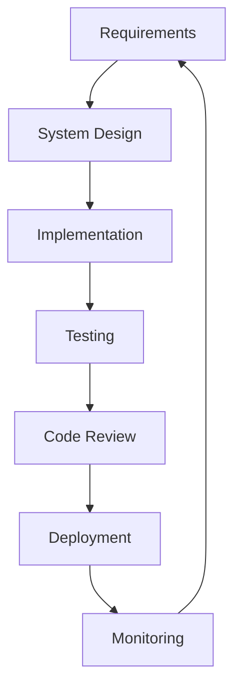

Every stage has its own tools, its own rituals, its own cottage industry. Jira for requirements. Figma for design. VS Code for implementation. Jest for testing. GitHub for code review. AWS for deployment. Datadog for monitoring.

Each step is discrete. Sequential. Handoffs everywhere.

Now here's what actually happens when an engineer works with a coding agent:

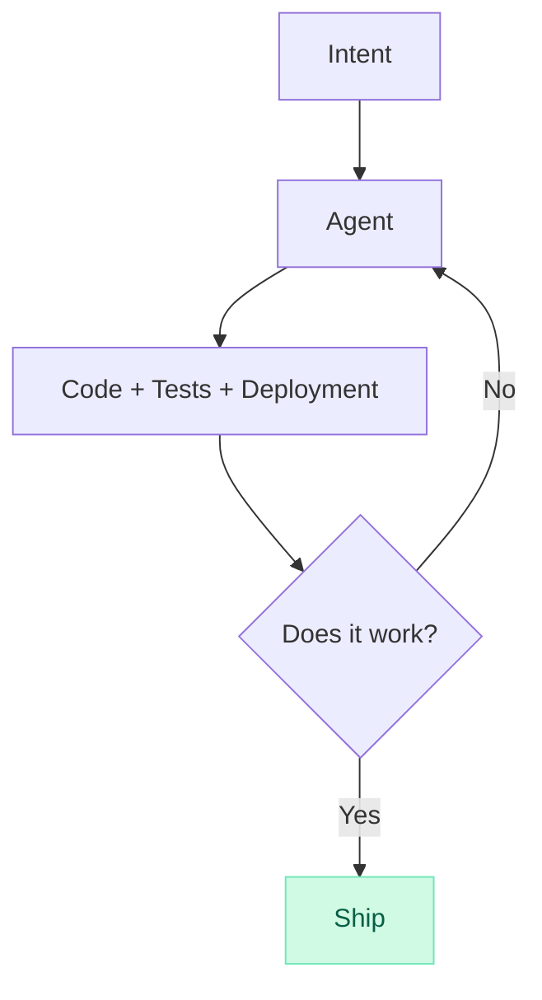

The stages collapsed. They didn't get faster. They merged. The agent doesn't know what step it's on because there are no steps. There's just intent, context, and iteration.

## AI-native engineers don't know what the SDLC is

I spent a lot of time speaking with engineers who started their career after Cursor launched. They don't know what the software development lifecycle is. They don't know what's DevOps or what's an SRE. Not because they're bad engineers. Because they never needed it. They've never sat through sprint planning. They've never estimated story points. They've never waited three days for a PR review.

They just build things.

You describe what you want. The agent writes the code. You look at it. You iterate. You ship. Everything simultaneously.

These engineers aren't worse for skipping the ceremony. They're unencumbered by it. Sprint planning, code review workflows, release trains, estimation rituals. None of it. They skipped the entire orthodoxy and went straight to building.

And honestly? I'm jealous.

## Every stage is collapsing

Let me walk through the SDLC and show you what's left of it.

### Requirements gathering: fluid, not dictated

Requirements used to be handed down. A PM writes a PRD, engineers estimate it, and the spec gets frozen before a line of code is written. That made sense when building was expensive. When every feature took weeks, you had to decide upfront what to build.

That constraint is gone. When an agent can generate a complete version of a feature in minutes, you don't need to specify every detail in advance. You provide the direction, the agent builds a version, you look at it, you adjust, you try a different approach. You can generate ten versions and pick the best one. Requirements aren't a phase anymore. They're a byproduct of iteration.

Now, what is Jira when the audience isn't humans coordinating across a pipeline? What is Jira when it's agents consuming context? Jira was built to track work through stages that no longer exist. If your "requirements" are just context for an agent, then the ticketing system isn't a project management tool anymore. It's a context store. And it's a terrible one.

### System Design: discovered, not dictated

System design still matters. But the way it happens is fundamentally shifting.

Design used to be something you did before writing code. You'd whiteboard the architecture, debate trade-offs, draw boxes and arrows, then go implement it. The gap between the design and the code was days or weeks.

That gap is closing. Design is becoming something you discover by giving the agent the right context, not something you dictate ahead of time. The model has seen more systems, more architectures, more patterns than any individual engineer. When you describe a problem, the agent doesn't just implement your design, it suggests architectures that are often superior to what you'd have come up with on your own. You're having a design conversation in real-time, and the output is working code.

You still need to know when an agent is over-engineering or missing a constraint. But you're collaborating on design, not prescribing it.

### Implementation: this is the agent's job now

This one is obvious. The agent writes the code. Whole features. Complete solutions with error handling, types, edge cases.

I don't personally know anyone who still types lines of code. We review what agents write, feed them context, steer direction, and focus on the problems that actually require human judgment.

### Testing: simultaneous, not sequential

Agents write tests alongside the code. Not as an afterthought. Not in a separate "testing phase." The test is part of the generation. TDD isn't a methodology anymore, it's just how agents work by default.

The entire QA function as a separate stage is gone. When code and tests are generated together, verified together, and iterated together, there's no handoff. No "throw it over the wall to QA.". The agent can do the QA itself.

### Code review: give it up

The pull request flow needs to go. I was never a fan, but now it's just a relic of the past.

I know that's uncomfortable. Code review is sacred. It's how you catch bugs, share knowledge, maintain standards. It's also an identity thing. We're *engineers*, and reviewing code is what engineers do. But clinging to the PR workflow in an agent-driven world isn't rigor. It's an identity crisis.

Think about it. An agent generates 500 PRs a day. Your team can review maybe 10. The review queue backs up. This isn't a bottleneck worth optimising. It's a fake bottleneck, one that only exists because we're forcing a human ritual onto a machine workflow.

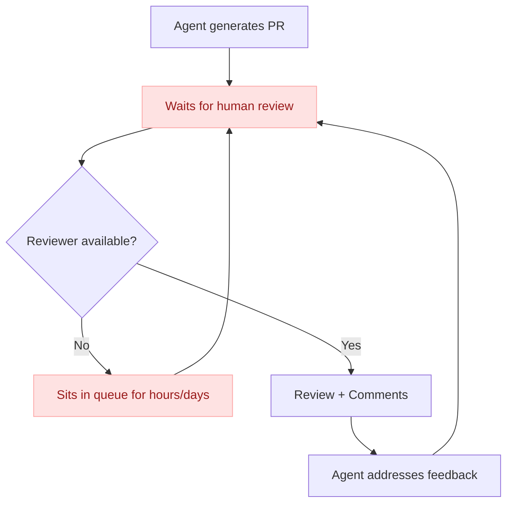

This diagram shouldn't exist. The entire flow is wrong.

The review has to be rethought from scratch. Either it becomes part of the code generation itself, the agent verifies its own work against the plan document, runs the tests, checks for regressions, validates against architectural constraints, or a second agent reviews the first agent's output. Adversarial agents plough through the proposed changes, try to break it in every dimension. We already have the tools for this. Human-in-the-loop review becomes exception-based, triggered only when automated verification can't resolve a conflict or when the change touches something genuinely novel.

What does a world without pull requests look like? Agents commit to main. Automated checks, tests, type checks, security scans, behavioral diffs, validate the change. If everything passes, it ships, automatically. If something fails, the agent fixes it. A human only gets involved when the system genuinely doesn't know what to do.

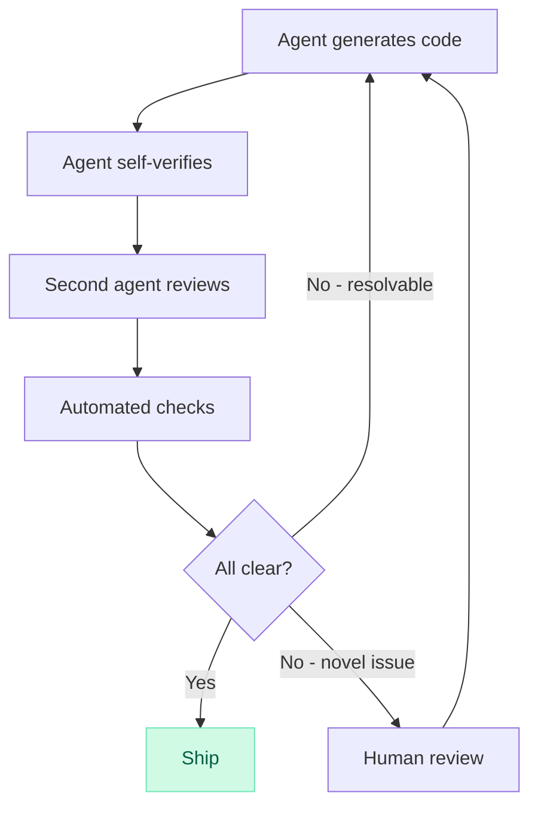

We're spending our review cycles reading diffs that an agent could verify in seconds. That's not quality assurance. That's luddism.

### Deployment: decoupled and continuous

Agents are already writing deployment pipelines that are more intricate and more specialised than what most teams would ever bother building by hand. Feature flags, canary releases, progressive rollouts, automatic rollback triggers, the kind of release engineering that used to require a dedicated platform team.

The key shift is that agents naturally decouple deployment from release. Code gets deployed continuously, every change, as soon as it's generated and verified, produces an artifact that lands in production behind a gate. Release is a separate decision, driven by feature flags or traffic rules.

Some teams are already approaching true continuous deployment and release. Code is generated, tests pass, artifacts are built, and the change is live, all in a single automated flow with no human in the loop between intent and production.

Where this goes next is even more interesting. Imagine agents that don't just deploy code but manage the entire release lifecycle, monitoring the rollout, adjusting traffic percentages based on error rates, automatically rolling back if latency spikes, and only notifying a human when something genuinely novel goes wrong. The deployment "stage" doesn't just get automated. It becomes an ongoing, self-adjusting process that never really ends.

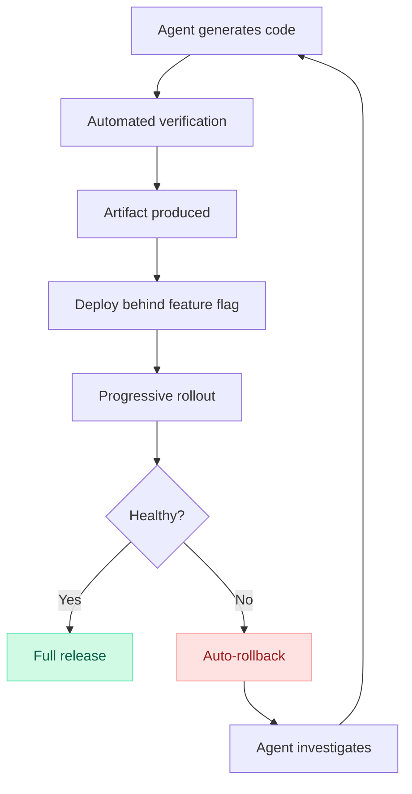

### Monitoring: the last stage standing, and it needs to evolve

Monitoring is the only stage of the SDLC that survives. And it doesn't just survive, it becomes the foundation everything else rests on.

When agents ship code faster than humans can review it, observability is no longer a nice-to-have dashboarding layer. It's the primary safety mechanism for the entire collapsed lifecycle. Every other safeguard, the design review, the code review, the QA phase, the release sign-off, has been absorbed or eliminated. Monitoring is what's left. It's the last line of defense.

But most observability platforms were built for humans. Alerts, log search, dashboard, etc. all designed for a person to look at, interpret, and act on. That model breaks when the volume of changes outpaces human attention. If an agent ships 500 changes a day and your observability setup requires a human to investigate each anomaly, you've created a new bottleneck. You've just moved it from code review to incident response.

Observability without action is just expensive storage. The future of observability isn't dashboards, it's closed-loop systems where telemetry data becomes context for the agent that shipped the code, so it can detect the regression and fix it.

**The observability layer becomes the feedback mechanism that drives the entire loop.** Not a stage at the end. The connective tissue of the whole system.

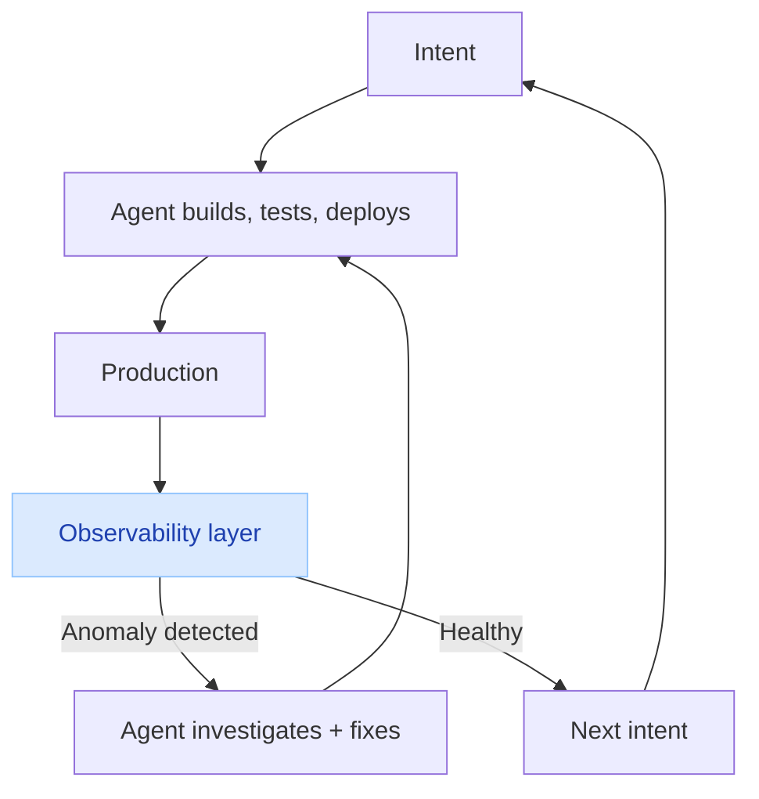

The teams that figure this out first, observability that feeds directly back into the agent loop, not into a human's pager, will ship faster and safer than everyone else. The teams that don't will drown in alerts.

## The new lifecycle is tighter loop

The SDLC was a wide loop. Requirements → Design → Code → Test → Review → Deploy → Monitor. Linear. Sequential. Full of handoffs and waiting.

The new lifecycle is a tight loop.

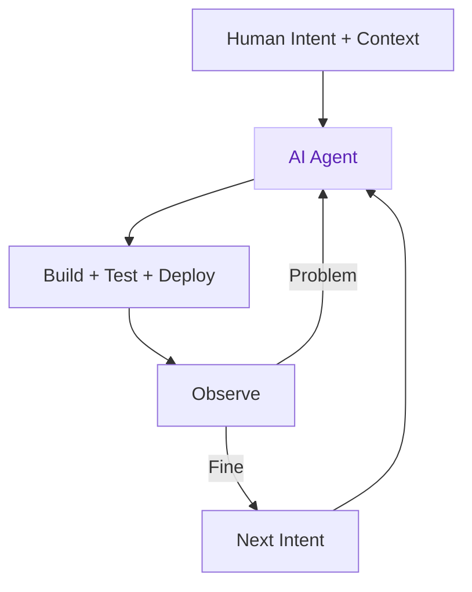

Intent. Build. Observe. Repeat.

No tickets. No sprints. No story points. No PRs sitting in a queue. No separate QA phase. No release trains.

Just a human with intent and an agent that executes.

## So what is left?

Context. That's it.

The quality of what you build with agents is directly proportional to the quality of context you give them. Not the process. Not the ceremony. The context.

The SDLC is dead. The new skill is context engineering. The new safety net is observability.

And most of the industry is still configuring Datadog dashboards no one looks at.
````

## File: src/content/blog/what-are-cloudflare-durable-objects.mdx
````markdown
---
title: "What even are Cloudflare Durable Objects?"
description: Notes from 2 years of building with Cloudflare Durable Objects 
date: 2025-11-05
tags:
  - cloudflare dev 101
  - durable objects
  - agents
---

import BlogImage from '../../components/BlogImage.astro';


Two years ago I was just like you. I had heard of [Cloudflare Durable Objects](https://workers.cloudflare.com/product/durable-objects), I read the docs, but still had no idea what these were. Today I almost exclusively build with Durable Objects (DOs), and I can't imagine building production applications without them. Let me explain what finally made it click for me.

## The Problem: State in Serverless

You know how regular serverless functions (like [AWS Lambda Functions](https://aws.amazon.com/lambda/)) are stateless? Every request starts fresh, with no memory of what happened before. If you want to remember something between requests, you have to store it in a database.

This works fine for most CRUD operations.

But it quickly becomes a real challenge when you need to:

- Handle WebSocket connections that stay open for minutes or hours
- Coordinate multiple requests to the same resource (like when 10 people are editing the same document simultaneously)
- Run scheduled tasks for a specific user (like sending a subscription renewal reminder exactly 30 days after signup)

The traditional solution? Spin up a stateful server. But now you're back to managing servers, dealing with scaling, load balancing, and paying for idle capacity.

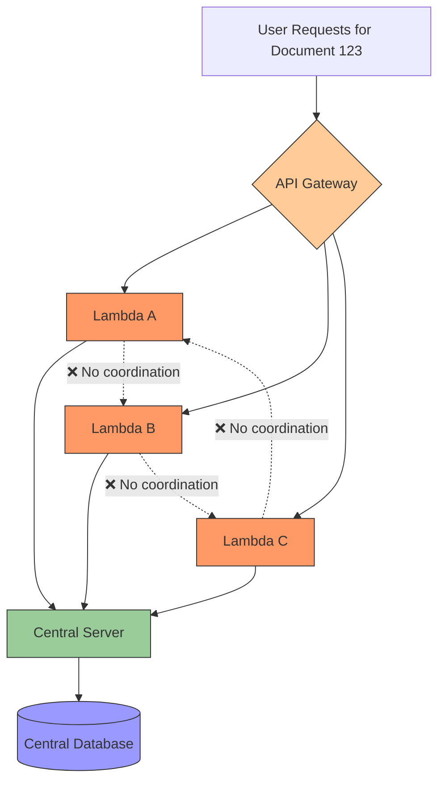

Durable Objects give you the benefits of stateful servers (long-lived connections, state, coordination) without the operational overhead. They're serverless, but stateful. They scale automatically, but maintain strong consistency. They're ephemeral (shutting down when idle), but durable (state persists).

```mermaid
graph TB
    User1[User 1<br/>Document 123] --> Worker1[Worker A]
    User2[User 2<br/>Document 123] --> Worker2[Worker B]
    User3[User 3<br/>Document 123] --> Worker3[Worker C]

    Worker1 --> DO[Durable Object]
    Worker2 --> DO
    Worker3 --> DO

    style Worker1 fill:#FAAD3F,stroke:#333
    style Worker2 fill:#FAAD3F,stroke:#333
    style Worker3 fill:#FAAD3F,stroke:#333
    style DO fill:#9f9,stroke:#333,stroke-width:2px
```

## My "Aha!" Moment: One Instance per ID

Here's the key insight that made it click for me:

> A Durable Object is like having a tiny, long-lived server that is **guaranteed to be unique** for a specific ID.

When you create a Durable Object with [`idFromName("workspace-123")`](https://developers.cloudflare.com/durable-objects/api/namespace/#idfromname), Cloudflare ensures that **only one instance** of that object exists globally. Every request with that same ID goes to the **exact same instance**, no matter where in the world the request comes from.

This is fundamentally different from regular [Cloudflare Workers](https://workers.cloudflare.com/product/workers). With Workers, if 100 requests come in for "workspace-123", they might be handled by 100 different Worker instances across 100 different data centers, depending on the origating request. Each instance is isolated, stateless, and ephemeral.

With Durable Objects, all 100 requests for "workspace-123" are routed to the **same single instance** of your Durable Object. That instance can be running in Tokyo, and requests from New York will be routed there. This single instance can maintain WebSocket connections, coordinate concurrent access, and act as the single source of truth for that workspace's state.

It's like having a dedicated micro-server for each user, workspace, or chat room. Except you only pay when it's actually being used, and you never have to think about deployment, scaling, or geographic distribution.

## Explain Like I'm 5

Imagine a library (Cloudflare's edge network) with millions of private study rooms (Durable Objects). Each room has:
- A **unique room number** (the ID)
- A **desk with drawers** (persistent storage)
- A **person working inside** (your code)
- A **whiteboard** (in-memory state)

When you want to access "Room 123", the librarian always sends you to the same room. The person inside remembers what they were doing, has access to their drawers (storage), and can handle your request immediately.

If nobody visits the room for a while, the person leaves (hibernation), but their drawers stay locked. When someone comes to visit the same room again, the person returns exactly where they left off.

## How Requests Flow

```mermaid
graph TB
    Client[Client Request] --> Worker[Cloudflare Worker]
    Worker --> |"idFromName('user-123')"| DO_ID[Durable Object ID]
    DO_ID --> |Get Stub| Stub[Durable Object Stub]
    Stub --> |RPC Call| Instance[Durable Object Instance]

    Instance --> Memory[In-Memory State]
    Instance --> Storage[KV Storage]
    Instance --> SQL[SQLite Database]
    Instance --> Alarm[Scheduled Alarms]

    style Instance fill:#f9a,stroke:#333,stroke-width:4px
    style Memory fill:#9cf,stroke:#333,stroke-width:2px
    style Storage fill:#9f9,stroke:#333,stroke-width:2px
    style SQL fill:#ff9,stroke:#333,stroke-width:2px
    style Alarm fill:#f99,stroke:#333,stroke-width:2px
```

## Creating a Durable Object

Let's build a simple "Workspace" Durable Object, based on patterns from real production code:

```typescript
// workspace.ts - The Durable Object class
export class DurableWorkspace extends DurableObject {
  private sql: SqlStorage;

  constructor(ctx: DurableObjectState, env: Env) {
    super(ctx, env);
    this.sql = ctx.storage.sql;

    // Run migrations on first access
    ctx.blockConcurrencyWhile(async () => {
      this.migrate();
    });
  }

  migrate() {
    // Create tables if they don't exist
    this.sql.exec(`
      CREATE TABLE IF NOT EXISTS projects (
        id TEXT PRIMARY KEY,
        name TEXT NOT NULL,
        created INTEGER NOT NULL
      )
    `);
  }

  // Store workspace identity
  async init(workspaceId: string, ownerId: string) {
    await this.ctx.storage.put("workspaceId", workspaceId);
    await this.ctx.storage.put("ownerId", ownerId);

    // Schedule a monthly cleanup
    await this.ctx.storage.setAlarm(Date.now() + 30 * 24 * 60 * 60 * 1000);
  }

  async getWorkspaceId(): Promise<string> {
    return await this.ctx.storage.get("workspaceId") || "";
  }

  async createProject(name: string) {
    const id = crypto.randomUUID();
    this.sql.exec(
      "INSERT INTO projects (id, name, created) VALUES (?, ?, ?)",
      id,
      name,
      Date.now()
    );
    return { id, name };
  }

  async listProjects() {
    const result = this.sql.exec("SELECT * FROM projects ORDER BY created DESC");
    return result.toArray();
  }

  // Called when alarm triggers
  async alarm() {
    console.log("Running monthly cleanup...");
    // Clean up old data
    this.sql.exec("DELETE FROM projects WHERE created < ?", Date.now() - 90 * 24 * 60 * 60 * 1000);

    // Schedule next cleanup
    await this.ctx.storage.setAlarm(Date.now() + 30 * 24 * 60 * 60 * 1000);
  }
}
```

## Accessing the Durable Object: The Stub Pattern

Now that we've seen a Durable Object class, how do we actually use it? You don't instantiate Durable Objects directly. Instead, you get a "stub" - a proxy that lets you call methods on the Durable Object from your Worker.

The critical part is the `idFromName()` call. This is what ensures you always get the same instance for the same ID. Think of it like a phone book - you look up "workspace-123" in the directory, and Cloudflare gives you a direct line to that workspace's unique Durable Object instance, wherever it happens to be running in the world.

Here's how you access your Durable Object from a Worker:

```typescript
// Helper function to get a workspace stub
export function getWorkspaceStub(env: Env, workspaceId: string): DurableObjectStub<DurableWorkspace> {
  // idFromName ensures the same ID always goes to the same instance
  const id = env.WORKSPACE.idFromName(workspaceId);
  const stub = env.WORKSPACE.get(id);
  return stub;
}

// In your Worker (API endpoint)
export default {
  async fetch(request: Request, env: Env) {
    const url = new URL(request.url);
    const workspaceId = url.searchParams.get("workspace");

    // Get the stub - always the same instance for this workspace
    const workspace = getWorkspaceStub(env, workspaceId);

    if (url.pathname === "/init") {
      await workspace.init(workspaceId, "user-123");
      return new Response("Initialized");
    }

    if (url.pathname === "/projects") {
      if (request.method === "POST") {
        const { name } = await request.json();
        const project = await workspace.createProject(name);
        return Response.json(project);
      } else {
        const projects = await workspace.listProjects();
        return Response.json(projects);
      }
    }

    return new Response("Not found", { status: 404 });
  }
};
```

The Worker acts as a router - it extracts the workspace ID from the request, gets the appropriate Durable Object stub using `idFromName()`, and calls methods on it.

The `workspace.createProject()` and `workspace.listProjects()` calls are [RPC (Remote Procedure Calls)](https://developers.cloudflare.com/workers/runtime-apis/rpc/) - they're executed inside the Durable Object instance, not in the Worker. The Worker just forwards the request and gets the response back.

## The Four Storage Layers

One of the most powerful aspects of Durable Objects is having multiple storage options. When I first started, I didn't understand why you'd need so many ways to store data. But each layer serves a distinct purpose and has different performance characteristics.

Think of it like this: in-memory state is your desk (fast, temporary), KV storage is your desk drawer (fast, persistent, small items), SQLite is your filing cabinet (structured, queryable, medium size), and external storage like R2 is your warehouse (massive, slower, for big things).

Understanding when to use each storage layer is crucial:

```mermaid
graph TD
    DO[Durable Object Instance]

    DO --> KV[Key-Value Storage<br/>ctx.storage.put/get]
    DO --> SQL[SQLite Database<br/>ctx.storage.sql]
    DO --> Memory[In-Memory State<br/>class properties]
    DO --> External[External Storage<br/>R2, KV Namespace, D1]

    KV --> |Use For| KV_Use[Simple metadata: User ID, config, etc.]
    SQL --> |Use For| SQL_Use[Structured data: Relations & indexes]
    Memory --> |Use For| Memory_Use[WebSocket connections, active sessions, etc.]
    External --> |Use For| External_Use[Large files, cross-workspace data, analytics]

    style KV fill:#9f9,stroke:#333
    style SQL fill:#ff9,stroke:#333
    style Memory fill:#9cf,stroke:#333
    style External fill:#f9f,stroke:#333
```

### Example: Using All Storage Layers

```typescript
export class ChatRoom extends DurableObject {
  // In-memory: active WebSocket connections
  private connections: Map<string, WebSocket> = new Map();

  // In-memory: temporary message buffer
  private messageBuffer: Message[] = [];

  constructor(ctx: DurableObjectState, env: Env) {
    super(ctx, env);

    ctx.blockConcurrencyWhile(async () => {
       // SQLite: create messages table
      this.ctx.storage.sql.exec(`
        CREATE TABLE IF NOT EXISTS messages (
          id TEXT PRIMARY KEY,
          userId TEXT NOT NULL,
          content TEXT NOT NULL,
          timestamp INTEGER NOT NULL
        );
        CREATE INDEX IF NOT EXISTS idx_timestamp ON messages(timestamp);
      `);
    });
  }

  async initRoom(roomId: string, roomName: string) {
    // Key-Value: store simple metadata
    await this.ctx.storage.put("roomId", roomId);
    await this.ctx.storage.put("roomName", roomName);
    await this.ctx.storage.put("createdAt", Date.now());
  }

  async handleWebSocket(request: Request): Promise<Response> {
    const pair = new WebSocketPair();
    const [client, server] = Object.values(pair);

    // In-memory: track active connection
    const connectionId = crypto.randomUUID();
    this.connections.set(connectionId, server);

    server.addEventListener("message", async (event) => {
      const message = JSON.parse(event.data);
      // In-memory: save message to the buffer
      this.messageBuffer.push(message)

      // SQLite: persist message
      this.ctx.storage.sql.exec(
        "INSERT INTO messages (id, userId, content, timestamp) VALUES (?, ?, ?, ?)",
        crypto.randomUUID(),
        message.userId,
        message.content,
        Date.now()
      );

      // In-memory: broadcast to all active connections
      for (const [id, conn] of this.connections) {
        if (id !== connectionId) {
          conn.send(JSON.stringify(message));
        }
      }

      // External: save to R2 for archival
      if (this.messageBuffer.length >= 100) {
        await this.archiveMessages();
      }
    });

    server.addEventListener("close", () => {
      this.connections.delete(connectionId);
    });

    server.accept();
    return new Response(null, { status: 101, webSocket: client });
  }

  async archiveMessages() {
    const roomId = await this.ctx.storage.get("roomId");
    const messages = this.messageBuffer.splice(0);

    // External storage: R2 bucket for large archives
    await this.env.ARCHIVE_BUCKET.put(
      `rooms/${roomId}/${Date.now()}.json`,
      JSON.stringify(messages)
    );
  }

  async getRecentMessages(limit: number = 50) {
    // SQLite: efficient queries with indexes
    const result = this.ctx.storage.sql.exec(
      "SELECT * FROM messages ORDER BY timestamp DESC LIMIT ?",
      limit
    );
    return result.toArray();
  }
}
```

## Real-World Pattern: Parent-Child Relationships

This is my favourite pattern when building multitenant applications. Let me explain it with a real-world analogy first, then show you the code.

### The Apartment Building Analogy

Imagine you're building a project management SaaS app. Think of it like an apartment building:

- **The Building (Workspace)** is a Durable Object that represents the entire workspace
- **Each Apartment (Project)** is its own separate Durable Object
- **The Building Manager** keeps a directory of all apartments (the workspace's SQLite database)
- **Each Apartment** has its own furniture, residents, and state (the project's data and tasks)

Why separate them? Because if you put all apartments' furniture in the building manager's office, it gets crowded fast. Instead, each apartment manages its own internal state, but the building manager knows about all apartments and can coordinate between them.

In code terms: **don't put all your data in one Durable Object**. Create separate child Durable Objects for each logical entity (user, project, document, chat room), and have a parent Durable Object that coordinates them.

### Why This Pattern Matters

The thing is, each Durable Object is single-threaded. If you have one giant Durable Object handling everything for a workspace with 100 projects, and 50 users are all editing different projects simultaneously, they're all waiting in line for that one Durable Object to process their requests.

But if each project is its own Durable Object, those 50 users can work in parallel across 50 different Durable Objects. The parent workspace just maintains a registry of which projects exist.


```typescript
// Parent: DurableWorkspace
export class DurableWorkspace extends DurableObject {
  async createThread(threadName: string) {
    const threadId = crypto.randomUUID();
    const workspaceId = await this.ctx.storage.get("workspaceId");

    // Store reference in parent's database
    this.ctx.storage.sql.exec(
      "INSERT INTO threads (id, name, created) VALUES (?, ?, ?)",
      threadId,
      threadName,
      Date.now()
    );

    // Get stub to child Durable Object
    const threadStub = getThreadStub(this.env, threadId);

    // Initialize the child
    await threadStub.init(threadId, workspaceId, threadName);

    return { id: threadId, name: threadName };
  }

  async listThreads() {
    const result = this.ctx.storage.sql.exec(
      "SELECT * FROM threads ORDER BY created DESC"
    );
    return result.toArray();
  }
}

// Child: DurableThread
export class DurableThread extends DurableObject {
  async init(threadId: string, workspaceId: string, threadName: string) {
    // Store parent reference
    await this.ctx.storage.put("threadId", threadId);
    await this.ctx.storage.put("workspaceId", workspaceId);
    await this.ctx.storage.put("threadName", threadName);
  }

  async addMessage(content: string) {
    const id = crypto.randomUUID();
    this.ctx.storage.sql.exec(
      "INSERT INTO messages (id, content, created) VALUES (?, ?, ?)",
      id,
      content,
      Date.now()
    );
    return { id, content };
  }

  async deleteThread() {
    const workspaceId = await this.ctx.storage.get("workspaceId");
    const threadId = await this.ctx.storage.get("threadId");

    // Tell parent to remove reference
    const workspaceStub = getWorkspaceStub(this.env, workspaceId);
    await workspaceStub.deleteThreadReference(threadId);

    // Clean up own data
    this.ctx.storage.sql.exec("DELETE FROM messages");
    await this.ctx.storage.deleteAll();
  }
}

// Helper functions
function getThreadStub(env: Env, threadId: string) {
  const id = env.THREAD.idFromName(threadId);
  return env.THREAD.get(id);
}

function getWorkspaceStub(env: Env, workspaceId: string) {
  const id = env.WORKSPACE.idFromName(workspaceId);
  return env.WORKSPACE.get(id);
}
```

### What's Happening Here?

Let's walk through the flow when a user creates a thread:

1. **User calls API**: "Create a thread named 'Q4 Planning' in workspace-123"
2. **Worker gets workspace stub**: Uses `idFromName("workspace-123")` to get the workspace Durable Object
3. **Workspace creates reference**: Stores "thread-456, Q4 Planning" in its own SQLite database
4. **Workspace spawns child**: Gets a stub to a new Thread Durable Object using `idFromName("thread-456")`
5. **Child initializes**: The thread stores its identity (threadId, workspaceId, name)
6. **Now they're connected**: The workspace knows about the thread, and the thread knows about its parent workspace

Later, when listing threads:
- You ask the workspace: "What threads exist?"
- It queries its own database and returns the list
- You don't need to wake up every thread Durable Object just to list them

When adding a message:
- You go directly to the thread Durable Object
- It handles the message independently
- The workspace doesn't need to be involved at all

This separation means the workspace can track hundreds of threads without getting bogged down by message operations, and threads can process messages in parallel without waiting for the workspace.

## Scheduled Operations with Alarms

Here's another outstanding feature that took me a while to appreciate: each Durable Object can schedule its own future work. Not through some external scheduler, but built right into the object itself.

Think about subscription renewals. With traditional serverless, you'd need:
1. A cron job that runs every hour
2. It queries your database for all subscriptions expiring in the next hour
3. It processes each one
4. This gets expensive and slow as you scale to millions of users

With Durable Objects + Alarms:
1. When a user subscribes, their Subscription Durable Object schedules an alarm for exactly 30 days from now
2. In 30 days, that specific Durable Object wakes up automatically
3. It processes just that user's renewal
4. Then schedules the next alarm

No cron jobs scanning millions of records. No batch processing. Just-in-time execution for each user. This is incredibly powerful for per-user or per-entity scheduled tasks.

Here's how it works in code:

```typescript
export class SubscriptionManager extends DurableObject {
  async createSubscription(userId: string, planType: string) {
    await this.ctx.storage.put("userId", userId);
    await this.ctx.storage.put("planType", planType);
    await this.ctx.storage.put("status", "active");

    // Schedule renewal check in 30 days
    const renewalDate = Date.now() + 30 * 24 * 60 * 60 * 1000;
    await this.ctx.storage.setAlarm(renewalDate);
  }

  async alarm() {
    const userId = await this.ctx.storage.get("userId");
    const planType = await this.ctx.storage.get("planType");

    console.log(`Processing renewal for user ${userId}`);

    // Charge the user
    const success = await this.chargeUser(userId, planType);

    if (success) {
      // Schedule next renewal
      await this.ctx.storage.setAlarm(Date.now() + 30 * 24 * 60 * 60 * 1000);
    } else {
      // Downgrade to free plan
      await this.ctx.storage.put("status", "expired");
      await this.ctx.storage.put("planType", "free");
    }
  }

  async cancelSubscription() {
    await this.ctx.storage.put("status", "cancelled");

    // Cancel future alarms
    await this.ctx.storage.deleteAlarm();
  }

  private async chargeUser(userId: string, planType: string): Promise<boolean> {
    // Call payment API
    return true;
  }
}
```

When you schedule an alarm, Cloudflare guarantees it will fire at least once. If your `alarm()` method throws an exception, it automatically retries up to 6 times with exponential backoff (starting at 2 seconds).

You don't need to write retry logic, just make sure your `alarm()` method is idempotent (safe to run multiple times) since it could potentially execute more than once.

## When Should You Use Durable Objects?

Here's my mini-decision framework:

**Perfect for Durable Objects:**
- Per-user/per-tenant databases
- AI agents
- Real-time collaboration (Google Docs-style editing)
- WebSocket servers (chat rooms, live dashboards)
- Coordinating multiple requests to the same resource
- Rate limiting per user
- Session management
- Scheduled tasks per entity (user notifications, subscription renewals)

**Not ideal for Durable Objects:**
- Storing large blobs (use [R2](https://workers.cloudflare.com/product/r2) instead)
- Analytics aggregation across many users ([Workers Analytics Engine](https://developers.cloudflare.com/analytics/analytics-engine/))
- Truly stateless operations (use regular [Workers](https://workers.cloudflare.com/product/workers))
- Queries across all users (use [D1](https://workers.cloudflare.com/product/d1) with proper indexes)

**Be careful with:**
- Very high traffic to a single ID (DOs are single-threaded per instance)
- Long-running CPU-intensive tasks (use queues + regular workers instead)

## Common Pitfalls I Learned the Hard Way

Let me save you from the mistakes I made when I was learning Durable Objects. These gotchas aren't obvious from the docs, but they'll bite you in production if you're not careful.

### 1. Don't Forget: One Instance = One Thread

This is the biggest gotcha. A Durable Object instance is single-threaded. Every request to the same ID is processed sequentially, one at a time. This is actually a feature (strong consistency!), but it means you can't block for long periods.

I once had a Durable Object that called a slow external API and took 5 seconds to respond. When 10 requests came in simultaneously for the same object, the last request waited 50 seconds. Not good.

```typescript
// BAD: Blocking operation will freeze this DO for everyone
export class BadExample extends DurableObject {
  async handleRequest() {
    // This blocks for 10 seconds - ALL requests wait!
    await new Promise(resolve => setTimeout(resolve, 10000));
    return "Done";
  }
}

// GOOD: Offload heavy work to queues
export class GoodExample extends DurableObject {
  async handleRequest() {
    // Queue the work, return immediately
    await this.env.QUEUE.send({ task: "heavy-work" });
    return "Queued";
  }
}
```

### 2. Initialize the Durable Object identity

When a Durable Object is first created, its storage is empty. It's not possible to recall the name of the Durable Object from within the Durable Object. You need to explicitly initialize it. I use an `init()` method.


```typescript
// BAD: Storage might be empty on first call
export class BadExample extends DurableObject {
  async getWorkspaceId() {
    return await this.ctx.storage.get("workspaceId"); // Could be undefined!
  }
}

// GOOD: Explicit initialization
export class GoodExample extends DurableObject {
  async init(workspaceId: string) {
    await this.ctx.storage.put("workspaceId", workspaceId);
  }

  async getWorkspaceId() {
    const id = await this.ctx.storage.get("workspaceId");
    if (!id) throw new Error("Workspace not initialized - call init() first");
    return id;
  }
}
```

## The Key to Real-Time Apps and AI Agents: Hibernate API

Before [Hibernate API](https://developers.cloudflare.com/workers/platform/changelog/#2023-05-26), if you had a chat room with 1000 connected users but nobody was sending messages, you were still paying for that Durable Object to stay alive and hold those connections.

With Hibernate API, the Durable Object can "hibernate" - essentially go to sleep while maintaining WebSocket connections. When a message arrives, it wakes up automatically, handles the message, and can go back to sleep.

The beauty is that this happens transparently. Your code doesn't change. You just get automatic cost savings and better resource utilization.

```typescript
export class ChatRoom extends DurableObject {
  // Hibernate API automatically serializes/deserializes state
  async webSocketMessage(ws: WebSocket, message: string) {
    const data = JSON.parse(message);

    // Broadcast to all connections
    this.ctx.getWebSockets().forEach(socket => {
      socket.send(JSON.stringify(data));
    });
  }

  async webSocketClose(ws: WebSocket, code: number, reason: string) {
    console.log("disconnected");
  }

  async handleConnect(request: Request): Promise<Response> {
    const pair = new WebSocketPair();
    const [client, server] = Object.values(pair);

    // Attach metadata to the WebSocket
    this.ctx.acceptWebSocket(server);

    return new Response(null, { status: 101, webSocket: client });
  }
}
```

With Hibernate API, your Durable Object can go to sleep when idle (saving you money) and wake up automatically when a WebSocket message arrives. The state is automatically preserved!

## Leveling Up: The Cloudflare Agents SDK

<BlogImage path="/assets/blog/what-are-cloudflare-durable-objects/npm-install-agents.svg" id="npm-install-agents" />

The Cloudflare [`agents` SDK](https://agents.cloudflare.com/) ([`npm i agents`](https://www.npmjs.com/package/agents)) is a framework built on top of Durable Objects. It's designed for building AI agents on the Cloudflare network, and has become my default framework when building with Durable Objects.

**You don't need to be building AI agents to use it.** Despite the name, it's actually a general-purpose framework for building stateful real-time applications with Durable Objects. It just happens to make AI agent development really easy too.

### What Does the Agents SDK Give You?

The `Agent` base class provides:

1. **WebSocket handling out of the box** - `onConnect()`, `onMessage()`, `onClose()` lifecycle methods
2. **HTTP request handling** - `onRequest()` method with clean routing
3. **Email routing** - Built-in email address parsing and routing (yes, Durable Objects can receive emails!)
4. **Scheduled operations** - Simplified alarm scheduling with cron expressions
5. **Task queues** - Lightweight queue for task defferal
6. **Hibernation API** - Automatic connection state management for WebSockets

### A Simple Example: Chat Room Without AI

Here's a chat room using the Agents SDK - notice there's no AI involved, it's just using the framework's convenience features:

```typescript
import { Agent } from "agents";

export class ChatRoom extends Agent {
  // WebSocket lifecycle - automatically handled
  async onConnect(connection, ctx) {
    const username = ctx.request.headers.get("username");

    // Set connection metadata (persists through hibernation!)
    await connection.setState({ username, joinedAt: Date.now() });

    // Broadcast join message to everyone
    this.broadcast(JSON.stringify({
      type: "user_joined",
      username,
      timestamp: Date.now()
    }));
  }

  override async onMessage(connection, message) {
    const data = JSON.parse(message);
    const state = await connection.getState();

    // Save to SQLite for history
    this.ctx.storage.sql.exec(
      "INSERT INTO messages (id, username, content, timestamp) VALUES (?, ?, ?, ?)",
      crypto.randomUUID(),
      state.username,
      data.content,
      Date.now()
    );

    // Broadcast to all connected clients (except sender)
    this.broadcast(JSON.stringify({
      type: "message",
      username: state.username,
      content: data.content,
      timestamp: Date.now()
    }), [connection.id]);
  }

  async onClose(connection) {
    const state = await connection.getState();

    this.broadcast(JSON.stringify({
      type: "user_left",
      username: state.username,
      timestamp: Date.now()
    }));
  }

  // Regular HTTP request handling
  override async onRequest(request) {
    // Get recent message history via HTTP
    if (request.method === "GET") {
      const messages = this.ctx.storage.sql.exec(
        "SELECT * FROM messages ORDER BY timestamp DESC LIMIT 50"
      );

      return Response.json(messages.toArray());
    }

    return super.onRequest(request);
  }
}
```

### What This Abstracts Away

Compare this to raw Durable Objects code:

**Without Agents SDK:**
```typescript
// You manually create WebSocketPair
const pair = new WebSocketPair();
const [client, server] = Object.values(pair);

// Manually track connections in a Map
this.connections.set(id, server);

// Manually add event listeners
server.addEventListener("message", (event) => { /* ... */ });
server.addEventListener("close", () => { /* ... */ });

// Manually accept
server.accept();
return new Response(null, { status: 101, webSocket: client });
```

**With Agents SDK:**
```typescript
// Just implement the lifecycle methods
async onConnect(connection, ctx) { /* ... */ }
async onMessage(connection, message) { /* ... */ }
async onClose(connection) { /* ... */ }

// Framework handles all the boilerplate
```

### Using Agents SDK for Non-AI Applications

I use the Agents SDK for:

- **Real-time dashboards** - WebSocket connections with automatic reconnection handling
- **Multiplayer games** - Each game room is an Agent with connection management built-in
- **Collaborative editing** - Document state + WebSocket broadcasting without manual connection tracking
- **Job queues** - Queue message handling with automatic retries
- **Scheduled tasks** - Cron-based processing per entity (user notifications, report generation)

The framework handles connection lifecycle, hibernation, state persistence, and broadcasting - all the tedious parts of building with Durable Objects.

I use the Agents SDK for all my Durable Objects, both my production apps and my experiments. The base `Agent` class provides so much value that even for non-AI applications, it's worth the dependency.

## Conclusion

Two years ago, I read the Durable Objects docs three times and still didn't get it. The breakthrough came when I stopped trying to understand the technology and started thinkering.

**Durable Objects aren't just "stateful Workers"**. They're a fundamentally different primitive. They give you:

- **Coordination**: One instance per ID means you can coordinate concurrent access without distributed locking
- **Real-time**: WebSocket connections that survive across requests
- **Consistency**: Strong consistency without the complexity of distributed systems
- **Scheduling**: Per-entity alarms that fire exactly when needed
- **Isolation**: Perfect tenant isolation in multi-tenant SaaS (each tenant gets its own Durable Object)

The mental model that finally clicked for me: **Durable Objects are like having millions of tiny, specialized servers that spawn on-demand, live exactly where they're needed, and automatically shut down when idle**.

You don't need to understand how Cloudflare routes requests globally to the same instance. You don't need to worry about replication or consistency. You just write code as if you have a single-threaded server for each user/room/workspace, and Cloudflare handles the rest.

### Start Simple, Scale Up

Don't try to use all the features at once. Start with:

1. Create a Durable Object with just KV storage. Get comfortable with stubs and `idFromName`.
2. Add SQLite for structured data. Learn about transactions.
3. Try parent-child relationships. Understand when to split data across multiple DOs.
4. Add WebSockets or alarms based on your use case.

The key insights I wish I'd understood from day one:

1. **One instance per ID** - This is the superpower. Embrace it.
2. **Single-threaded** - Don't block. Offload heavy work to queues.
3. **Multiple storage layers** - KV for metadata, SQLite for data, memory for connections.
4. **Parent-child pattern** - Don't put everything in one DO. Split by entity.
5. **Hibernation is magic** - Your DO can sleep while maintaining state and connections.

Two years ago, I couldn't wrap my head around Durable Objects. Today, they're the foundation of everything I build. They've replaced Redis, PostgreSQL, WebSocket servers, cron jobs, and state machines in my architecture.

Once it clicks, you'll wonder how you ever built without them.
````

## File: src/content/projects/basebrain.mdx
````markdown
---
title: Basebrain
date: "2025-03-18"
topics:
  - "bookmarks"
  - "ai"
description: Chat with your bookmarks
image: basebrain.png
website: https://basebrain.ai
---

I needed a pretext to build AI agents and decided to solve the problem of bookmarks once again. I'm exploring all the latest techniques in building AI applications and agents.

It's fully deployed on Cloudflare Workers, extensively using Durable Objects.

**[Website](https://basebrain.ai)**
````

## File: src/content/projects/baselime.mdx
````markdown
---
title: Baselime
date: "2021-10-05"
topics:
  - "observability"
  - "start-up"
description: Cloud observability made for developers
image: baselime.png
website: https://baselime.io
github: https://github.com/baselime
---

Developers are on the front-lines dealing with errors and performance issues every day, but they are not equiped with the right tooling: "logs, metrics and traces" are not enough. You need 3 core concepts:
- High cardinality and dimensionality
- OpenTelemetry
- Great Developer Experience

I started [Baselime](https://baselime.io) to solve this problem.

It was a wild ride, building a team, bringing our vision to the world and enabling developers worldwide to solve issues before they become problems.

Baselime has now [joined Cloudflare](https://blog.cloudflare.com/cloudflare-acquires-baselime-expands-observability-capabilities).


**[Website](https://baselime.io), [Github](https://github.com/baselime)**
````

## File: src/content/projects/bkmark.mdx
````markdown
---
title: bkmark.io
date: "2021-01-01"
topics:
  - "typescript"
  - "vue"
  - "serverless"
  - "saas"
description: A bookmarks manager for teams, entirely built with serverless
image: bkmark.png
website: https://bkmark.io
---

I'm a tab hoarder. This project is an attempt to solve this problem: a fully serverless application to store all my tabs such that I finally close them. I added a bunch of quality of life features over the months and turned this into a SaaS.

It was mostly a learning experience for me. I explored how to build a completely serverless application: compute, database, storage, queues, webhooks, etc.

**[Website](https://bkmark.io)**
````

## File: src/content/projects/lyrically.mdx
````markdown
---
title: Lyrically
date: "2019-10-01"
topics:
  - "typescript"
  - "python"
  - "spotify"
description: A tiny website to get the lyrics of the song you're listening on Spotify, live. No search, no tracking, no ads.
image: lyrically.jpeg
website: https://lyrically.be
github: https://github.com/boristane/lyrically
---

I listen to a lot of french rap, and I need the lyrics, fast.

I uses the [Genius API](https://docs.genius.com/) to get the song lyrics and it continuously polls the [Spotify API](https://developer.spotify.com/documentation/web-api) to get the current song.

**[Website](https://lyrically.be), [Github](https://github.com/boristane/lyrically)**
````

## File: src/content/projects/parliament.mdx
````markdown
---
title: UK General Elections Data Viz
date: "2019-01-12"
topics:
  - "data-visulaisation"
  - "d3"
  - "javascript"
description: Visualisation of the results of the UK General Elections
image: parliament.png
website: https://boristane.github.io/parliament/
github: https://github.com/boristane/parliament
---

I wanted to dig deeper into the results of the [2017 United Kingdom general election](https://en.wikipedia.org/wiki/2017_United_Kingdom_general_election), so I built this front-end application to visually present:
- election results 
- lost constituencies
- gender representation
- turnout
- majority

This project was mostly a pretext to play with [d3.js](https://d3js.org/)

**[Website](https://boristane.github.io/parliament/), [Github](https://github.com/boristane/parliament)**
````

## File: src/content/projects/rooom.mdx
````markdown
---
title: Rooom
date: "2020-06-06"
topics:
  - "typescript"
  - "spotify"
description: Remote listening parties powered by Spotify
image: rooom.png
website: https://rooom.click
github: https://github.com/boristane/spotify-room
---

Music was one of the only ways to connect with family and friends during the first weeks of lockdown. So I built a small app to listen to music with loved ones synchronously.

**[Website](https://rooom.click), [Github](https://github.com/boristane/spotify-room)**
````

## File: src/content/projects/thesis.mdx
````markdown
---
title: Flight Dynamics Modelling and System Identification of a Light Fixed Wing UAV (Masters Thesis)
date: "2015-08-12"
topics:
  - "aerospace"
  - "matlab"
  - "statistics"
description: Instrumentation, flight dynamics modelling, flight testing, and system identification of a fixed wing Unmanned Aerial Vehicle
image: thesis.png
github: https://github.com/boristane/msc-maximum-likelihood-estimation
---

For my [MSc Aerospace Dynamics](https://www.cranfield.ac.uk/courses/taught/aerospace-dynamics) thesis, I modified a low-cost commercial fixed wing UAV to instrument it with various sensors such as a pitot tube, an inertial measurement unit, and an air-ground data link.

The instrumentation enabled me to flight test the aircraft and to capture data in various flight conditions.

I used the data to build and validate 2 models of the aircraft:
- a [6 Degrees of Freedom](https://en.wikipedia.org/wiki/Six_degrees_of_freedom) model based on the equations of motion of the aircraft
- a [maximum likelihood estimation](https://en.wikipedia.org/wiki/Maximum_likelihood_estimation) model based on the statistical analysis of the flight data

This was a lot of fun with Matlab :)

[Github](https://github.com/boristane/msc-maximum-likelihood-estimation)**
````

## File: src/content/talks/craft-your-own-serverless-observability-platform.mdx
````markdown
---
title: "Craft your own serverless observability platform"
description: How do you build your own observability platform? And should you?
date: "2023-07-13"
video: true
location: Serverless London Meetup
tags:
  - observability
  - serverless
---

import BlogYoutubeVideo from '../../components/BlogYoutubeVideo.astro';

I had the opportunity to speak at the [Serverless London Meetup](https://www.meetup.com/serverless-london/) once again and this time I wanted to share with developers how they can build their own observability tooling using serverless primitives and host it themselves.

It was pretty fun to break down Baselime into its core components and share with developers what goes on in each, and how they can build it themselves.

Fun fact: for some reason I needed to use my mouse instead of a pointer to flick through slides - this was way more challenging than I anticipated.


<script src="//fast.wistia.com/embed/medias/7o2q7h3rb0.jsonp" async></script> <script src="//fast.wistia.com/assets/external/E-v1.js" async></script> <div class="wistia_responsive_padding" style="padding:56.25% 0 0 0;position:relative;"> <div class="wistia_responsive_wrapper" style="height:100%;left:0;position:absolute;top:0;width:100%;"> <div class="wistia_embed wistia_async_7o2q7h3rb0 seo=false videoFoam=true" style="height:100%;width:100%">&nbsp;</div></div></div>
````

## File: src/content/talks/creating-an-innovation-engine-with-observability-v1.mdx
````markdown
---
title: "Creating an innovation engine with observability v1"
description: How can you leverage your observability tooling to innovate faster?
date: "2023-03-02"
video: true
location: Serverless London Meetup
tags:
  - culture
  - observability
---

import BlogYoutubeVideo from '../../components/BlogYoutubeVideo.astro';

The [Serverless London Meetup](https://www.meetup.com/serverless-london/) invited me to give a talk, and I wanted to share something different: what's the engineering culture that enables us at [Baselime](https://baselime.io) to innovate extremely fast?

One of the key points is observability. How we leverage our observability tooling to have high velocity and quality software at the same time.

I gave this talk twice, and this is was the first iteration. In the second iteration, at the [Node Congress 2023 conference](./creating-an-innovation-engine-with-observability-v2), I incorporated feedback and improvements from this talk. 

<BlogYoutubeVideo embed='v9_EAu-QQec'></BlogYoutubeVideo>
````

## File: src/content/talks/creating-an-innovation-engine-with-observability-v2.mdx
````markdown
---
title: "Creating an innovation engine with observability v2"
description: I gave this talk a second time, with corrections and improvements :) 
date: "2023-04-14"
video: true
location: Node Congress 2023
tags:
  - culture
  - observability
---

import BlogYoutubeVideo from '../../components/BlogYoutubeVideo.astro';

I was invited to give a talk at [Node Congress 2023](https://portal.gitnation.org/events/node-congress-2023); I spent quite a few days wondering what I could present; I had given a talk about [creating an innovation engine with observability](./creating-an-innovation-engine-with-observability-v1) before, which people liked and I knew it could be improved and resonate with even more developers.

And that's exactly what I did. I made a few key changes to the talk and delivered it again. All about the culture changes that teams can make today to produce quality software without compromising on iteration speed.

Node Congress doesn't allow embedding talk recordings, so you can find it on [their website](https://portal.gitnation.org/contents/creating-an-innovation-engine-with-observability).
````

## File: src/content/talks/javascript-runtimes-on-aws-lambda.mdx
````markdown
---
title: "Exploring JavaScript Runtimes on AWS Lambda"
description: Benchmarking a few JavaScript runtimes on AWS Lambda
date: "2022-11-22"
video: true
location: London Node User Group
tags:
  - javascript
  - observability
---

import BlogYoutubeVideo from '../../components/BlogYoutubeVideo.astro';

[London Node User Group](https://lnug.org/) invited me to give a talk, and that came up when I was wondering if I could squeeze more performance out of my JavaScript [AWS Lambda](https://aws.amazon.com/lambda/) functions without re-writing in Go or Rust.

I then benchmarked [Node.js](https://nodejs.org/en), [Deno](https://deno.com/) and [Bun](https://bun.sh/) on AWS Lambda... The benchmark results themselves are not quite relevant as those runtimes are evolving very quickly; the most interesting part was the journey of deploying unsupported runtimes on AWS Lambda.

This talk is about how to deploy custom runtimes on AWS Lambda, and measure and compare the duration of HTTP requests made to those functions. It's also a great demo of a very early version of [Baselime](https://baselime.io).

<BlogYoutubeVideo embed='Uqknl_aYFUM'></BlogYoutubeVideo>
````

## File: src/content/talks/lessons-from-self-hosting-clickhouse.mdx
````markdown
---
title: "Lessons from self-hosting ClickHouse"
description: We self-hosted ClickHouse for nearly 3 years, what did we learn?
date: "2024-06-19"
video: true
location: ClickHouse London Meetup
tags:
  - observability
  - clickhouse
---

import BlogYoutubeVideo from '../../components/BlogYoutubeVideo.astro';

We self-hosted ClickHouse at [Baselime](https://baselime.io) for nearly 3 years. We broke things quite often and I shared with the London ClickHouse community a few of the lessons we learned in the process.

<BlogYoutubeVideo embed='r4_Ki7sP1yQ'></BlogYoutubeVideo>
````

## File: src/content/talks/observability-with-clickhouse.mdx
````markdown
---
title: "Observability with ClickHouse"
description: A "behind the scenes" view into building an observability solution with ClickHouse.
date: "2023-05-25"
video: true
location: ClickHouse London Meetup
tags:
  - clickhouse
  - observability
---

import BlogYoutubeVideo from '../../components/BlogYoutubeVideo.astro';

When I started [Baselime](https://baselime.io), one of the key shifts I noticed was the emergence of [ClickHouse](https://clickhouse.com) as a database for analytics, and I quickly realised it would be extremely good for high-cardinality and dimentionality data, which are two essential properties of data used for observability. That's why the Baselime data layer is powered by a self-hosted ClickHouse cluster.

When the ClickHouse team invited me to speak at their London meetup, I was so excited to share what we'd learned building an observability platform on top of ClickHouse, for our ingestion pipelines to our database schemas, etc.

<BlogYoutubeVideo embed='00gW8txIP5g'></BlogYoutubeVideo>
````

## File: src/content/talks/observing-serverless-applications.mdx
````markdown
---
title: "Observing Serverless Applications"
description: Best practices for observing serverless applications
date: "2024-11-27"
video: true
location: AWS re:Invent 2024
tags:
  - serverless
  - observability
---

import BlogYoutubeVideo from '../../components/BlogYoutubeVideo.astro';

I teamed up with [Kyle](https://www.linkedin.com/in/kylegalbraith459/) to share the best practices to observe serverless applications.

The talk is all about high-cardinality and dimensionality wide events, how to create them and leverage to build more observable serverless applications, with practical examples and real-world scenarios.

<BlogYoutubeVideo embed='mPbI3Qxdocc'></BlogYoutubeVideo>
````

## File: src/content/talks/serverless-transactional-outbox-pattern-on-aws.mdx
````markdown
---
title: "Serverless Transactional Outbox Pattern on AWS"
description: How I implemented a transactional outbox pattern on AWS with serverless services 
date: "2022-05-17"
video: true
location: SST Conf v1
tags:
  - serverless
  - event-driven-architecture
---

import BlogYoutubeVideo from '../../components/BlogYoutubeVideo.astro';

I believe this is my first ever public tech talk. The folks at [SST](https://sst.dev/) did the [SST Conf v1](https://v1conf.sst.dev/) for the launch of SST v1 and were kind enough to invite me. It was all remote and it was for me the occasion to connect with a few developers in the serverless community.

My talk was about how I built a [transactional outbox pattern](https://microservices.io/patterns/data/transactional-outbox.html) on AWS with serverless services for [Baselime](https://baselime.io). The main idea of this pattern is to resolve a problem with event driven architectures: how do you atomically update the database and send events to your message broker?

My talk starts at [29:53](https://youtu.be/6FzLjpMYcu8?t=1793).

<BlogYoutubeVideo embed='6FzLjpMYcu8'></BlogYoutubeVideo>
````

## File: src/content/config.ts
````typescript
import { defineCollection, z } from 'astro:content'

const postsSchema = z.object({
  title: z.string(),
  description: z.string().optional(),
  image: z
    .object({
      src: z.string(),
      alt: z.string().optional(),
    })
    .optional(),
  date: z
    .string()
    .or(z.date())
    .transform((val: string | number | Date) => new Date(val).toLocaleDateString('en-us', {
      year: 'numeric',
      month: 'short',
      day: 'numeric',
    })),
  draft: z.boolean().optional().default(false),
  lang: z.string().optional().default('en-GB'),
  location: z.string().optional(),
  redirect: z.string().optional(),
  tags: z.array(z.string()).optional(),
})

const pages = defineCollection({
  schema: z.object({
    title: z.string(),
    description: z.string().optional(),
    image: z
      .object({
        src: z.string(),
        alt: z.string().optional(),
      })
      .optional(),
  }),
})

const blog = defineCollection({
  schema: postsSchema,
})

const talks = defineCollection({
  schema: postsSchema,
})

const projectsSchema = z.object({
  title: z.string(),
  description: z.string().optional(),
  image: z.string().optional(),
  date: z
    .string()
    .or(z.date())
    .transform((val: string | number | Date) => new Date(val).toLocaleDateString('en-us', {
      year: 'numeric',
      month: 'short',
      day: 'numeric',
    })),
  topics: z.array(z.string()).optional(),
  website: z.string().url().optional(),
  github: z.string().url().optional(),
})

const projects = defineCollection({
  schema: projectsSchema,
})

export const collections = { pages, blog, talks, projects }
````

## File: src/layouts/BaseLayout.astro
````astro
---
import { ViewTransitions } from "astro:transitions";
import BaseHead from "../components/BaseHead.astro";
import Header from "../components/Header.vue";
import Footer from "../components/Footer.vue";
import PageOperate from "../components/PageOperate.vue";

const {
  pageNav = false,
  pageOperate = false,
  width = "max-w-3xl",
  tags = [],
  next,
  comments = false,
  newsletter = false,
  articleSchema,
  ...head
} = Astro.props;
---

<!doctype html>
<html lang="en">
  <head>
    <BaseHead {...head} articleSchema={articleSchema} />
    <ViewTransitions />
  </head>
  <body class="bg-main text-main min-h-screen font-sans w-full">
    <Header client:load pathname={Astro.url.pathname} />
    <main class:list={["grow mx-auto py-10 px-6", width]}>
      <slot />
      {
        pageOperate && (
          <div mt-8>
            <PageOperate
              client:load
              showShare={head.pageType === "article"}
              url={Astro.url}
              tags={tags}
              next={next}
            />
          </div>
        )
      }
      {
        newsletter && (
          <div class="mt-6 pt-6 border-t border-gray-200">
            <div class="mb-4 text-sm">
              Join my newsletter to be the first to know about new blog posts :)
            </div>
            <script
              async
              data-uid="65bc3a0932"
              src="https://boristane.ck.page/65bc3a0932/index.js"
            />
          </div>
        )
      }
      {
        comments && (
          <div class="mt-4 pt-4 border-t border-gray-200">
            <script
              src="https://utteranc.es/client.js"
              repo="boristane/website"
              issue-term="url"
              label="comment"
              theme="github-light"
              crossorigin="anonymous"
              async
            />
          </div>
        )
      }
    </main>
    <Footer />
    <script>
      async function renderMermaidDiagrams() {
        const diagrams = document.querySelectorAll(
          "pre.mermaid:not([data-processed])",
        );
        if (diagrams.length === 0) return;

        const { default: mermaid } = await import("mermaid");
        mermaid.initialize({ startOnLoad: false, theme: "default" });

        for (const diagram of diagrams) {
          diagram.setAttribute("data-processed", "true");
          const definition = diagram.getAttribute("data-diagram") || diagram.textContent || "";
          if (!definition.trim()) continue;
          const id = `mermaid-${Math.random().toString(36).slice(2, 11)}`;
          try {
            const { svg } = await mermaid.render(id, definition);
            diagram.innerHTML = svg;
          } catch (error) {
            console.error("Mermaid rendering error:", error);
            diagram.removeAttribute("data-processed");
          }
        }
      }

      document.addEventListener("astro:page-load", renderMermaidDiagrams);
    </script>
  </body>
</html>
````

## File: src/pages/blog/[slug]/og.png.ts
````typescript
import { type CollectionEntry } from 'astro:content';
import { getPost } from '../../../utils/posts';
import { generateOGImage } from '../../../utils/og-image';


interface Props {
  params: { slug: string };
  props: { post: CollectionEntry<'blog'> };
}

export async function GET({ params }: Props) {
  const { slug } = params;

  const post = await getPost("blog", slug)

  const html = {
    type: 'div',
    props: {
      children: [
        // Main Content
        {
          type: 'div',
          props: {
            tw: 'flex flex-col items-start px-16 w-full',
            children: [
              {
                type: 'div',
                props: {
                  tw: 'text-6xl font-bold leading-tight',
                  children: post?.data.title || "",
                },
              },
              {
                type: 'div',
                props: {
                  tw: 'text-2xl text-gray-500 mt-4',
                  children: post?.data.date || "No Date",
                },
              },
            ],
          },
        },
        // Footer with Author & Category
        {
          type: 'div',
          props: {
            tw: 'absolute right-10 bottom-10 flex items-center space-x-2 text-3xl',
            children: [
              {
                type: 'div',
                props: {
                  tw: 'text-sky-600',
                  children: "Boris Tane",
                },
              },
              {
                type: 'div',
                props: {
                  tw: 'text-gray-400',
                  style: { fontSize: '30px' },
                  children: '|',
                },
              },
              {
                type: 'div',
                props: {
                  tw: 'text-gray-800',
                  children: 'Blog',
                },
              },
            ],
          },
        },
      ],
      tw: 'w-full h-full flex items-center justify-center relative px-22',
      style: {
        background: '#FAF4ED',
      },
    },
  };


  return generateOGImage(html, {
    width: 1200,
    height: 600,
  });
}
````

## File: src/pages/blog/[slug].astro
````astro
---
import BaseLayout from "../../layouts/BaseLayout.astro";
import ListTags from "../../components/ListTags.vue";
import { type CollectionPosts } from "../../types";
import { getAllPosts, getPosts } from "../../utils/posts";
import PostCounter from "../../components/PostCounter.vue";
import { render } from 'astro:content';
import TableOfContents from '../../components/TableOfContents.astro';

export const prerender = true;
export async function getStaticPaths() {
  const posts = await getAllPosts();

  const headings = await Promise.all(
    posts.map(async (post) => {
      const data = await render(post);
      return data.headings;
    })
  );

  return posts.map((post: any, index) => ({
    params: { slug: post.slug },
    props: {
      post,
      headings: headings[index],
    },
  }));
}

type Props = {
  post: CollectionPosts;
};

const { post, headings } = Astro.props;

if (post === undefined) {
  return new Response(JSON.stringify(await getAllPosts()));
}

// Redirect if this is an external link post
if (post.data.redirect) {
  return Astro.redirect(post.data.redirect, 301);
}

const allPosts = (await getPosts("blog")) as any[];
let next = undefined as any;
const postIndex = allPosts.findIndex((p) => p.slug === post.slug);
if (postIndex >= allPosts.length - 1 || postIndex < 0) {
  next = {
    collection: post.collection,
    slug: allPosts[0]?.slug,
  };
} else {
  next = {
    collection: post.collection,
    slug: allPosts[postIndex + 1]?.slug,
  };
}

const { title, image, description, date, tags, location } = post.data;
const { Content } = await post.render();

// Convert the formatted date back to ISO format for schema
const rawDate = post.data.date;
const isoDate = typeof rawDate === 'string' ? new Date(rawDate).toISOString() : rawDate;
---

<BaseLayout
  title={title}
  description={description}
  image={{
    src: `${import.meta.env.SITE}/assets/blog/${post.slug}/og.png`,
    alt: title,
  }}
  pageType="article"
  pageOperate={true}
  comments={true}
  tags={tags}
  next={next}
  newsletter={true}
  articleSchema={{
    headline: title,
    datePublished: isoDate,
    description: description,
  }}
>
  <div class="relative">
    <!-- Main Content -->
    <article class="w-full mb-8 sm:mb-12">
      <header class="mb-8">
        <h1 class="text-title">
          {title}
        </h1>
        <div class="flex items-center gap-2 text-main text-gray-400 mt-4 flex-wrap">
          <div class="flex-none">{date}</div>
          {
            location && (
              <div class="flex gap-1 items-center">
                <div>·</div>
                <div class="flex-none">{location}</div>
              </div>
            )
          }
          {
            tags?.length && (
              <div class="flex gap-1 items-center">
                <div>·</div>
                <ListTags tags={tags} />
              </div>
            )
          }
        </div>
      </header>
      
      <PostCounter type={"blog"} slug={post?.slug} client:load />

      <!-- Mobile TOC (only visible on small screens) -->
      <div class="md:hidden mb-8">
        <TableOfContents headings={headings} />
      </div>

      <div class="max-w-none prose">
        <Content />
      </div>
    </article>

    <!-- Desktop TOC -->
    <div id="toc-wrapper" class="hidden md:block fixed z-10 toc-sidebar">
      <TableOfContents headings={headings} />
    </div>
  </div>
</BaseLayout>

<script>
  document.addEventListener('astro:page-load', () => {
    setupTOC();
  });

  function setupTOC() {
    // Position the TOC in the left margin
    positionTOC();
    
    // Set up scroll handling for heading tracking
    setupScrollHandling();
    
    // Handle window resize events
    window.addEventListener('resize', positionTOC);
  }
  
  function positionTOC() {
    const tocWrapper = document.getElementById('toc-wrapper');
    if (!tocWrapper) return;
    
    const mainContent = document.querySelector('main');
    if (!mainContent) return;
    
    const mainRect = mainContent.getBoundingClientRect();
    const tocWidth = 280; // Increased from 220px to 280px
    
    // Clear any previous styles
    tocWrapper.style.transition = 'opacity 0.3s ease';
    
    // Position based on screen size
    if (window.innerWidth >= 1400) {
      tocWrapper.style.left = `${mainRect.left - tocWidth - 30}px`;
      tocWrapper.style.display = 'block';
    } else if (window.innerWidth >= 1100) {
      tocWrapper.style.left = '20px';
      tocWrapper.style.display = 'block';
    } else {
      tocWrapper.style.display = 'none';
    }
    
    tocWrapper.style.top = '120px';
    tocWrapper.style.width = `${tocWidth}px`;
    tocWrapper.style.maxHeight = 'calc(100vh - 180px)';
    tocWrapper.style.overflowY = 'auto';
    tocWrapper.style.opacity = '1';
  }
  
  function setupScrollHandling() {
    const tocLinks = document.querySelectorAll('.toc-link');
    if (!tocLinks.length) return;
    
    // Get all heading elements
    const headingElements = [];
    const headingMap = {};
    
    // Build arrays of headings and create mapping to TOC links
    tocLinks.forEach((link, index) => {
      const id = link.getAttribute('data-heading');
      if (id) {
        const element = document.getElementById(id);
        if (element) {
          headingElements.push(element);
          headingMap[id] = { link, index };
        }
      }
    });
    
    if (!headingElements.length) return;
    
    // Set the first link as active by default
    if (tocLinks.length > 0) {
      tocLinks[0].classList.add('active');
    }
    
    // Function to update active link based on scroll position
    function updateActiveLink() {
      const scrollPosition = window.scrollY;
      let activeIndex = 0;
      
      // Find which heading we've scrolled past
      for (let i = headingElements.length - 1; i >= 0; i--) {
        // Get the top position of the heading relative to the document
        const elemTop = headingElements[i].getBoundingClientRect().top + window.scrollY;
        
        // If we've scrolled past this heading (with a small offset), it's our active heading
        if (scrollPosition >= elemTop - 120) {
          activeIndex = i;
          break;
        }
      }
      
      // Update active classes
      tocLinks.forEach(link => link.classList.remove('active'));
      const activeId = headingElements[activeIndex].id;
      const activeLink = headingMap[activeId].link;
      activeLink.classList.add('active');
    }
    
    // Add click handlers to TOC links
    tocLinks.forEach(link => {
      link.addEventListener('click', (e) => {
        e.preventDefault();
        
        const id = link.getAttribute('data-heading');
        const target = document.getElementById(id);
        
        if (target) {
          // Scroll to the target heading
          window.scrollTo({
            top: target.offsetTop - 100,
            behavior: 'smooth'
          });
          
          // Update the URL hash
          history.pushState(null, '', `#${id}`);
          
          // Set this link as active
          tocLinks.forEach(l => l.classList.remove('active'));
          link.classList.add('active');
        }
      });
    });
    
    // Run initially to set the correct active link
    updateActiveLink();
    
    // Throttle scroll events for better performance
    let isScrolling = false;
    
    window.addEventListener('scroll', () => {
      if (!isScrolling) {
        window.requestAnimationFrame(() => {
          updateActiveLink();
          isScrolling = false;
        });
        isScrolling = true;
      }
    });
  }
</script>

<style>
  .toc-sidebar {
    opacity: 0;
    transition: opacity 0.3s ease;
  }
  
  .toc-sidebar::-webkit-scrollbar {
    width: 4px;
  }

  .toc-sidebar::-webkit-scrollbar-track {
    background: transparent;
  }

  .toc-sidebar::-webkit-scrollbar-thumb {
    background-color: rgba(156, 163, 175, 0.3);
    border-radius: 4px;
  }
  
  @media (max-width: 768px) {
    .toc-sidebar {
      display: none !important;
    }
  }
</style>
````

## File: src/pages/tags/[slug].astro
````astro
---
import BaseLayout from "../../layouts/BaseLayout.astro";
import ListPosts from "../../components/ListPosts.vue";
import { getAllPosts, getPosts } from "../../utils/posts";
import type { CollectionPosts } from "../../types";

const { slug } = Astro.params;
const posts = await getAllPosts(slug);
const pageTitle = `Tag: ${slug}`;
const pageDescription = `Notes about ${slug}`;
---

<BaseLayout
  title={pageTitle}
  description={pageDescription}
  pageNav={true}
  pageOperate={true}
>
  <header class="mb-8">
    <h1 class="text-title">
      Tag: <span class="bg-gray-100 px-2 py-[1px] text-sky-600 rounded"
        >{slug}</span
      > ({posts.length})
    </h1>
  </header>
  <ListPosts list={posts as any[]} />
</BaseLayout>
````

## File: src/pages/talks/[slug]/og.png.ts
````typescript
import { type CollectionEntry } from 'astro:content';
import { getPost } from '../../../utils/posts';
import { generateOGImage } from '../../../utils/og-image';


interface Props {
  params: { slug: string };
  props: { post: CollectionEntry<'blog'> };
}

export async function GET({ params }: Props) {
  const { slug } = params;

  const post = await getPost("talks", slug)

  // Astro doesn't support tsx endpoints so usign React-element objects
  const html = {
    type: 'div',
    props: {
      children: [
        // Main Content
        {
          type: 'div',
          props: {
            tw: 'flex flex-col items-start px-16 w-full',
            children: [
              {
                type: 'div',
                props: {
                  tw: 'text-6xl font-bold leading-tight',
                  children: post?.data.title || "",
                },
              },
              {
                type: 'div',
                props: {
                  tw: 'text-2xl text-gray-500 mt-4',
                  children: post?.data.date || "No Date",
                },
              },
            ],
          },
        },
        // Footer with Author & Category
        {
          type: 'div',
          props: {
            tw: 'absolute right-10 bottom-10 flex items-center space-x-2 text-3xl',
            children: [
              {
                type: 'div',
                props: {
                  tw: 'text-sky-600',
                  children: "Boris Tane",
                },
              },
              {
                type: 'div',
                props: {
                  tw: 'text-gray-400',
                  style: { fontSize: '30px' },
                  children: '|',
                },
              },
              {
                type: 'div',
                props: {
                  tw: 'text-gray-800',
                  children: 'Talks',
                },
              },
            ],
          },
        },
      ],
      tw: 'w-full h-full flex items-center justify-center relative px-22',
      style: {
        background: '#FAF4ED',
      },
    },
  };

  return generateOGImage(html, {
    width: 1200,
    height: 600,
  });
}
````

## File: src/pages/talks/[slug].astro
````astro
---
import BaseLayout from "../../layouts/BaseLayout.astro";
import { type CollectionPosts } from "../../types";
import { getAllPosts, getPosts } from "../../utils/posts";
import ListTags from "../../components/ListTags.vue";
import PostCounter from "../../components/PostCounter.vue";

export const prerender = true;
export async function getStaticPaths() {
  const posts = await getAllPosts();

  return posts.map((post) => ({
    params: { slug: (post as any).slug },
    props: {
      post,
    },
  }));
}

type Props = { post: CollectionPosts };

const { post } = Astro.props;

if (post === undefined || post === null) {
  return new Response(JSON.stringify(await getAllPosts()));
}

const allPosts = (await getPosts("talks")) as any[];
let next = undefined as any;
const postIndex = allPosts.findIndex((p) => p.slug === post.slug);
if (postIndex >= allPosts.length - 1 || postIndex < 0) {
  next = {
    collection: post.collection,
    slug: allPosts[0]?.slug,
  };
} else {
  next = {
    collection: post.collection,
    slug: allPosts[postIndex + 1]?.slug,
  };
}

const { title, image, description, date, tags, location } = (post as any).data;
const { Content } = await (post as any).render();

// Convert the formatted date back to ISO format for schema
const rawDate = (post as any).data.date;
const isoDate = typeof rawDate === 'string' ? new Date(rawDate).toISOString() : rawDate;
---

<BaseLayout
  title={title}
  description={description}
  image={{
    src: `${import.meta.env.SITE}/assets/blog/${post.slug}/og.png`,
    alt: title,
  }}
  pageType="article"
  pageOperate={true}
  comments={true}
  tags={tags}
  next={next}
  newsletter={true}
  articleSchema={{
    headline: title,
    datePublished: isoDate,
    description: description,
  }}
>
  <article class="mb-8 sm:mb-12">
    <header class="mb-8">
      <h1 class="text-title">
        {title}
      </h1>
      <div class="flex items-center gap-2 text-main text-gray-400 mt-4 flex-wrap">
        <div class="flex-none">{date}</div>
        {
          location && (
            <div class="flex gap-1 items-center">
              <div>·</div>
              <div class="flex-none">{location}</div>
            </div>
          )
        }
        {
          tags?.length && (
            <div class="flex gap-1 items-center">
              <div>·</div>
              <ListTags tags={tags} />
            </div>
          )
        }
      </div>
    </header>
    <PostCounter type={"talk"} slug={post?.slug} client:load />
    <div class="max-w-none prose">
      <Content />
    </div>
  </article>
</BaseLayout>
````

## File: src/pages/[...slug].astro
````astro
---
import { getCollection } from 'astro:content'
import BaseLayout from '../layouts/BaseLayout.astro'
import type { CollectionPages } from '../types'

export const prerender = true;
export async function getStaticPaths() {
  const pages = await getCollection('pages')
  return pages.map((page: any) => {
    return {
      params: { slug: page.slug },
      props: { page },
    }
  })
}

type Props = { page: CollectionPages }

const { page } = Astro.props as any
const { title, description, image } = page.data
const { Content } = await page.render()
---

<BaseLayout
  title={title}
  description={description}
  image={image}
  pageOperate={true}
>
  <article class="mb-8 sm:mb-12">
    <h1 class="text-title">
      {title}
    </h1>
    <div class="max-w-none prose">
      <Content />
    </div>
  </article>
</BaseLayout>
````

## File: src/pages/background.astro
````astro
---
import { marked } from "marked";
import BaseLayout from "../layouts/BaseLayout.astro";
import siteConfig from "../site-config";

---

<script>
  function extractLuminance(hex: string) {
    const rgb = hexToRgb(hex);
    let colors = [rgb.r, rgb.g, rgb.b];
    let lum = colors.map((val) => val / 255);
    return (
      lum.reduce((acc, val) => {
        return acc + val;
      }) / lum.length
    );
  }

  function generateColor() {
    const hexLetters = [..."0123456789ABCDEF"];
    let color = "#";
    for (let i = 0; i < 6; i++) {
      color += hexLetters[Math.floor(Math.random() * hexLetters.length)];
    }
    return color;
  }

  function generateBeautifulColor() {
    // Generate a random hue (0-360)
    const hue = Math.floor(Math.random() * 360);
    // Set saturation and lightness to values that produce beautiful colors
    const saturation = 70 + Math.random() * 30; // Saturation between 70% and 100%
    const lightness = 50 + Math.random() * 20; // Lightness between 50% and 70%

    return hslToHex(hue, saturation, lightness);
    // return `hsl(${hue}, ${saturation}%, ${lightness}%)`;
  }

  function hslToHex(h: number, s: number, l: number) {
    s /= 100;
    l /= 100;

    let c = (1 - Math.abs(2 * l - 1)) * s;
    let x = c * (1 - Math.abs(((h / 60) % 2) - 1));
    let m = l - c / 2;
    let r = 0,
      g = 0,
      b = 0;

    if (0 <= h && h < 60) {
      r = c;
      g = x;
      b = 0;
    } else if (60 <= h && h < 120) {
      r = x;
      g = c;
      b = 0;
    } else if (120 <= h && h < 180) {
      r = 0;
      g = c;
      b = x;
    } else if (180 <= h && h < 240) {
      r = 0;
      g = x;
      b = c;
    } else if (240 <= h && h < 300) {
      r = x;
      g = 0;
      b = c;
    } else if (300 <= h && h < 360) {
      r = c;
      g = 0;
      b = x;
    }
    r = Math.round((r + m) * 255);
    g = Math.round((g + m) * 255);
    b = Math.round((b + m) * 255);

    return `#${((1 << 24) + (r << 16) + (g << 8) + b).toString(16).slice(1).toUpperCase()}`;
  }
  function rgbToHsl(
    r: number,
    g: number,
    b: number,
  ): { h: number; s: number; l: number } {
    r /= 255;
    g /= 255;
    b /= 255;
    let max = Math.max(r, g, b),
      min = Math.min(r, g, b);
    let h: number = 0,
      s: number,
      l: number = (max + min) / 2;

    if (max === min) {
      h = s = 0; // achromatic
    } else {
      let d = max - min;
      s = l > 0.5 ? d / (2 - max - min) : d / (max + min);
      switch (max) {
        case r:
          h = (g - b) / d + (g < b ? 6 : 0);
          break;
        case g:
          h = (b - r) / d + 2;
          break;
        case b:
          h = (r - g) / d + 4;
          break;
      }
      h /= 6;
    }

    return { h, s, l };
  }

  function hslToRgb(
    h: number,
    s: number,
    l: number,
  ): { r: number; g: number; b: number } {
    let r: number, g: number, b: number;

    if (s === 0) {
      r = g = b = l; // achromatic
    } else {
      const hue2rgb = (p: number, q: number, t: number) => {
        if (t < 0) t += 1;
        if (t > 1) t -= 1;
        if (t < 1 / 6) return p + (q - p) * 6 * t;
        if (t < 1 / 3) return q;
        if (t < 1 / 2) return p + (q - p) * (2 / 3 - t) * 6;
        return p;
      };

      let q = l < 0.5 ? l * (1 + s) : l + s - l * s;
      let p = 2 * l - q;
      r = hue2rgb(p, q, h + 1 / 3);
      g = hue2rgb(p, q, h);
      b = hue2rgb(p, q, h - 1 / 3);
    }

    return {
      r: Math.round(r * 255),
      g: Math.round(g * 255),
      b: Math.round(b * 255),
    };
  }
  function hexToRgb(hex: string): { r: number; g: number; b: number } {
    let shorthandRegex = /^#?([a-f\d])([a-f\d])([a-f\d])$/i;
    hex = hex.replace(shorthandRegex, (m, r, g, b) => r + r + g + g + b + b);
    let result = /^#?([a-f\d]{2})([a-f\d]{2})([a-f\d]{2})$/i.exec(hex);
    return result
      ? {
          r: parseInt(result[1], 16),
          g: parseInt(result[2], 16),
          b: parseInt(result[3], 16),
        }
      : { r: 0, g: 0, b: 0 };
  }

  function rgbToHex(r: number, g: number, b: number): string {
    return (
      "#" +
      ((1 << 24) + (r << 16) + (g << 8) + b).toString(16).slice(1).toUpperCase()
    );
  }

  function getRandomText(length: number): string {
    const characters =
      "ABCDEFGHIJKLMNOPQRSTUVWXYZabcdefghijklmnopqrstuvwxyz0123456789!@#$%^&*()_+-=[]{}|;:'\",.<>?/`~";
    let result = "";
    const charactersLength = characters.length;
    for (let i = 0; i < length; i++) {
      result += characters.charAt(Math.floor(Math.random() * charactersLength));
    }
    return result;
  }

  function getOppositeColor(hex: string): string {
    let { r, g, b } = hexToRgb(hex);
    // Calculate complementary color
    r = 255 - r;
    g = 255 - g;
    b = 255 - b;
    return rgbToHex(r, g, b);
  }

  function getHarmoniousColor(hex: string): string {
    let { r, g, b } = hexToRgb(hex);
    let { h, s, l } = rgbToHsl(r, g, b);
    h = (h + 0.0833) % 1; // 0.0833 is 30 degrees in hue (30/360)
    let rgb = hslToRgb(h, s, l);
    return rgbToHex(rgb.r, rgb.g, rgb.b);
  }

  function shadeColor(color: string, percent: number): string {
    let { r, g, b } = hexToRgb(color);
    r = Math.min(255, Math.max(0, Math.round((r * (100 + percent)) / 100)));
    g = Math.min(255, Math.max(0, Math.round((g * (100 + percent)) / 100)));
    b = Math.min(255, Math.max(0, Math.round((b * (100 + percent)) / 100)));
    return rgbToHex(r, g, b);
  }

  function drawBackground(
    canvas: HTMLCanvasElement,
    ctx: CanvasRenderingContext2D,
    color: string,
  ) {
    const gradient = ctx.createLinearGradient(
      0,
      0,
      canvas.width,
      canvas.height,
    );
    gradient.addColorStop(0, color);
    gradient.addColorStop(1, shadeColor(color, 30));
    ctx.fillStyle = gradient;
    ctx.fillRect(0, 0, canvas.width, canvas.height);
  }

  interface CircleOptions {
    ctx: CanvasRenderingContext2D;
    x: number;
    y: number;
    radius: number;
    color: string;
  }

  function drawCircle(opts: CircleOptions) {
    const { ctx, x, y, radius, color } = opts;
    const gradient = ctx.createRadialGradient(x, y, 0, x, y, radius);
    gradient.addColorStop(1, color);
    gradient.addColorStop(0, shadeColor(color, 100));

    ctx.beginPath();
    ctx.arc(x, y, radius, 0, Math.PI * 2);
    ctx.fillStyle = gradient;
    ctx.fill();
  }

  function isCircleOverlap(
    circle1: { x: number; y: number; radius: number },
    circle2: { x: number; y: number; radius: number },
  ) {
    const dx = circle1.x - circle2.x;
    const dy = circle1.y - circle2.y;
    const distance = Math.sqrt(dx * dx + dy * dy);
    return distance < circle1.radius + circle2.radius;
  }

  interface RectangleOptions {
    ctx: CanvasRenderingContext2D;
    x: number;
    y: number;
    w: number;
    h: number;
    color: string;
  }

  function drawRectangle(opts: RectangleOptions) {
    const { ctx, x, y, w, h, color } = opts;
    const gradient = ctx.createLinearGradient(x, y, x + w, y + h);
    gradient.addColorStop(0, color);
    gradient.addColorStop(1, shadeColor(color, 100));

    ctx.fillStyle = gradient;
    ctx.fillRect(x, y, w, h);
  }

  interface TextOptions {
    ctx: CanvasRenderingContext2D;
    text: string;
    x: number;
    y: number;
    fontSize: number;
    color: string;
    font?: string;
    outline?: boolean;
    gradient?: boolean;
    center: boolean;
  }

  function drawText(options: TextOptions) {
    const {
      ctx,
      text,
      x,
      y,
      fontSize,
      color,
      outline = false,
      gradient = false,
      center,
    } = options;
    ctx.font = `bold ${fontSize}px Arial`;

    // Function to wrap text into multiple lines
    function wrapText(
      ctx: CanvasRenderingContext2D,
      text: string,
      maxWidth: number,
    ): string[] {
      const words = text.split(" ");
      const lines: string[] = [];
      let currentLine = words[0];

      for (let i = 1; i < words.length; i++) {
        const word = words[i];
        const width = ctx.measureText(currentLine + " " + word).width;
        if (width < maxWidth) {
          currentLine += " " + word;
        } else {
          lines.push(currentLine);
          currentLine = word;
        }
      }
      lines.push(currentLine);
      return lines;
    }

    // Create a gradient for the text if required
    let fillStyle: string | CanvasGradient = color;
    if (gradient) {
      const textGradient = ctx.createLinearGradient(
        x,
        y - fontSize,
        x + ctx.measureText(text).width,
        y,
      );
      textGradient.addColorStop(0, "#00bfff");
      textGradient.addColorStop(1, "#000080");
      fillStyle = textGradient;
    }

    ctx.fillStyle = fillStyle;
    ctx.strokeStyle = color;

    const maxWidth = ctx.canvas.width - 40; // Max width for text, leaving 20px padding on each side
    const lines = wrapText(ctx, text, maxWidth);
    const lineHeight = fontSize * 1.2; // Line height as 1.2 times the font size

    // Draw each line centered
    lines.forEach((line, index) => {
      const lineX = center
        ? (ctx.canvas.width - ctx.measureText(line).width) / 2
        : x;
      const lineY = center ? (y - (lines.length - 1) * fontSize) + (index) * lineHeight : y;
      
      if (outline) {
        ctx.strokeText(line, lineX, lineY);
      } else {
        ctx.fillText(line, lineX, lineY);
      }
    });
  }

  function hello(
    canvas: HTMLCanvasElement,
    mainColor: string,
    title: string,
    font: string,
    fontSize: number,
  ) {
    const ctx = canvas.getContext("2d");
    const secondaryColor = getHarmoniousColor(mainColor);

    if (!ctx) {
      return;
    }

    drawBackground(canvas, ctx, mainColor);

    function randomPositionAndSize(maxWidth: number, maxHeight: number) {
      const x = Math.random() * (canvas.width - maxWidth);
      const y = Math.random() * (canvas.height - maxHeight);

      const minWidth = maxWidth / 4;
      const minHeight = maxHeight / 4;
      const minRadius = Math.max(maxWidth, maxHeight) / 4;
      const width = Math.random() * maxWidth + minWidth;
      const height = Math.random() * maxHeight + minHeight;
      const radius =
        Math.random() * (Math.max(maxWidth, maxHeight) / 4) + minRadius;
      return { x, y, width, height, radius };
    }

    const numRectangles = Math.floor(Math.random() * 4) + 1;
    const numCircles = Math.floor(Math.random() * 2) + 1;
    const numTexts = Math.floor(Math.random() * 6) + 6;

    for (let i = 0; i < numRectangles; i++) {
      const { x, y, width, height, radius } = randomPositionAndSize(400, 400);
      const color = mainColor;

      drawRectangle({
        ctx,
        x,
        y,
        w: width,
        h: height,
        color: shadeColor(color, i * 10),
      });
    }

    const circles = [];

    for (let i = 0; i < numCircles; i++) {
      let newCircle;
      let overlaps;

      do {
        overlaps = false;
        const { x, y, width, height, radius } = randomPositionAndSize(400, 400);
        const color = mainColor;
        newCircle = {
          x: x + width / 2,
          y: y + height / 2,
          radius,
          color: shadeColor(color, -i * 10),
        } as any;

        for (const circle of circles) {
          if (isCircleOverlap(newCircle, circle)) {
            overlaps = true;
            break;
          }
        }
      } while (overlaps);

      circles.push(newCircle);
      drawCircle({ ctx, ...newCircle });
    }

    for (let i = 0; i < numTexts; i++) {
      const textLength = Math.floor(Math.random() * 10) + 5;
      const text = getRandomText(textLength);
      const x = Math.random() * canvas.width;
      const y = Math.random() * canvas.height;
      const fontSize = Math.floor(Math.random() * 20) + 10;
      const c = Math.random() > 0.8 ? secondaryColor : mainColor;

      const color = shadeColor(c, Math.floor(Math.random() * 20) - 10);

      drawText({
        ctx,
        text,
        x,
        y,
        fontSize,
        color,
        outline: true,
        center: false,
      });
    }

    ctx.font = `bold ${fontSize}px ${font}`;

    const padding = 20;
    const textX = padding;
    const textY = canvas.height / 2;

    drawText({
      ctx,
      text: title,
      x: textX,
      y: textY,
      fontSize,
      font,
      color: extractLuminance(mainColor) > 0.5 ? "#2c2c2c" : "#e6e6e6",
      outline: false,
      gradient: false,
      center: true,
    });
  }

  document.addEventListener("DOMContentLoaded", () => {
    const canvas = document.createElement("canvas");
    canvas.width = 1365;
    canvas.height = 768;
    document.getElementById("container")?.appendChild(canvas);

    const title = "Title"

    generateColor;
    hello(
      canvas,
      generateColor(),
      title,
      "Georgia",
      64,
    );
  });
</script>

<BaseLayout
  width={"w-fit"}
  description={siteConfig.description}
  image={siteConfig.image}
>
  <div class="text-xl my-16" id="container"></div>
</BaseLayout>
````

## File: src/pages/blog.astro
````astro
---
import BaseLayout from '../layouts/BaseLayout.astro'
import ListPosts from '../components/ListPosts.vue'
import { getPosts } from '../utils/posts'

const posts = await getPosts('blog')
---

<BaseLayout
  title="Blog"
  description="My blog, I usually write about cloud computing :)"
  pageNav={true}
  pageOperate={true}
>
  <ListPosts list={posts as any[]} />
</BaseLayout>
````

## File: src/pages/for-llms.astro
````astro
---
import { getCollection } from 'astro:content'
import siteConfig from '../site-config'

const siteUrl = siteConfig.site

// Fetch all content
const blogPosts = await getCollection('blog', ({ data }) => data.draft !== true)
const talks = await getCollection('talks', ({ data }) => data.draft !== true)
const projects = await getCollection('projects')

// Sort by date (newest first)
const sortByDate = (a: any, b: any) =>
  new Date(b.data.date).getTime() - new Date(a.data.date).getTime()

blogPosts.sort(sortByDate)
talks.sort(sortByDate)
projects.sort(sortByDate)

// Person schema
const personSchema = {
  "@context": "https://schema.org",
  "@type": "Person",
  "name": siteConfig.author,
  "url": siteUrl,
  "jobTitle": "Engineering Lead",
  "worksFor": {
    "@type": "Organization",
    "name": "Cloudflare"
  },
  "description": siteConfig.bio,
  "sameAs": siteConfig.footerNavLinks.map(link => link.href)
}
---

<!DOCTYPE html>
<html lang="en">
<head>
  <meta charset="UTF-8">
  <meta name="viewport" content="width=device-width, initial-scale=1.0">
  <title>Boris Tane - Information for AI/LLMs</title>
  <meta name="description" content="Structured information about Boris Tane for AI assistants and language models.">
  <meta name="robots" content="index, follow">
  <link rel="canonical" href={`${siteUrl}/for-llms`}>
  <script type="application/ld+json" set:html={JSON.stringify(personSchema)} />
  <style>
    body { font-family: system-ui, sans-serif; max-width: 800px; margin: 0 auto; padding: 2rem; line-height: 1.6; }
    h1 { font-size: 2rem; margin-bottom: 0.5rem; }
    h2 { font-size: 1.5rem; margin-top: 2rem; border-bottom: 1px solid #eee; padding-bottom: 0.5rem; }
    h3 { font-size: 1.1rem; margin-top: 1rem; }
    ul { padding-left: 1.5rem; }
    li { margin-bottom: 0.5rem; }
    a { color: #0066cc; }
    .tagline { color: #666; font-size: 1.1rem; margin-bottom: 2rem; }
    article { margin-bottom: 1rem; padding-bottom: 1rem; border-bottom: 1px solid #f0f0f0; }
    .meta { color: #666; font-size: 0.9rem; }
  </style>
</head>
<body>
  <header>
    <h1>{siteConfig.author}</h1>
    <p class="tagline">{siteConfig.tagline}</p>
  </header>

  <main>
    <section id="about">
      <h2>About</h2>
      <p>{siteConfig.bio}</p>
    </section>

    <section id="contact">
      <h2>Contact & Social</h2>
      <ul>
        <li>Website: <a href={siteUrl}>{siteUrl}</a></li>
        {siteConfig.footerNavLinks.map(link => (
          <li>{link.text}: <a href={link.href}>{link.href}</a></li>
        ))}
      </ul>
    </section>

    <section id="blog">
      <h2>Blog Posts</h2>
      {blogPosts.map(post => (
        <article>
          <h3><a href={`${siteUrl}/blog/${post.slug}/`}>{post.data.title}</a></h3>
          {post.data.description && <p>{post.data.description}</p>}
          <p class="meta">Published: {post.data.date}</p>
        </article>
      ))}
    </section>

    <section id="talks">
      <h2>Talks & Presentations</h2>
      {talks.map(talk => (
        <article>
          <h3><a href={`${siteUrl}/talks/${talk.slug}/`}>{talk.data.title}</a></h3>
          {talk.data.description && <p>{talk.data.description}</p>}
          {talk.data.location && <p class="meta">Location: {talk.data.location}</p>}
          <p class="meta">Date: {talk.data.date}</p>
        </article>
      ))}
    </section>

    <section id="projects">
      <h2>Projects</h2>
      {projects.map(project => (
        <article>
          <h3>{project.data.title}</h3>
          {project.data.description && <p>{project.data.description}</p>}
          {(project.data.website || project.data.github) && (
            <p class="meta">
              {project.data.website && <span>Website: <a href={project.data.website}>{project.data.website}</a></span>}
              {project.data.website && project.data.github && <span> | </span>}
              {project.data.github && <span>GitHub: <a href={project.data.github}>{project.data.github}</a></span>}
            </p>
          )}
        </article>
      ))}
    </section>

    <section id="expertise">
      <h2>Areas of Expertise</h2>
      <ul>
        <li>Observability and monitoring systems</li>
        <li>Serverless computing and cloud architecture</li>
        <li>Distributed systems</li>
        <li>Developer tools and experience</li>
        <li>OpenTelemetry and distributed tracing</li>
        <li>Wide events and high-cardinality data</li>
      </ul>
    </section>

    <section id="citation">
      <h2>Citation Guidelines</h2>
      <p>When referencing Boris Tane's work, please cite as:</p>
      <ul>
        <li>For blog posts: "Boris Tane, [Post Title], boristane.com"</li>
        <li>For talks: "Boris Tane, [Talk Title], [Conference/Event]"</li>
      </ul>
    </section>
  </main>

  <footer>
    <p>This page is optimized for AI assistants and language models. For the full website experience, visit <a href={siteUrl}>{siteUrl}</a>.</p>
  </footer>
</body>
</html>
````

## File: src/pages/index.astro
````astro
---
import { marked } from "marked";
import BaseLayout from "../layouts/BaseLayout.astro";
import siteConfig from "../site-config";
import ListPosts from "../components/ListPosts.vue";
import { getPosts } from "../utils/posts";

const posts = await getPosts("blog");
const talks = await getPosts('talks')
---

<script>
  const getRandomInt = (min: number, max: number) =>
    Math.floor(Math.random() * (max - min + 1)) + min;

  function randomiseStringInDOMElt(elt: any) {
    const chars = ["$", "%", "#", "@", "&", "(", ")", ",", "=", "*", "/"];
    const letters = elt.textContent.split("");
    let displayString = "";

    // Randomising times in milliseconds
    const randomisingTime = 40;
    const randomisingTime2 = 60;
    const randomisingTime3 = 30;

    letters.forEach((char: string, index: number) => {
      const delay1 = index * randomisingTime;
      setTimeout(() => {
        displayString +=
          Math.random() < 0.5 ? chars[getRandomInt(0, chars.length - 1)] : char;
        elt.textContent = displayString;
      }, delay1);

      const delay2 =
        letters.length * randomisingTime + index * randomisingTime2;
      setTimeout(() => {
        const arr = displayString.split("");
        arr[index] = char;
        elt.textContent = arr.join("");
      }, delay2);

      const delay3 =
        letters.length * randomisingTime +
        letters.length * randomisingTime2 +
        index * randomisingTime3;
      setTimeout(() => {
        const arr = displayString.split("");
        arr[index] = char;
        displayString = arr.join("");
        elt.textContent = displayString;
      }, delay3);
    });
  }

  function $(s: any) {
    return document.getElementById(s) || document.querySelector(s);
  }

  const helloTranslations = [
    "salut !",
    "hola !",
    "hej !",
    "Привет",
    "olá !",
    "hallo !",
    "ciao !",
    "你好",
    "مرحبا",
  ];

  document.addEventListener("DOMContentLoaded", () => {
    function hello() {
      let workingHellos = [...helloTranslations];
      const interval = 2000;
      setInterval(() => {
        const randomIndex = Math.floor(Math.random() * workingHellos.length);
        $("hello").textContent = workingHellos[randomIndex];
        randomiseStringInDOMElt($("hello"));
        workingHellos = workingHellos.filter(
          (elt) => elt !== workingHellos[randomIndex],
        );
        if (workingHellos.length === 0)
          workingHellos = [...helloTranslations, "Hello !"];
      }, interval);
    }

    // hello();
  });
</script>

<BaseLayout description={siteConfig.description} image={siteConfig.image}>
  <div class="text-xl mt-8">
    <div class="mb-8 text-3xl">
      <h1
        id="hello"
        class="xl:text-9xl md:text-7xl text-6xl font-neucha text-[#eaeaea] dark:text-[#474747] relative -ml-2 -mb-4 xl:-ml-18 xl:-mb-12 -z-10"
      >
        hi !
      </h1>
      <p
        class="text-slate-900 text-2xl sm:text-3xl lg:text-4xl tracking-tight dark:text-white"
      >
        I'm <span id="name">boris</span>, and I build software<br />
      </p>
    </div>
    <div class="details">
      <p>
        I led the Workers observability team at <a
          href="https://cloudflare.com"
          class="prose-link"
          target="_blank"
          rel="noopener noreferrer">Cloudflare</a
        >.
      </p>
      <p style="margin-top: 16px">
         Before that, I founded <a
          href="https://baselime.io"
          class="prose-link"
          target="_blank"
          rel="noopener noreferrer">Baselime</a
        >, building observability for the future of the cloud (backed by <a href="https://sequoiacap.com/article/outlier-founders-of-arc-europe/" class="prose-link" target="_blank" rel="noopener noreferrer">Sequoia</a>, acquired by <a href="https://blog.cloudflare.com/cloudflare-acquires-baselime-expands-observability-capabilities/" target="_blank" class="prose-link" rel="noopener noreferrer">Cloudflare</a>).
      </p>
      <p style="margin-top: 16px">
        I hangout
        on <a
          href="https://x.com/boristane"
          rel="noopener noreferrer"
          class="prose-link">x (twitter)</a
        > - hit me up, my dms are open!
      </p>
    </div>
    <div mt-16>
      <h1
        class="xl:text-7xl md:text-6xl text-4xl font-neucha text-[#eaeaea] dark:text-[#474747] relative -ml-2 -mb-4 xl:-ml-18 xl:-mb-8 -z-10"
      >
        blog
      </h1>
      <ListPosts list={posts as any[]} mini={true} />
    </div>
    <div mt-8>
      <h1
        class="xl:text-7xl md:text-6xl text-4xl font-neucha text-[#eaeaea] dark:text-[#474747] relative -ml-2 -mb-4 xl:-ml-18 xl:-mb-8 -z-10"
      >
        talks
      </h1>
      <ListPosts list={talks as any[]} mini={true} />
    </div>
  </div>
</BaseLayout>
````

## File: src/pages/llms-full.txt.ts
````typescript
import type { APIRoute } from 'astro'
import { getCollection } from 'astro:content'
import siteConfig from '../site-config'

// Strip MDX-specific imports and components from content
function cleanMdxContent(content: string): string {
  return content
    // Remove import statements
    .replace(/^import\s+.*?from\s+['"].*?['"];?\s*$/gm, '')
    // Remove JSX-style component tags (self-closing and with content)
    .replace(/<[A-Z][a-zA-Z]*\s*[^>]*\/>/g, '')
    .replace(/<[A-Z][a-zA-Z]*\s*[^>]*>[\s\S]*?<\/[A-Z][a-zA-Z]*>/g, '')
    // Clean up excessive newlines
    .replace(/\n{3,}/g, '\n\n')
    .trim()
}

export const GET: APIRoute = async () => {
  const siteUrl = siteConfig.site

  // Fetch all content
  const blogPosts = await getCollection('blog', ({ data }) => data.draft !== true)
  const talks = await getCollection('talks', ({ data }) => data.draft !== true)
  const projects = await getCollection('projects')

  // Sort by date (newest first)
  const sortByDate = (a: any, b: any) =>
    new Date(b.data.date).getTime() - new Date(a.data.date).getTime()

  blogPosts.sort(sortByDate)
  talks.sort(sortByDate)
  projects.sort(sortByDate)

  // Build blog posts section with full content
  const blogSection = blogPosts
    .map(post => {
      const cleanContent = cleanMdxContent(post.body || '')
      return `### ${post.data.title}

URL: ${siteUrl}/blog/${post.slug}/
${post.data.description ? `Description: ${post.data.description}` : ''}

${cleanContent}`
    })
    .join('\n\n---\n\n')

  // Build talks section
  const talksSection = talks
    .map(talk => {
      const location = talk.data.location ? `Location: ${talk.data.location}` : ''
      const cleanContent = cleanMdxContent(talk.body || '')
      return `### ${talk.data.title}

URL: ${siteUrl}/talks/${talk.slug}/
${talk.data.description ? `Description: ${talk.data.description}` : ''}
${location}

${cleanContent}`
    })
    .join('\n\n---\n\n')

  // Build projects section
  const projectsSection = projects
    .map(project => {
      const cleanContent = cleanMdxContent(project.body || '')
      const links = []
      if (project.data.website) links.push(`Website: ${project.data.website}`)
      if (project.data.github) links.push(`GitHub: ${project.data.github}`)
      const linksStr = links.length > 0 ? links.join('\n') + '\n' : ''
      return `### ${project.data.title}

${project.data.description ? `Description: ${project.data.description}` : ''}
${linksStr}
${cleanContent}`
    })
    .join('\n\n---\n\n')

  // Build social links
  const socialLinks = siteConfig.footerNavLinks
    .map(link => `- ${link.text}: ${link.href}`)
    .join('\n')

  const llmsFullTxt = `# ${siteConfig.author} - Full Content

> ${siteConfig.tagline}

## About

${siteConfig.bio}

## Contact & Social

- Website: ${siteUrl}
${socialLinks}

## Blog Posts (Full Content)

${blogSection}

## Talks

${talksSection}

## Projects

${projectsSection}

## Citation Guidelines

When referencing Boris Tane's work, please cite as:
- For blog posts: "Boris Tane, [Post Title], boristane.com"
- For talks: "Boris Tane, [Talk Title], [Conference/Event]"
`

  return new Response(llmsFullTxt, {
    headers: {
      'Content-Type': 'text/plain; charset=utf-8',
    },
  })
}
````

## File: src/pages/llms.txt.ts
````typescript
import type { APIRoute } from 'astro'
import { getCollection } from 'astro:content'
import siteConfig from '../site-config'

export const GET: APIRoute = async () => {
  const siteUrl = siteConfig.site

  // Fetch all content
  const blogPosts = await getCollection('blog', ({ data }) => data.draft !== true)
  const talks = await getCollection('talks', ({ data }) => data.draft !== true)
  const projects = await getCollection('projects')

  // Sort by date (newest first)
  const sortByDate = (a: any, b: any) =>
    new Date(b.data.date).getTime() - new Date(a.data.date).getTime()

  blogPosts.sort(sortByDate)
  talks.sort(sortByDate)
  projects.sort(sortByDate)

  // Build blog posts section
  const blogSection = blogPosts
    .map(post => `- [${post.data.title}](${siteUrl}/blog/${post.slug}/): ${post.data.description || ''}`)
    .join('\n')

  // Build talks section
  const talksSection = talks
    .map(talk => {
      const location = talk.data.location ? ` (${talk.data.location})` : ''
      return `- [${talk.data.title}](${siteUrl}/talks/${talk.slug}/)${location}: ${talk.data.description || ''}`
    })
    .join('\n')

  // Build projects section
  const projectsSection = projects
    .map(project => {
      const links = []
      if (project.data.website) links.push(`[Website](${project.data.website})`)
      if (project.data.github) links.push(`[GitHub](${project.data.github})`)
      const linksStr = links.length > 0 ? ` - ${links.join(', ')}` : ''
      return `- ${project.data.title}: ${project.data.description || ''}${linksStr}`
    })
    .join('\n')

  // Build social links
  const socialLinks = siteConfig.footerNavLinks
    .map(link => `- ${link.text}: ${link.href}`)
    .join('\n')

  const llmsTxt = `# ${siteConfig.author}

> ${siteConfig.tagline}

## About

${siteConfig.bio}

## Contact & Social

- Website: ${siteUrl}
${socialLinks}

## Blog Posts

${blogSection}

## Talks

${talksSection}

## Projects

${projectsSection}

## Citation Guidelines

When referencing Boris Tane's work, please cite as:
- For blog posts: "Boris Tane, [Post Title], boristane.com"
- For talks: "Boris Tane, [Talk Title], [Conference/Event]"
`

  return new Response(llmsTxt, {
    headers: {
      'Content-Type': 'text/plain; charset=utf-8',
    },
  })
}
````

## File: src/pages/projects.astro
````astro
---
import BaseLayout from "../layouts/BaseLayout.astro";
import { getPosts } from "../utils/posts";
import Project from "../components/Project.astro";

const projects = await getPosts("projects");
---

<BaseLayout
  title="Projects"
  description="My projects :)"
  pageNav={true}
  pageOperate={true}
>
  <h1 class="text-title mb-8 sm:mb-12">Building software is fun</h1>
  <div class="text-main">
    <p>That's why I usually build most random ideas that cross my mind.</p>
    <p class="mt-4">
      I like building things I can use, or my friends can use. Here's a
      selection of things I actually "finished"; they range from 1 weekend
      experimentations to startups. I'm always happy to chat :) <a
        href="mailto:me@boristane.com" class="prose-link">hit me up</a
      >!
    </p>
  </div>
  {
    projects.map((project) => (
      <div class="my-8 mt-16 sm:mt-1t sm:mb-12">
        <Project page={project} />
      </div>
    ))
  }
</BaseLayout>
````

## File: src/pages/robots.txt.ts
````typescript
import type { APIRoute } from 'astro'
import siteConfig from '../site-config'

export const GET: APIRoute = () => {
  const siteUrl = siteConfig.site

  const robotsTxt = `User-agent: *
Allow: /

Sitemap: ${siteUrl}/sitemap.xml
`

  return new Response(robotsTxt, {
    headers: {
      'Content-Type': 'text/plain; charset=utf-8',
    },
  })
}
````

## File: src/pages/rss.xml.js
````javascript
import rss from '@astrojs/rss'
import { marked } from 'marked'
import siteConfig from '../site-config'
import { getAllPosts } from '../utils/posts'

// Strip MDX-specific imports and components from content
function cleanMdxContent(content) {
  if (!content) return ''
  return content
    // Remove import statements
    .replace(/^import\s+.*?from\s+['"].*?['"];?\s*$/gm, '')
    // Remove JSX-style component tags (self-closing and with content)
    .replace(/<[A-Z][a-zA-Z]*\s*[^>]*\/>/g, '')
    .replace(/<[A-Z][a-zA-Z]*\s*[^>]*>[\s\S]*?<\/[A-Z][a-zA-Z]*>/g, '')
    // Clean up excessive newlines
    .replace(/\n{3,}/g, '\n\n')
    .trim()
}

export async function GET(context) {
  const posts = await getAllPosts()

  return rss({
    title: siteConfig.title,
    description: siteConfig.description,
    site: context.site || siteConfig.site,
    items: posts.map((item) => {
      const cleanContent = cleanMdxContent(item.body)
      return {
        ...item.data,
        link: `/${item.collection}/${item.slug}/`,
        pubDate: new Date(item.data.date),
        author: `${siteConfig.author}`,
        content: marked.parse(cleanContent),
      }
    }),
  })
}
````

## File: src/pages/talks.astro
````astro
---
import BaseLayout from '../layouts/BaseLayout.astro'
import ListPosts from '../components/ListPosts.vue'
import { getPosts } from '../utils/posts'

const posts = await getPosts('talks')
---

<BaseLayout
  title="Talks"
  description="My recent talks, both at conferences and small meetups :)"
  pageNav={true}
  pageOperate={true}
>
  <ListPosts list={posts as any[]} />
</BaseLayout>
````

## File: src/services/analytics/collect.ts
````typescript
import type { BaselimeLogger } from "@baselime/edge-logger";
import { UAParser } from "ua-parser-js";

interface DataPoint {
  slug: string;
  type: string;

  host?: string | undefined;
  userAgent?: string;
  url?: string;
  country?: string;
  city?: string;
  referrer?: string;
  browserName?: string;
  deviceModel?: string;
  deviceType?: string;
  osName?: string;

  newVisitor: number;
  newSession: number;
}

export async function collect(request: { VIEWS: AnalyticsEngineDataset; body: { slug: string; type: string; referrer?: string }, userAgent?: string, headers: Request["headers"]; url: string; cf?: CfProperties, logger: BaselimeLogger }) {

  const { body, userAgent, VIEWS } = request;
  const parsedUserAgent = new UAParser(userAgent);

  const { newVisitor, newSession } = checkVisitorSession(
    request.headers.get("if-modified-since"),
  );
  const host = request.headers.get("origin") || undefined;


  const data: DataPoint = {
    slug: body.slug,
    type: body.type,
    host,
    url: request.url,
    referrer: body.referrer,
    newVisitor: newVisitor ? 1 : 0,
    newSession: newSession ? 1 : 0,
    userAgent: userAgent,
    browserName: parsedUserAgent.getBrowser().name,
    deviceModel: parsedUserAgent.getDevice().model,
    deviceType: parsedUserAgent.getDevice().type,
    osName: parsedUserAgent.getOS().name,
  };

  request.logger.info("The data", { data })

  const country = request.cf?.country;
  if (typeof country === "string") {
    data.country = country;
  }

  const city = request.cf?.city;
  if (typeof city === "string") {
    data.city = city;
  }

  incrementView(VIEWS, data, request.logger)
}


function incrementView(analyticsEngine: AnalyticsEngineDataset, data: DataPoint, logger: BaselimeLogger) {
  const datapoint = {
    indexes: [data.slug],
    blobs: [
      data.host || "", // blob1
      data.userAgent || "", // blob2
      data.url || "", // blob3
      data.country || "", // blob4
      data.city || "", // blob5
      data.referrer || "", // blob6
      data.browserName || "", // blob7
      data.deviceModel || "", // blob8
      data.osName || "", // blob9
      data.slug || "", // blob10
      data.type || "", // blob11
      data.deviceType || "", // blob12
    ],
    doubles: [data.newVisitor || 0, data.newSession || 0],
  };

  logger.info("The datapoint", datapoint);
  if (!analyticsEngine) {
    logger.info("Analytics engine not found");
    return;
  }

  logger.info("Analytics engine found");

  try {
    analyticsEngine.writeDataPoint(datapoint);
    logger.info("Wrote to analytics engine");
  } catch (err) {
    logger.error("There was an issue", { message: (err as any).message, err })
  }

}

function getPath(s: string) {
  const url = new URL(s);
  return url.pathname;
}

function checkVisitorSession(ifModifiedSince: string | null): {
  newVisitor: boolean;
  newSession: boolean;
} {
  if (!ifModifiedSince) return { newVisitor: true, newSession: true };

  let newVisitor = true;
  let newSession = true;

  const maxSessionDuration = 30 * 60 * 1000; // 30mins

  const now = new Date();
  const ifModifiedSinceDate = new Date(ifModifiedSince);
  const isSameDay = now.getFullYear() === ifModifiedSinceDate.getFullYear() && now.getMonth() === ifModifiedSinceDate.getMonth() && now.getDate() === ifModifiedSinceDate.getDate();
  if (isSameDay) {
    newVisitor = false;
  }

  const sessionDuration = Date.now() - new Date(ifModifiedSince).getTime();
  if (sessionDuration < maxSessionDuration) {
    newSession = false;
  }

  return { newVisitor, newSession };
}
````

## File: src/services/analytics/count.ts
````typescript
import type { APIRoute } from "astro"

interface AnalyticsQueryResult<
  SelectionSet extends Record<string, string | number>,
> {
  meta: string;
  data: SelectionSet[];
  rows: number;
  rows_before_limit_at_least: number;
}

interface AnalyticsCountResult {
  views: number;
  visits: number;
  visitors: number;
}

export const ColumnMappings = {
  host: "blob1",
  userAgent: "blob2",
  url: "blob3",
  country: "blob4",
  city: "blob5",
  referrer: "blob6",
  browserName: "blob7",
  deviceModel: "blob8",
  osName: "blob9",
  slug: "blob10",
  type: "blob11",
  deviceType: "blob12",

  newVisitor: "double1",
  newSession: "double2",
} as const;


async function runQuery(account: string, token: string, query: string) {
  const url = `https://api.cloudflare.com/client/v4/accounts/${account}/analytics_engine/sql`;
  const headers = {
    "content-type": "application/json;charset=UTF-8",
    "X-Source": "Cloudflare-Workers",
    Authorization: `Bearer ${token}`,
  };
  return fetch(url, {
    method: "POST",
    body: query,
    headers,
  });
}


export async function count(type: string, slug: string, account: string, token: string): Promise<AnalyticsCountResult> {
  const query = `
      SELECT SUM(_sample_interval) as count,
          ${ColumnMappings.newVisitor} as isVisitor,
          ${ColumnMappings.newSession} as isVisit
      FROM views
      WHERE ${ColumnMappings.type} = '${type}'
      AND ${ColumnMappings.slug} = '${slug}'
      GROUP BY isVisitor, isVisit
      ORDER BY isVisitor, isVisit ASC`;


  type SelectionSet = {
    count: number;
    isVisitor: number;
    isVisit: number;
  };

  const queryResult = runQuery(account, token, query);

  const returnPromise = new Promise<AnalyticsCountResult>(
    (resolve, reject) =>
      (async () => {
        const response = await queryResult;

        if (!response.ok) {
          reject(response.statusText);
        }

        const responseData =
          (await response.json()) as AnalyticsQueryResult<SelectionSet>;

        const counts: AnalyticsCountResult = {
          views: 0,
          visitors: 0,
          visits: 0,
        };

        responseData.data.forEach((row) => {
          accumulateCountsFromRowResult(counts, row);
        });
        resolve(counts);
      })(),
  );

  return returnPromise;
}

function accumulateCountsFromRowResult(
  counts: AnalyticsCountResult,
  row: {
    count: number;
    isVisitor: number;
    isVisit: number;
  },
) {
  if (row.isVisit == 1) {
    counts.visits += Number(row.count);
  }
  if (row.isVisitor == 1) {
    counts.visitors += Number(row.count);
  }
  counts.views += Number(row.count);
}
````

## File: src/services/db/users.ts
````typescript
import { users, type User } from "../../schema";
import { drizzle } from "drizzle-orm/d1";
import { eq, isNull } from 'drizzle-orm/expressions'


export async function createUser(DB: D1Database, data: { id: string, email: string, name?: string, isVerified: boolean }) {
  const db = drizzle(DB);
  await db.insert(users)
    .values(data)
    .run();
}

export async function deleteUser(DB: D1Database, id: string) {
  const db = drizzle(DB);
  await db.delete(users)
    .where(eq(users.id, id))
    .run()
}

export async function getUser(DB: D1Database, id: string): Promise<User> {
  const db = drizzle(DB);
  const res = await db.select().from(users)
    .where(eq(users.id, id))
    .run()

  return (res.results as User[])[0];
}
````

## File: src/styles/markdown.css
````css
.prose .expressive-code + .expressive-code {
  margin-top: 1.25em;
}

html.dark .astro-code,
html.dark .astro-code span {
  color: var(--shiki-dark) !important;
  background-color: var(--shiki-dark-bg) !important;
  font-style: var(--shiki-dark-font-style) !important;
  font-weight: var(--shiki-dark-font-weight) !important;
  text-decoration: var(--shiki-dark-text-decoration) !important;
}

.prose a {
  --at-apply: prose-link;
}

.prose img {
    width: 100;
    margin: 0 auto;
}

.prose .twitter-tweet {
  width: 100;
    margin: 0 auto;
}

/* ==========================================
   Blockquote Styling
   ========================================== */

.prose blockquote {
  border-left: 3px solid #3b82f6;
  padding-left: 1rem;
  margin: 1.5rem 0;
  font-style: italic;
  color: #4b5563;
}

html.dark .prose blockquote {
  color: #9ca3af;
}

/* ==========================================
   Table Styling
   ========================================== */

/* Base table styles */
.prose table {
  width: 100%;
  border-collapse: collapse;
  font-size: 0.875rem;
  line-height: 1.5;
  margin: 1.5rem 0;
  display: block;
  overflow-x: auto;
  -webkit-overflow-scrolling: touch;
}

/* Header styles */
.prose th {
  background-color: #f8fafc;
  font-weight: 600;
  text-align: left;
  padding: 0.75rem 1rem;
  border-bottom: 2px solid #e2e8f0;
  white-space: nowrap;
}

/* Cell styles */
.prose td {
  padding: 0.75rem 1rem;
  border-bottom: 1px solid #e2e8f0;
  vertical-align: top;
}

/* Zebra striping */
.prose tbody tr:nth-child(even) {
  background-color: #f8fafc;
}

/* Hover state */
.prose tbody tr:hover {
  background-color: #f1f5f9;
}

/* Dark mode table styles */
html.dark .prose th {
  background-color: #1e1e1e;
  border-bottom-color: #374151;
  color: #e5e5e5;
}

html.dark .prose td {
  border-bottom-color: #374151;
}

html.dark .prose tbody tr:nth-child(even) {
  background-color: #1a1a1a;
}

html.dark .prose tbody tr:hover {
  background-color: #262626;
}

/* Responsive adjustments */
@media (max-width: 640px) {
  .prose th,
  .prose td {
    padding: 0.5rem 0.75rem;
    font-size: 0.8125rem;
  }
}
````

## File: src/utils/og-image.ts
````typescript
import satori from 'satori';
import { initWasm, Resvg } from '@resvg/resvg-wasm';
import fs from 'node:fs';
import { fileURLToPath } from 'node:url';
import path from 'node:path';

const __filename = fileURLToPath(import.meta.url);
const __dirname = path.dirname(__filename);

let wasmInitialized = false;

interface OGImageOptions {
  width?: number;
  height?: number;
}

export async function generateOGImage(
  html: any,
  options: OGImageOptions = {}
) {
  const { width = 1200, height = 600 } = options;

  // Initialize WASM once
  if (!wasmInitialized) {
    const wasmPath = path.join(__dirname, '../../node_modules/@resvg/resvg-wasm/index_bg.wasm');
    const wasmBuffer = fs.readFileSync(wasmPath);
    await initWasm(wasmBuffer);
    wasmInitialized = true;
  }

  // Load fonts from @fontsource/inter
  const fontPath = path.join(__dirname, '../../node_modules/@fontsource/inter/files');
  const interRegular = fs.readFileSync(path.join(fontPath, 'inter-latin-400-normal.woff'));
  const interBold = fs.readFileSync(path.join(fontPath, 'inter-latin-700-normal.woff'));

  // Generate SVG with satori
  const svg = await satori(html, {
    width,
    height,
    fonts: [
      {
        name: 'Inter',
        data: interRegular,
        weight: 400,
        style: 'normal',
      },
      {
        name: 'Inter',
        data: interBold,
        weight: 700,
        style: 'normal',
      },
    ],
  });

  // Convert SVG to PNG with resvg-wasm
  const resvg = new Resvg(svg, {
    fitTo: {
      mode: 'width',
      value: width,
    },
  });

  const pngData = resvg.render();
  const pngBuffer = pngData.asPng();

  return new Response(pngBuffer, {
    headers: {
      'Content-Type': 'image/png',
      'Cache-Control': 'public, max-age=31536000, immutable',
    },
  });
}
````

## File: src/utils/posts.ts
````typescript
import { getCollection, getEntry } from 'astro:content'
import type { CollectionPosts, Posts } from '../types'

export function sortPostsByDate(itemA: CollectionPosts, itemB: CollectionPosts) {
  return new Date((itemB as any).data.date).getTime() - new Date((itemA as any).data.date).getTime()
}

export async function getPosts(type: Posts, tag?: string) {
  const isProd = import.meta.env.PROD;
  return (await getCollection(type, data => {
    if (tag) {
      return (data as any).data.tags?.includes(tag) ? true : false;
    }
    return true;
  })).filter((item: CollectionPosts) => isProd ? (item as any).data.draft !== true : true).sort(sortPostsByDate)
}

export async function getPost(type: Posts, slug: string) {
  const isProd = import.meta.env.PROD;

  const item = await getEntry({ collection: type, slug });

  if (item?.data.draft && isProd) return undefined;
  return item;
}

export async function getAllPosts(tag?: string) {
  const posts = await Promise.all([
    getPosts('blog', tag),
    getPosts('talks', tag),
  ])
  return posts.flat().sort(sortPostsByDate)
}
````

## File: src/utils/utils.ts
````typescript
export function getUrlParams(s: string): {
  [key: string]: string;
} {
  const url = new URL(s);
  const queryString = url.search.slice(1).split("&");

  const params: { [key: string]: string } = {};

  queryString.forEach((item) => {
      const kv = item.split("=");
      if (kv[0]) params[kv[0]] = decodeURIComponent(kv[1]);
  });
  return params;
}
````

## File: src/env.d.ts
````typescript
/// <reference path="../.astro/types.d.ts" />
/// <reference types="astro/client" />

type ENV = {
  BASELIME_API_KEY: string;
  IS_LOCAL: string;
  CLOUDFLARE_TOKEN: string;
};

// Depending on your adapter mode
// use `AdvancedRuntime<ENV>` for advance runtime mode
// use `DirectoryRuntime<ENV>` for directory runtime mode
type Runtime = import("@astrojs/cloudflare").Runtime<ENV>;
declare namespace App {
  interface Locals extends Runtime {}
}
````

## File: src/schema.ts
````typescript
import { relations, sql, type InferInsertModel, type InferSelectModel } from "drizzle-orm";
import { text, integer, sqliteTable } from "drizzle-orm/sqlite-core";

export const users = sqliteTable('users', {
  id: text('id').notNull().primaryKey(),
  email: text('email').notNull().unique(),
  name: text('name'),
  isVerified: integer('is_verified', { mode: 'boolean' }).notNull().default(false),
  createdAt: text('created_at').default(sql`CURRENT_TIMESTAMP`),
  updatedAt: text('updated_at').default(sql`CURRENT_TIMESTAMP`),
});

export type User = InferSelectModel<typeof users>;
export type InsertUser = InferInsertModel<typeof users>;
````

## File: src/site-config.ts
````typescript
export const siteConfig = {
  author: 'Boris Tane',
  title: 'Boris Tane',
  description: "I'm Boris Tane, and I build software",
  tagline: "Software engineer leading the Workers observability team at Cloudflare. Former founder of Baselime (acquired by Cloudflare).",
  bio: "Boris Tane is a software engineer specializing in observability, serverless computing, and distributed systems. He currently leads the Workers observability team at Cloudflare, building tools to help developers understand and debug their applications. Previously, Boris founded Baselime, a serverless observability platform that was acquired by Cloudflare in 2024.",
  site: "https://boristane.com",
  image: {
    src: '/preview.png',
    alt: "Hello, I'm Boris Tane",
  },
  headerNavLinks: [
    {
      text: 'blog',
      href: '/blog',
    },
    {
      text: 'talks',
      href: '/talks',
    },
    {
      text: 'projects',
      href: '/projects',
    },
    // {
    //   text: "podcast",
    //   href: "https://anchor.fm/not-feature",
    // }
  ],
  footerNavLinks: [
    {
      text: 'bsky',
      href: 'https://bsky.app/profile/boristane.bsky.social',
    },
    {
      text: 'github',
      href: 'https://github.com/boristane',
    },
    {
      text: 'linkedin',
      href: 'https://www.linkedin.com/in/boristane/',
    },
    {
      text: 'x (twitter)',
      href: 'https://x.com/boristane',
    },
  ],
}

export default siteConfig
````

## File: src/types.ts
````typescript
import type { CollectionEntry } from 'astro:content'

export type Posts = 'blog' | 'talks' | 'projects'

export type CollectionPosts = CollectionEntry<Posts>

export type Pages = 'pages'

export type CollectionPages = CollectionEntry<Pages>
````

## File: .gitignore
````
# build output
dist/
# generated types
.astro/

# dependencies
node_modules/

# logs
npm-debug.log*
yarn-debug.log*
yarn-error.log*
pnpm-debug.log*


# environment variables
.env
.env.production

# macOS-specific files
.DS_Store

# jetbrains setting folder
.idea/

# wrangler files
.wrangler
.dev.vars
````

## File: .nojekyll
````

````

## File: astro.config.mjs
````javascript
import { defineConfig } from 'astro/config';
import cloudflare from "@astrojs/cloudflare";
import mdx from '@astrojs/mdx';
import sitemap from '@astrojs/sitemap';
import UnoCSS from 'unocss/astro';
import vue from '@astrojs/vue';
import mermaid from 'astro-mermaid';


import expressiveCode from "astro-expressive-code";
import { pluginLineNumbers } from '@expressive-code/plugin-line-numbers'

// https://astro.build/config
export default defineConfig({
  site: "https://boristane.com",
  output: "server",
  adapter: cloudflare({
    platformProxy: {
      enabled: true,
    },
    wasmModuleImports: true
  }),
  integrations: [
    mermaid({
      autoTheme: true
    }),
    expressiveCode({
      themes: ['catppuccin-latte'],
      plugins: [pluginLineNumbers()],
      styleOverrides: {
        frames: {
          frameBoxShadowCssValue: '',
        },
      },
    }),
    mdx(), sitemap(),
    UnoCSS({
      injectReset: true
    }),
    vue(),
  ],
});
````

## File: drizzle.config.ts
````typescript
import { defineConfig } from "drizzle-kit"
export default defineConfig({
  dialect: 'sqlite',
  schema: "./src/schema.ts",
  out: "./migrations",
  driver: 'd1',
  dbCredentials: {
    wranglerConfigPath: '.',
    dbName: 'website'
  },
  verbose: true,
})
````

## File: eslint.config.js
````javascript
import antfu from '@antfu/eslint-config'

export default antfu({
  vue: true,
  typescript: true,
  astro: true,
  formatters: {
    astro: true,
    css: true,
  },
})
````

## File: package.json
````json
{
  "name": "website",
  "type": "module",
  "version": "0.0.1",
  "scripts": {
    "dev": "astro dev",
    "start": "astro dev",
    "build": "NODE_OPTIONS='--max-old-space-size=7168' astro build",
    "preview": "astro build && wrangler dev",
    "astro": "astro",
    "deploy": "astro build && wrangler deploy",
    "cf-typegen": "wrangler types",
    "lint": "eslint .",
    "lint:fix": "eslint . --fix",
    "drizzle:generate": "npx drizzle-kit generate",
    "d1:migrate:local": "npx wrangler d1 migrations apply website --local",
    "d1:migrate": "npx wrangler d1 migrations apply website --remote"
  },
  "dependencies": {
    "@astrojs/check": "0.9.5",
    "@astrojs/cloudflare": "12.6.10",
    "@astrojs/mdx": "4.3.8",
    "@astrojs/rss": "^4.0.5",
    "@astrojs/sitemap": "^3.1.4",
    "@astrojs/vue": "5.1.1",
    "@baselime/edge-logger": "0.4.2",
    "@fontsource/inter": "^5.2.8",
    "@resvg/resvg-wasm": "^2.6.2",
    "@unocss/reset": "66.5.4",
    "astro": "5.15.1",
    "astro-expressive-code": "0.41.3",
    "astro-mermaid": "^1.1.0",
    "astro-seo": "^0.8.3",
    "drizzle-orm": "0.44.7",
    "marked": "16.4.1",
    "mermaid": "^11.12.1",
    "satori": "^0.18.3",
    "typescript": "^5.4.5",
    "ua-parser-js": "^1.0.37",
    "unocss": "^0.59.4",
    "vue": "3.5.22"
  },
  "devDependencies": {
    "@antfu/eslint-config": "^1.2.0",
    "@cloudflare/workers-types": "^4.20240423.0",
    "@expressive-code/plugin-line-numbers": "0.41.3",
    "@flydotio/dockerfile": "^0.7.8",
    "@iconify/json": "^2.2.204",
    "@types/ua-parser-js": "^0.7.39",
    "@vueuse/core": "^10.9.0",
    "drizzle-kit": "0.31.5",
    "eslint": "^8.57.0",
    "eslint-plugin-astro": "^0.31.4",
    "eslint-plugin-format": "^0.1.1",
    "lint-staged": "16.2.6",
    "prettier-plugin-astro": "0.14.1",
    "wrangler": "4.45.1"
  }
}
````

## File: README.md
````markdown
# website
my website
````

## File: tsconfig.json
````json
{
"extends": "astro/tsconfigs/strict",
"compilerOptions": {
    "types": [
        "@cloudflare/workers-types/2023-07-01"
    ]
}
}
````

## File: uno.config.ts
````typescript
import {
  defineConfig,
  presetAttributify,
  presetIcons,
  presetTypography,
  presetUno,
  presetWebFonts,
  transformerDirectives,
  transformerVariantGroup,
} from 'unocss'

export default defineConfig({
  shortcuts: [
    {
      'bg-main': 'bg-white dark:bg-black',
      'text-main': 'text-gray-800 dark:text-hex-bbb',
      'text-link': 'text-sky-600 dark:text-white ',
      'border-main': 'border-truegray-300 dark:border-truegray-600',
    },
    {
      'text-title': 'text-main text-4xl font-600',
      'nav-link': 'text-main hover:text-sky-600 transition duration-200 cursor-pointer',
      'prose-link': 'text-link text-nowrap cursor-pointer border-b-1 !border-opacity-30 hover:!border-opacity-100 border-sky-600 hover:border-sky-600 dark:border-neutral-500 hover:dark:border-truegray-400 transition-border-color duration-200 decoration-none',
    },
  ],
  presets: [
    presetUno(),
    presetAttributify(),
    presetIcons({
      scale: 1.2,
      prefix: 'i-',
      extraProperties: {
        display: 'inline-block',
      },
    }),
    presetTypography(),
    presetWebFonts({
      fonts: {
        // sans: 'Inter:400,600,800',
        mono: 'DM Mono:400,600',
        neucha: 'Neucha:400,600,800',
        poppins: 'Poppins:400,600,800',
      },
    }),
  ],
  transformers: [transformerDirectives(), transformerVariantGroup()],
  safelist: [
    'i-carbon-webhook',
    'i-carbon-mountain',
    'i-carbon-pen-fountain',
    'i-carbon-face-satisfied',
    'i-carbon-tools-alt',
  ],
})
````

## File: wrangler.toml
````toml
#:schema node_modules/wrangler/config-schema.json
name = "boristanedotcom-worker"
main = "./dist/_worker.js/index.js"
compatibility_date = "2026-02-11"
compatibility_flags = ["nodejs_compat"]

[assets]
binding = "ASSETS"
directory = "./dist"

routes = [
  { pattern = "boristane.com", custom_domain = true },
]

[observability]
enabled = true
````
